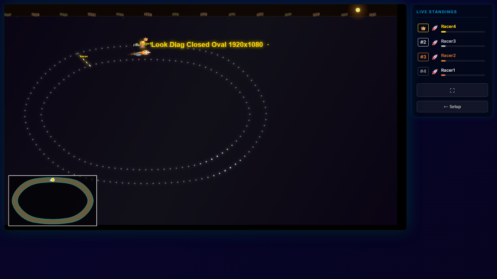
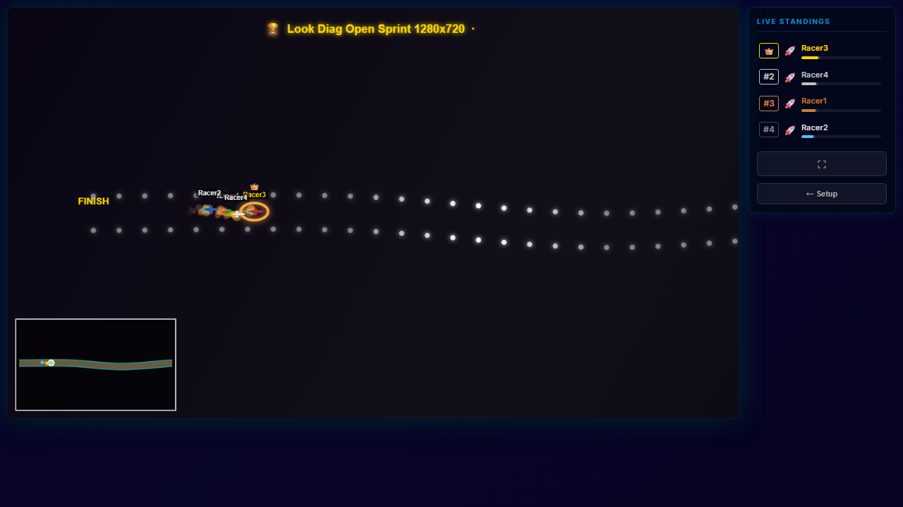
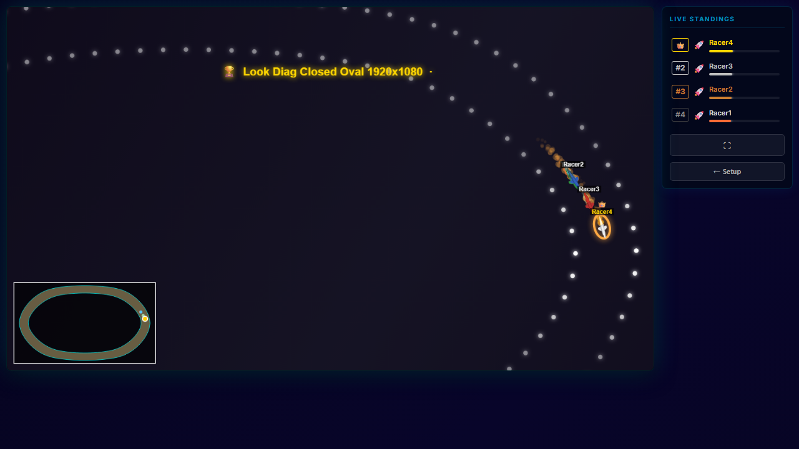
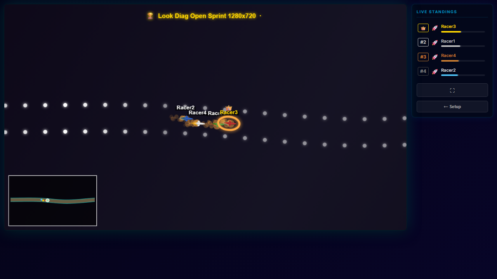
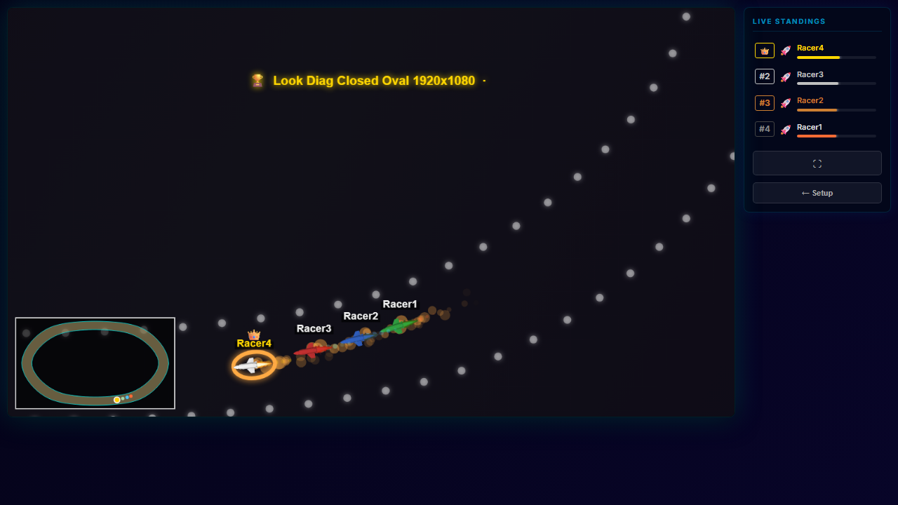
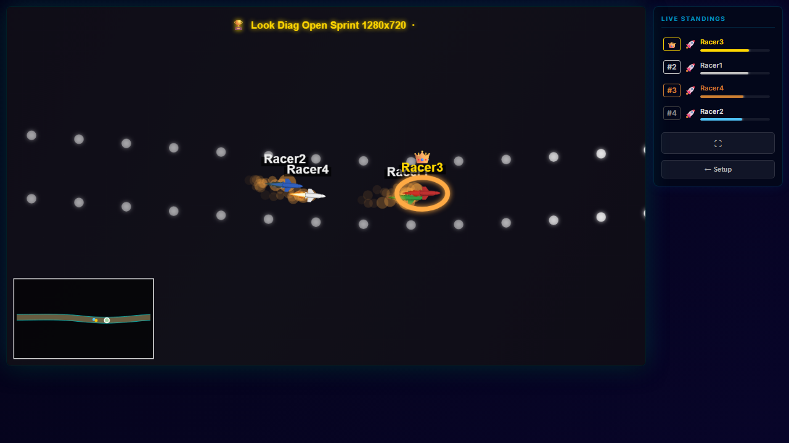

# Camera Look Comparison — Closed vs Open Track

| State | Closed (1920×1080 oval) | Open (1280×720 sprint) |
|---|---|---|
| OVERVIEW |  |  |
| LEADER_ZOOM |  |  |
| BATTLE_ZOOM |  |  |

## Setup

- Track geometries: identical to `camera-pan-diagnostic.spec.js` (PR #77 reference tracks)
- 4 racers, type `rocket`, viewport 1280×720
- Closed: 1-lap race, 25 s cap, 4 winners declared
- Open: time-race, 25 s, 4 winners declared
- HUD overlays hidden via injected CSS; diagnostic logs off

## Screenshot timing

Each screenshot taken ≈2 s after `[data-state]` transitions to the target state
(CameraStateHUD has a 150 ms fade delay, so actual camera transition precedes DOM update
by ~150 ms). At 60 fps, 2 s ≈ 120 frames of lerp time — >99% convergence for the
5%/frame open-track pan lerp; >93% for the 1.5 s zoom-lerp constant.

## Zoom reference (from diag-run, PR #77 data)

| State | Closed canvas effZoom | Open canvas effZoom |
|---|---|---|
| OVERVIEW | 0.67 (dirZoom 1.0 × bsX 0.667) | 1.50 (BASE 1.5 × dirZoom 1.0) |
| LEADER_ZOOM | ~1.58 (dirZoom 2.37 × bsX) | ~2.22 (BASE 1.5 × dirZoom 1.48) |
| BATTLE_ZOOM | ~2.37 (dirZoom 3.55 × bsX) | ~3.32 (BASE 1.5 × dirZoom 2.22) |

Settled target values from the diagnostic run. Actual screenshot zoom may differ
by up to ~7% if lerp was still converging at the 2 s mark.

## Known limitations

- Open-track BATTLE centroid is at a different world position than closed-track
  (sprint racers are further right). Same logical camera state, not same world position.
- Minimap and race-name HUD are visible in screenshots — these are normal game UI,
  not diagnostic overlays.
- Zoom values in the table are settled targets from the PR #77 diagnostic run,
  not directly measured in this test run.