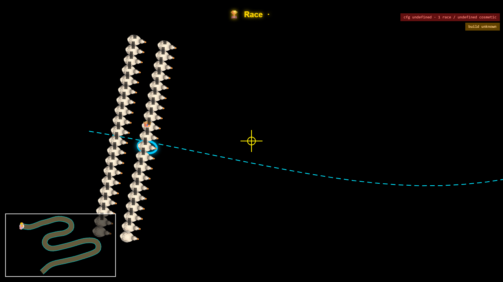

# CORRIDOR-OVERLAY-1 — make the corridor visible, and the units it is measured in

**Branch** `feat/corridor-overlay-1` off `feat/ceremony-hold-centre-1` · 2026-08-08 ·
**not merged, not minted, toggle default OFF**

---

## 1. I did NOT get the deciding picture, and I will not claim a verdict

The overlay is built and shipped behind a Dev Screen toggle, but **the capture is still missing the
two things that would settle the question**. Answering from the centreline alone would be my original
measurement redrawn — and that is precisely the measurement under dispute.

What the capture has: the cyan **centreline** through the field, the yellow **frame-centre cross**,
the minimap, the HUD. What it is missing:

- **The background does not paint.** `getBackgroundImage()` reports the image loaded (`bgReady: true`)
  and the frame still comes out black. The blit runs through `getBgCanvasReady()`, which builds a
  darkened OffscreenCanvas; that path is not producing one in this capture. **Without the artwork the
  picture cannot answer "water or bank", which is the entire question.**
- **The red corridor edges still do not draw**, even after correcting the offset — see §3.

The one thing readable from it: at x = 640 the centreline runs at roughly y ≈ 445 while the cross sits
at y = 360 — about **85 screen px**, which at 732 world px across a 1280 px frame is **≈ 49 world px**.
That is the same number my earlier measurement produced, drawn rather than computed. **It is not
evidence about the bank** and I am not offering it as such.

---

## 2. What was built

`corridorOverlay.js` — centreline dashed cyan, both corridor edges red, a yellow cross on the frame
centre. Every line comes from the same `shape.getPosition` the camera measures against, and from
`camera._trackWidthPx` itself: an overlay that computed its own corridor could agree with neither
party. Drawn before the racers so it can never hide one; the cross is in screen space, because the
claim under test is about the frame's centre.

Dev Screen → Camera Advanced → **"Show track corridor (debug)"**, default OFF. No fingerprint moves.

The capture drives the module graph through Vite and preloads the background inside the script. **No
credentials were requested or used.**

---

## 3. THE UNIT CONFUSION — the inventory, not the fix

`EditorShape.getPosition(t, offset)` computes `offset * this._centerWidth`, and
`this._centerWidth = track.width`. **So the second argument is normalised against the full declared
width, not a world-pixel distance.** I found it by passing `trackWidthPx / 2` = 150 and watching the
edges vanish — they had been placed 150 widths off the map.

For river-run, `width: 300`. Where each meaning is used:

| site | call / use | offset meaning | world px |
| --- | --- | --- | --- |
| `raceCore.js:335,343` | `getPosition(t, r.physicalY / 2)`, `physicalY ∈ [−1,+1]` | normalised, **±0.5** | racers at **±150** |
| `raceBehavior.js:227` | the comment documenting that mapping | normalised | ±150 |
| `trackRendering.js:142` | `getPosition(0, 1.0)` → `pOuter` | normalised, **±1.0** | boundary at **±300** |
| `trackRendering.js:143` | `getPosition(0, -1.0)` → `pInner` | normalised, ±1.0 | boundary at ±300 |
| `CameraDirector.js:1790` | `const half = this._trackWidthPx / 2` | **world px**, 300 = full width | ±150 |
| `framingRule.corridorGuarantee` | `trackWidthPx` = the corridor to keep in frame | **world px**, full width | ±150 |
| `zoomUnit.js` | every zoom setting in "track widths" of `referenceCorridorPx` | **world px** | — |

**The two meanings are a factor of two apart, and both are live:**

- **The racers and the camera agree.** Racers run at `±0.5` → ±150 world px; the camera halves 300 to
  get ±150. Same corridor.
- **The drawn boundary does not.** `trackRendering` uses `±1.0` → **±300 world px**, a band **twice as
  wide** as the one the racers run in and the camera guarantees.

So `width: 300` behaves as a **full width** in the physics and the camera, and as a **half width** in
the code that draws the track's edges. On a closed track that discrepancy is painted on screen. On an
open track like river-run **nothing is painted at all** (`renderRaceFrame.js:150`), so the artwork is
the only reference and nothing checks it against either number.

**This is a strong candidate for the root of the whole dispute.** Not fixed here, as instructed. The
block that takes it should decide which meaning `width` has *before* touching anything — the answer
moves the racers' corridor, the drawn track, every zoom setting expressed in track widths, and the
corridor guarantee together.

---

## 4. What I did NOT do

- **Did not ask for or use any credentials.** The capture goes through the Vite module graph.
- **Did not fix the unit confusion.** §3 — instructed not to, and it is far too load-bearing to fold in.
- **Did not state a verdict on camera-versus-geometry.** §1 — the picture is not there.
- **Did not mint or merge.** Toggle default OFF; no fingerprint moves.

---

## 5. What finishing it needs

Two small things. Make the background blit work in a headless capture — or capture from a live race
in the app, where it already works. And draw the edges at the offset matching **the racers' corridor**,
which from §3 is `±0.5` and not the `±1.0` the track drawing uses. That choice is itself part of the
question, which is why it belongs with the unit block rather than here.
