# PARTICLES-VISIBILITY-1 — why dust, rain and the finish burst appear at some moments and not others

**Measured 2026-09-28 at `7a8166f8` (master), on the production build, in a real browser. Nothing was
fixed. No product source changed on this branch.**

**Owns:** the measurement and the stated causes for the particle-visibility problem the owner reported
on 2026-09-28. The open row is [BACKLOG.md](../../docs/BACKLOG.md) PART ONE, *PARTICLES-VISIBILITY-1*.

---

## 0 · The answer in one table

| effect | what the owner saw | the cause | label |
| --- | --- | --- | --- |
| **Dust** | faint trails just after the start; none in the wide shot | The dust **is spawned and alive all race**, but the renderer's viewport cull drops most of it before drawing. The cull tests the screen Y position with the **X scale**, and on this closed track the two differ. The error grows with a particle's world Y. With the camera on the top of the world, 8% of the dust that is on screen is culled. On the bottom straight it is **90%**. The start is on the top straight, and that is where dust shows. What does get drawn is a large, soft, faint blob with a contrast ratio of about **1.3** against the dirt. | **MEASURED** |
| **Rain** | rings in a close follow shot; none in the wide shot | Rain drops are spawned only inside a **1280×720 rectangle at the world's top-left corner**, because the effect takes its area from the canvas size and then draws in world coordinates. Dirt Oval's world is 3072×2047. Rings are on screen in **100%** of frames with the camera centre inside that rectangle and in **6–9%** of frames with it outside. Over the whole race that is **25–28%** of frames. | **MEASURED** |
| **Finish burst** | does not really work | It **does fire**, on the exact physics step of every crossing (40 of 40), and every burst reaches the screen. At the photo-finish zoom the first bursts are large and bright but keep 10 or more particles on screen for only **0.4–1.2 s**. Later bursts, under the overview shot, are **4 px dots**. What the owner means by it not working is not something this measurement can decide. | **NOT PROVEN** |

★ **A fourth thing is on screen and is NOT dust.** The dotted line behind each horse, in the horse's own
colour, is a **position trail**: the last 10 drawn positions, fixed screen size, no cull, drawn
for every horse (`client/src/screens/RaceScreen/drawing/racerRendering.js:166-173`, pushed at
`:220-221`). In the follow and overview screenshots below, those dots are almost everything that trails
a horse, while the probe counts **0 dust particles drawn**. This is the most likely thing the owner reads
as faint dust trails behind some horses. **NOT PROVEN** as his reading; **MEASURED** that it is a separate system that is always drawn.

---

## 1 · How it was measured, and why the numbers describe HIS race

- **Where.** A plain `git clone --no-hardlinks` of master `7a8166f8` in `C:/tmp/pv1`, outside OneDrive,
  with its own `npm ci`. It had no worktree and no junctions. It ran on its own port, **4599**, the production arm's port
  (`client/e2e/prod-ports.js`), with its own data directory. The owner's servers on 4000, 4173 and 5173
  were not touched. The clone and its data directories are deleted (§9).
- **What was driven.** The production build of the clone, served by its own Node server (the
  `client/playwright.prod.config.js` arm, reused unchanged), in headless Chromium at 1280×720.
- **Which race.** The first run used a Quick Test with seed 9, as the brief asked. **It was not his race.** The clone's
  default setup fields **20** horses and his fields **40**, so the finishing order differed. The owner then ran
  the race again and it was stored as **`VY7KKE`** (2026-09-28 08:09 UTC, Quick Test, build `7a8166f8`, horse,
  seed 9, stage `quiet`, 2 laps). The measurement was re-run through the project's own reproducible-race door:
  its record, read **read-only** from `server/data/races.sqlite`, was turned into a race identifier with the
  product's `encodeRaceIdentifier` (`client/src/modules/raceIdentifier.js:155`). The identifier was pasted
  into the setup screen's seed field, as `client/e2e/race-identifier.spec.js` does.
  **Result: 40 of 40 finishing positions and 40 of 40 finishing times identical to the stored race, to the
  millisecond, in both arms.** One deviation: the identifier carries the
  clone's build id `7a8166f8+dirty`, because the probe made the clone's tree dirty. The probe touches only
  drawing and counting, and the identical finishing times are the check that the race did not move.
- **Two arms.** `owner11` has his 11 camera overrides written into the browser's camera store (§4).
  `defaults` has an empty store. Each was sampled **every rendered frame** from the start of the countdown to 9 s after the
  last crossing: **4,788** and **5,512** frames.
- **The probe.** Counters added only in the clone, at the spawn sites, inside the three draw
  functions and after the frame is drawn. "Drawn" means a draw call was issued. "On canvas" means the particle's
  circle, under the frame's real transform with **both** axis scales, touches the 1280×720 canvas. Contrast
  is sampled every 15th frame: the background canvas pixel under up to 25 particles, composited with
  the particle's colour at its alpha, as a relative-luminance contrast ratio. That ratio is 1.0 for invisible and 21 for
  black on white. The graphics-accessibility floor for a non-text element is 3.0.
- **The pilot.** The 20-horse Quick Test pair, run first, is not reported below except where it agrees. It showed the
  same cull and rain pattern.

**Reused:** the production Playwright arm and its isolated server (`playwright.prod.config.js`,
`e2e/auth.setup.js`, `e2e/prod-ports.js`, `e2e/e2e-env.js`); the Quick Test seed channel
(`sessionStorage.quickTestSeed`, from `e2e/quicktest-vs-harness.spec.js`); the track-cache wait from
`e2e/appReady.js` / `e2e/race-identifier.spec.js`; the race identifier encoder and the setup screen's
identifier door; `splitConfigDiffs` (`client/src/modules/parity/configFingerprint.js:57`) to
recover the cosmetic overrides; `sharp` from the root dev dependencies for the screenshots. **Built new
(throwaway, in the clone):** the per-frame probe and two spec files.

**Headless frame pacing, a limit on every number.** 45–46% of frames took longer than 25 ms in
headless Chromium on this machine. Dust spawns **once per rendered frame**
(`client/src/modules/surface-effects/generators/cloud.js:70`) while its fade is scaled by the frame's
time (`:96-99`). The burst's motion and fade are **per frame** with no time scaling
(`client/src/screens/RaceScreen/index.jsx:1501-1516`). So alive-counts and burst durations
depend on the frame rate. **The cull fraction and the rain rectangle do not**: they are geometry.

---

## 2 · Where each effect is defined, configured and gated — file:line

### Dust

- **Which emitter Dirt Oval resolves to.** The track lists surface classes `sand, earth, mud, grass`
  (`server/data/tracks/dirt-oval.json:10`). The horse lists `sand, earth, grass, asphalt, snow, mud`
  (`client/src/racer-types/HorseRacerType.js:71`). The **first racer class the track also has** wins
  (`client/src/modules/surface-effects/registry.js:87-97`), so every horse gets **`sand`**, the **cloud**
  generator (`client/src/modules/surface-effects/defaults.js:31-44`). Resolved once per racer at race start
  (`client/src/screens/RaceScreen/index.jsx:827` → `client/src/modules/surface-effects/trailResolver.js:27-46`).
- **The fallback path never runs here.** `st.dustParticles` stayed at **0** in every frame of both arms. The
  horse's fallback `trailFactory` (`HorseRacerType.js:28-41`) is reached only when no class matches (`index.jsx:1478-1483`).
- **Spawn and advance:** `index.jsx:1466-1485`, one `spawn` + `update` per racer per rendered frame,
  **only while `!r.finished`** (`:1469`). Cloud spawn chance, start/end size, lifetime and drift:
  `cloud.js:69-87`. Starting alpha: `cloud.js:56`. Fade and growth: `cloud.js:92-108`.
- **Draw:** `client/src/screens/RaceScreen/renderRaceFrame.js:174` → `particleRendering.js:66-72` →
  `cloud.js:110-127`. It is a pre-rendered radial-gradient blob (`generators/spriteHelpers.js:32-51`, stops 0.9 →
  0.4 → 0 alpha), culled by `spriteHelpers.js:54-70`.
- **What can change size, count, opacity or lifetime:**
  - the sand class values (code, `surface-effects/defaults.js:31-44`);
  - a server-stored override of the class (`registry.js:37-43`, loaded by
    `client/src/modules/storage/surfaceClassLoader.js:40`; **the owner's `server/data/surface-classes/` is empty**);
  - a per-racer-type `surfaceEffectOverrides` from the Dev Screen racer modal (`trailResolver.js:40-43`,
    `client/src/screens/DevScreen/sections/RacerEditModal.jsx:382`; **empty in VY7KKE's record**, `racerTypeOverrides: {}`);
  - the track's `surfaceClasses` list and the racer's class order;
  - the camera zoom, because dust is drawn in world units.

### Rain

- **Config on this track:** one effect, `rain`, at `server/data/tracks/dirt-oval.json:1693-1700`: count
  200, size 2.3, colour `#88aaff`, opacity 0.8. Editable in the track editor (`EffectConfig`, up to 3 effects).
- **Created:** `index.jsx:476-481`, with **`manifest.create(canvas, config)`** at `:479`, where `canvas` is
  the race canvas (`:421`), a fixed 1280×720 store.
- **Spawn:** `client/src/modules/track-effects/effects/rain.js:19-39`. Drops land at
  `Math.random() * width`, `Math.random() * height` of **that canvas** (`:20`, `:33-34`), `config.count` per
  second, each living 350–650 ms (`:16-17`, `:36`).
- **Update:** `index.jsx:971`, once per rendered frame with the smoothed frame time.
- **Draw:** `renderRaceFrame.js:161-165`, **inside the world transform**, so drop coordinates are world
  coordinates. Rings are stroked at `rain.js:41-53`, line width 1 **world** unit (`:44`), radius up to
  12 × size world units (`:16`, `:49`). There is no cull.
- **What can change it:** the four config values; the canvas size; the camera zoom (line width and ring
  size scale with it); and the smoothed frame time (`frameTimingConfig.dtSmoothingAlpha` in
  `client/src/modules/storage/defaults.js`).

### Finish burst

- **Emitted:** `index.jsx:1090-1092`, in the physics step loop, when `r.finishTimeMs === physicsTs`.
  `finishTimeMs` is set to that same step's `physicsTs` (`client/src/modules/raceCore.js:754`). **Measured:**
  the burst's step equals the stored finish time for every rank (e.g. 86176, 86688, 86992 ms for ranks 1–3).
- **Shape:** `particleRendering.js:17-32`: 45 particles, speed 2–9 world units per frame, radius 2–6 world
  units, seven fixed colours.
- **Advance:** `index.jsx:1501-1516` while racing (gravity, fade 0.014 per frame, so a 71-frame life, radius ×0.97 per frame) and
  `:1517-1534` after the race (the same, **without** the shrink).
- **Draw:** `renderRaceFrame.js:173` → `particleRendering.js:40-59`, with no cull and a 6-unit shadow blur. Drawn
  **before** the racers, so sprites paint over it.
- **What can change it:** nothing but code. There is no setting. The camera zoom decides its screen size and
  how fast it leaves the frame.

### Draw order, for reference (`renderRaceFrame.js:160-174`)

background → **track effects (rain)** → finish gate → track lights → **dust + burst** → **surface dust** →
racers, each with its **position trail**. Your reading was right that rain sits under the finish gate.
The finish gate only paints the gate itself (`client/src/screens/RaceScreen/drawing/trackRendering.js:184-190`),
so it hides nothing.

---

## 3 · Where the brief's readings were wrong

- **"two paths, surface emitter or native fallback".** True in code, but **on Dirt Oval with horses only
  the surface path runs.** The fallback pool stayed at 0 in every frame.
- **"advanced around 1486-1500 with a per-frame alpha decay".** That block advances only the **fallback**
  pool, which is empty here. The dust the owner sees is advanced by the cloud generator's own `update`
  (`cloud.js:92-108`), scaled by frame time. That `update` also **stops for a racer the moment it finishes** (`index.jsx:1469`).
  A finished racer's last few particles then stay frozen on screen at their last alpha until the page
  unmounts: **100–101 of the 103–104 alive** at the last racing frame, in both arms.
- **"rain spawns drops continuously at config.count per second".** True, and about 104 drops were alive
  in every frame of both arms. But they are spawned inside the **canvas-sized rectangle at the world's
  origin**, not over the track. The rate is not the problem; where they land is.
- **"finish burst particles are advanced around 1501-1530".** Correct. Emission is at `index.jsx:1091`,
  inside the physics loop, on the crossing step itself. There is no lag.

---

## 4 · The owner's 11 cosmetic overrides — found, and read from the server

**They can be read.** Every stored race carries its full config world in `races.world_configs`
(`server/src/races/raceStore.js`, the `races` table). Diffed against master's shipped defaults with the product's
own `splitConfigDiffs`, **VY7KKE shows 0 race-relevant and 11 cosmetic differences**, which matches his badge
`cfg cbe479 · 0 race / 11 cosmetic`. Every stored race since 2026-09-10 carries the same 11, and VY7KKE's
values are identical to those of 2026-09-24's `W57FQA`.

All 11 are in `cameraConfig`. Values are not restated here: their home is the stored race and, for
the defaults, `client/src/modules/storage/defaults.js`.

`battleCooldownMs`, `battlePulkThresholdT`, `battleWeight`, `cameraStateProfiles` (the framing width of
LEADER_ZOOM, BATTLE_ZOOM, COMEBACK_ZOOM and LEAD_CHANGE, and OVERVIEW's tracking time constant),
`corridorCapArriveMs`, `finishPauseMs`, `highlightHeroes`, `labelNamesWhenRoom`, `minRacersVisible`,
`outcomePhaseThreshold`, `winnerCardMs`.

**None of the 11 is a dust, rain or burst setting.** None of the three effects has a setting in any config
block. They touch the effects only **through the camera**: which shots are chosen (his battle weight
removes BATTLE_ZOOM entirely, which is visible in the tables), how wide each is, and where it points. That
decides the zoom (particle size, rain line width) and the world position under the camera (the cull error,
the rain rectangle). The measurement was run with exactly these 11 as arm `owner11`.

---

## 5 · The numbers

Each cell is **median / p90 / max**. N is the number of frames behind the column.

### 5a · Arm `owner11` (his race, his camera) — by camera state, RACING frames

| | OVERVIEW (N=667) | LEADER_ZOOM (N=1713) | LEAD_CHANGE (N=1042) | COMEBACK_ZOOM (N=341) | PHOTO_FINISH (N=334) | FINISHED (N=259) |
| --- | --- | --- | --- | --- | --- | --- |
| screen px per world unit (X) | 1.90 / 3.29 / 7.11 | 3.35 / 3.35 / 3.50 | 3.16 / 3.16 / 4.06 | 4.06 / 4.06 / 4.06 | 4.42 / 7.11 / 7.11 | 1.90 / 1.90 / 1.90 |
| dust spawned per frame | 6 / 10 / 16 | 8 / 11 / 17 | 8 / 11 / 17 | 8 / 11 / 17 | 8 / 11 / 16 | 0 / 0 / 0 |
| dust alive | 110 / 127 / 145 | 117 / 137 / 163 | 119 / 140 / 162 | 118 / 132 / 146 | 127 / 150 / 162 | 103 / 103 / 103 |
| dust **truly on canvas** | 93 / 117 / 139 | 39 / 91 / 126 | 47 / 62 / 113 | 44 / 54 / 64 | 9 / 64 / 78 | 103 / 103 / 103 |
| dust **drawn** | 37 / 107 / 120 | 47 / 95 / 126 | 0 / 59 / 78 | 1 / 29 / 44 | 8 / 64 / 78 | 103 / 103 / 103 |
| dust on canvas but **culled** | 14 / 90 / 107 | 11 / 34 / 59 | 37 / 51 / 103 | **44 / 54 / 64** | 0 / 4 / 7 | 0 / 0 / 0 |
| dust drawn but off canvas | 0 / 0 / 14 | 0 / 59 / 100 | 0 / 0 / 20 | 1 / 26 / 38 | 0 / 0 / 0 | 0 / 0 / 0 |
| dust screen radius px (drawn) | 13.5 / 22.1 / 43.0 | 21.9 / 24.8 / 27.6 | 22.5 / 24.3 / 26.1 | 28.9 / 33.5 / 37.0 | 20.2 / 44.4 / 61.1 | 13.5 / 13.5 / 13.5 |
| dust alpha (drawn) | 0.29 / 0.40 / 0.57 | 0.32 / 0.37 / 0.57 | 0.29 / 0.34 / 0.57 | 0.29 / 0.40 / 0.54 | 0.32 / 0.51 / 0.57 | 0.29 / 0.29 / 0.29 |
| dust contrast ratio | 1.26 / 1.47 / 1.56 | 1.32 / 1.45 / 1.53 | 1.30 / 1.37 / 1.40 | 1.28 / 1.37 / 1.39 | 1.37 / 1.57 / 1.68 | 1.25 / 1.25 / 1.25 |
| rain drops alive | 102 / 107 / 112 | 103 / 107 / 114 | 102 / 107 / 112 | 102 / 106 / 109 | 102 / 106 / 108 | 102 / 106 / 110 |
| rain rings **on canvas** | 15 / 27 / 43 | 0 / 16 / 70 | **0 / 0 / 0** | **0 / 0 / 0** | 0 / 41 / 52 | 23 / 27 / 32 |
| rain ring radius px (on canvas) | 28.0 / 36.8 / 69.3 | 45.3 / 69.8 / 92.1 | — | — | 23.2 / 56.5 / 107.6 | 27.6 / 33.6 / 40.6 |
| rain line width px | 1.90 / 3.29 / 7.11 | 3.34 / 3.34 / 3.50 | 3.16 / 3.16 / 4.06 | 4.06 / 4.06 / 4.06 | 4.42 / 7.11 / 7.11 | 1.90 / 1.90 / 1.90 |
| rain contrast ratio | 1.43 / 1.83 / 3.06 | 1.33 / 1.99 / 3.24 | — | — | 1.30 / 1.71 / 2.23 | 1.44 / 1.83 / 1.88 |
| burst on canvas | 0 / 211 / 334 | 0 / 0 / 0 | 0 / 0 / 0 | 0 / 0 / 0 | 0 / 46 / 201 | 0 / 114 / 262 |
| burst screen radius px | 4.3 / 13.3 / 24.7 | — | — | — | 18.6 / 25.6 / 30.9 | 4.5 / 7.3 / 7.7 |

By race phase (same arm): countdown N=432, start (first 5 s) N=162, mid-race N=3571, crossings N=364,
finished N=259. Dust **drawn / truly on canvas / culled while on canvas**: start 73 / 90 / 15; mid-race
**24 / 43 / 21**; crossings 78 / 79 / 1 (the crossings are on the top straight). Rain rings on canvas: start
0 / 0 / 4; mid-race 0 / 18 / 70.

### 5b · Arm `defaults` (his race, shipped camera) — the same cuts, condensed

| | OVERVIEW (N=434) | LEADER_ZOOM (N=1052) | BATTLE_ZOOM (N=1344) | LEAD_CHANGE (N=1188) | COMEBACK_ZOOM (N=339) | PHOTO_FINISH (N=293) |
| --- | --- | --- | --- | --- | --- | --- |
| dust truly on canvas | 99 / 113 / 124 | 41 / 99 / 134 | 28 / 40 / 103 | 34 / 58 / 79 | 30 / 37 / 47 | 10 / 53 / 66 |
| dust drawn | 21 / 111 / 124 | 35 / 98 / 134 | 7 / 68 / 92 | 10 / 56 / 75 | 5 / 26 / 33 | 8 / 53 / 66 |
| dust on canvas but culled | 35 / 90 / 108 | 18 / 40 / 52 | 23 / 33 / 88 | 18 / 31 / 51 | **30 / 37 / 47** | 0 / 7 / 10 |
| rain rings on canvas | 0 / 26 / 35 | 0 / 6 / 20 | 0 / 5 / 15 | 0 / 16 / 84 | **0 / 0 / 0** | 1 / 40 / 52 |

### 5c · The dust cull, bucketed by where the camera looks (RACING frames, all states)

The camera centre's **world Y**: the top straight is near 436, the bottom straight near 1522.

| camera centre world Y | `owner11`: frames · culled share of on-canvas dust | `defaults`: frames · culled share |
| --- | --- | --- |
| 0–700 (top of the world) | 1898 · **8.4%** | 1915 · **15.7%** |
| 700–1100 | 478 · 54.0% | 785 · 72.7% |
| 1100–1400 | 448 · 80.7% | 516 · 98.1% |
| 1400–2100 (bottom straight) | 1272 · **90.1%** | 1433 · **94.7%** |

In the same buckets the cull also **draws particles that are off canvas**: up to 10,365 blits in `owner11`'s
1100–1400 bucket. That is wasted work, and it is the same error in the other direction.

### 5d · Rain, by where the camera looks

| camera centre | `owner11` frames with ≥1 ring on canvas | `defaults` |
| --- | --- | --- |
| inside the 1280×720 world-origin rectangle | 857 of 857 (**100%**) | 930 of 930 (**100%**) |
| outside it | 276 of 3240 (**8.5%**, ring edges spilling in) | 229 of 3720 (**6.2%**) |
| whole race, RACING frames | 1133 of 4097 (27.7%) | 1159 of 4650 (24.9%) |

### 5e · Every finish burst (arm `owner11`; `defaults` agrees in shape)

All 40 bursts fired on the crossing step and all 40 put all 45 of their particles on canvas at their peak (one
peaked at 25). **Time with ≥10 of a burst's particles on canvas: median 1,283 ms, p90 1,583 ms, max 1,950 ms
(N=40)**. For ranks 1–11, emitted under PHOTO_FINISH at 4.4–7.1 px per world unit, it was **367–1,150 ms**. For
ranks 12–40, under OVERVIEW at about 1.9, it was 1,067–1,950 ms, but at a median screen radius of **4.3 px**.
`defaults`: median 1,500 ms, winner's burst 600 ms.

---

## 6 · The three causes, argued from the numbers

### Dust — MEASURED

1. **The cull uses the wrong scale for Y.** `cullBounds` reads only the transform's `a`, the X scale
   (`spriteHelpers.js:55`), and `isVisible` tests `py * a + f` (`:67`). The frame actually draws at
   `py * d + f`, and on a closed track `d ≠ a`: the world is scaled by 1280/3072 across and 720/2047 down
   (`renderRaceFrame.js:158`). The cull's Y is therefore off by `py · (a − d)` = `py · 0.156 · a`. At the common
   follow zoom (`a` ≈ 3.8) that is about 258 px on the top straight and about 900 px on the bottom straight. The canvas is
   720 px tall. §5c is the direct test, and it moves the way the arithmetic says, in both arms.
2. **What is drawn is faint on this background.** A tan blob (`#d4b483`) at a median alpha of about 0.3,
   through a gradient that peaks at 0.9, over a brown-tan dirt image gives a **contrast ratio of 1.2–1.7**
   (median about 1.3) in every state. At 13–30 px radius it reads as a slight haze, not a trail.
3. **How that produces his three sightings.** *Just after the start*, the pack is on the top straight,
   73 of 90 on-canvas particles are drawn, and dust is faintly visible. *In the wide mid-race shot*
   (the corresponding moment in the replay, `owner11-overview`: 37 on canvas, **2 drawn**) the camera sits on the right-hand turn
   and the bottom of the world, so the cull removes it. *In the close follow shot on the bottom straight*
   (`owner11-follow`: 54 on canvas, **0 drawn**) there is no dust at all. What trails the horses there is the
   position trail.
4. **After a racer finishes, its last particles freeze** (`index.jsx:1469` stops its `update`). This is visible as static
   haze around the finish line from the first crossing until the page unmounts.

### Rain — MEASURED

1. **The drops fall in the wrong place.** `rain.create` receives the race canvas (`index.jsx:479`), takes
   its 1280×720 as the spawn area (`rain.js:20`, `:33-34`), and the drops are drawn in world coordinates
   (`renderRaceFrame.js:161-165`). The probe read the spawn rectangle back from the live effect: `width 1280,
   height 720`. On Dirt Oval that rectangle covers the world's top-left corner, which is part of the left-hand turn
   and the left end of the top straight.
2. **So rain follows the camera's position, not the shot type.** Inside the rectangle, rings are on
   screen in every frame. Outside it, almost never (§5d). His close follow shot with rain was on the left turn
   (`owner11-followRain`). His overview shot without rain was elsewhere.
3. **When rings are visible they are coarse and low-contrast.** Line width is 1 world unit, 1.9–7.1 px on screen,
   and rings grow to about 30–140 px in radius. The blue-on-brown contrast ratio has a median of 1.3–1.6,
   rising to about 3 only for the freshest drops.

### Finish burst — NOT PROVEN, with what was measured

It fires 40 of 40 times, on the right step, at the racer's position, and reaches the canvas every time.
So there is no measured defect of the kind that broke dust and rain. What the numbers do show, any of which
could be what he means:

- **Under PHOTO_FINISH** (about 7 px per world unit) the particles leave the frame fast. Speed is in world units per
  frame, so 14–64 screen px per frame, and the winner's burst holds 10 or more particles on screen for 0.4–0.6 s.
- **Under the overview**, where 29 of the 40 crossings are shown, a burst is 4 px dots.
- It is drawn **under** the racers (`renderRaceFrame.js:173`, before the sprites), exactly where the crossing
  horses are.
- Its life is counted in **frames** (71), so on a slower machine it lasts longer and moves slower. On a faster one it is shorter.

Deciding which of these he means needs his eye on the screenshots, not another measurement.

---

## 7 · Screenshots — his race (VY7KKE), taken from the clone during the replay

All are in `PARTICLES-VISIBILITY-1/`. The top-right badges read `cfg cbe479 · 0 race / 11 cosmetic` (`owner11`)
or `· defaults`, and `build 7a8166f8 · detached +dirty` (the probe).

| his observation | `owner11` (his camera) | `defaults` |
| --- | --- | --- |
| just after the start: faint dust behind some horses | 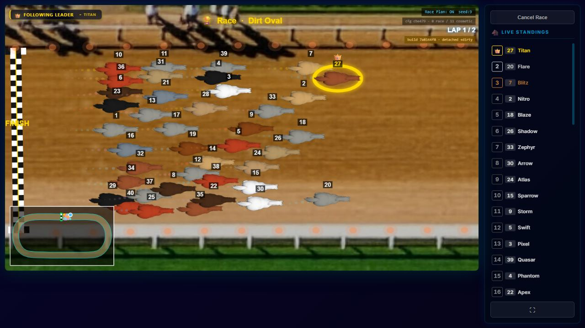 1.6 s in, LEADER_ZOOM, top straight: 99 dust on canvas, 76 drawn | 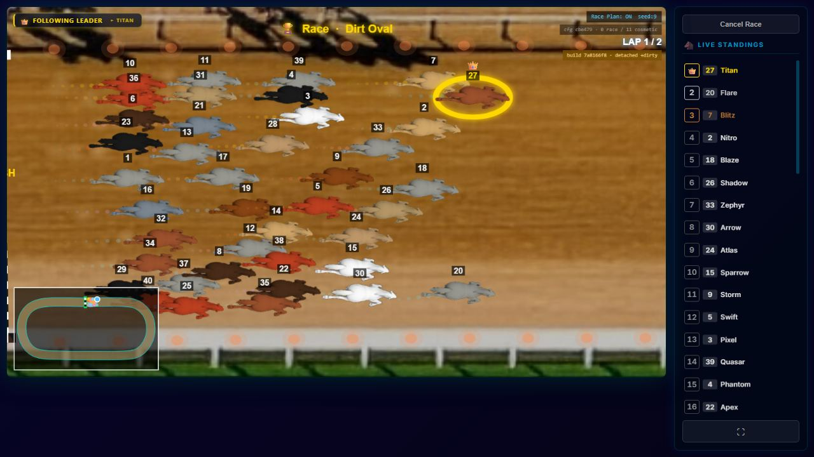 |
| wide shot mid-race: no dust, no rain | 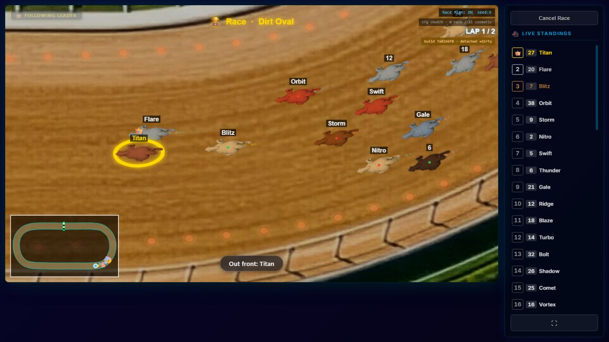 15.2 s, OVERVIEW, right turn: 37 on canvas, **2 drawn**, 0 rain rings | 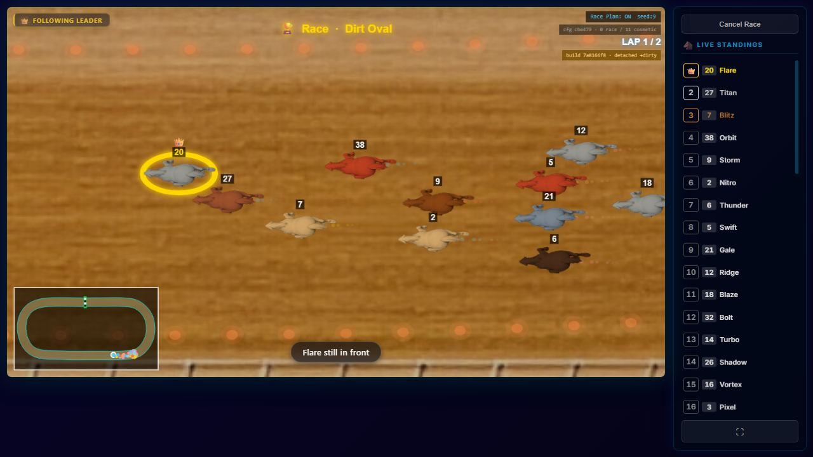 21.1 s: 33 on canvas, **0 drawn** |
| close follow shot (bottom straight) | 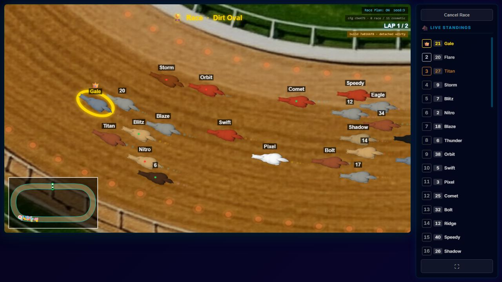 28.3 s: 54 on canvas, **0 drawn**. The dots behind the horses are the position trail | 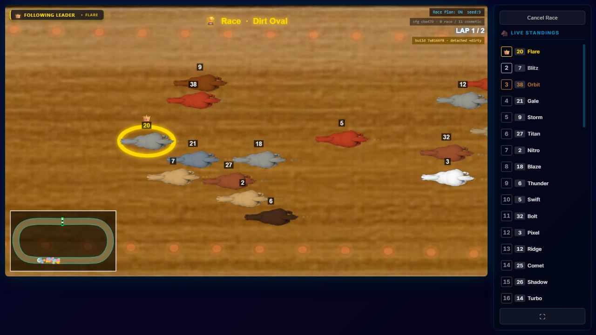 30 on canvas, 0 drawn |
| close follow shot with rain rings | 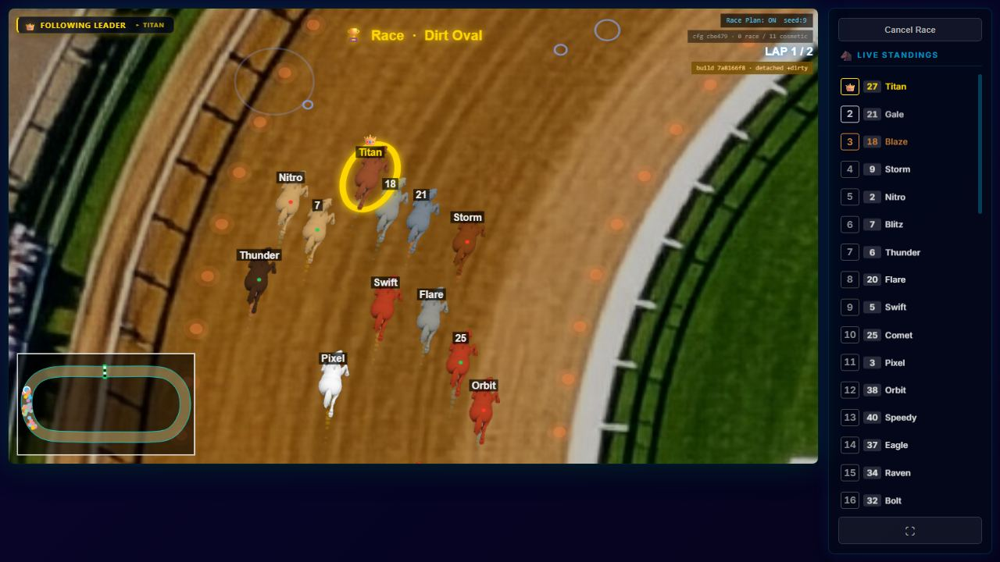 33.4 s, left turn, inside the rain rectangle: rings top-left | 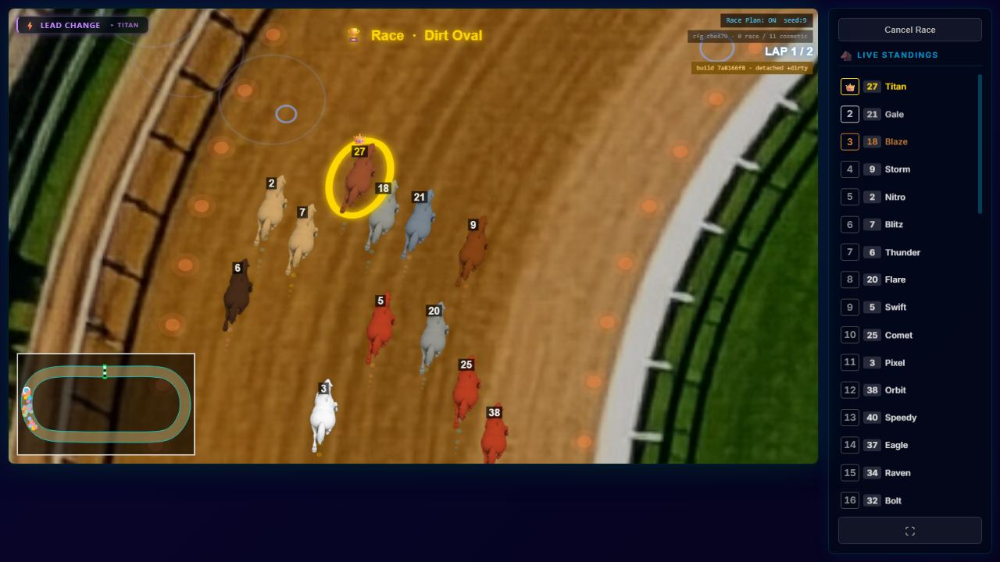 |
| the finish | 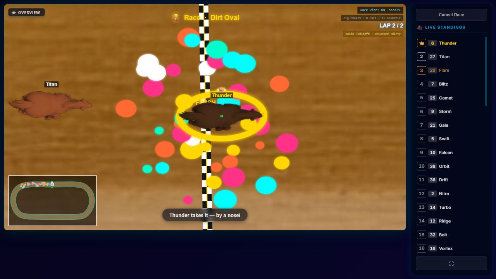 88.5 s, the winner's burst, PHOTO_FINISH at 7.1 px per world unit | 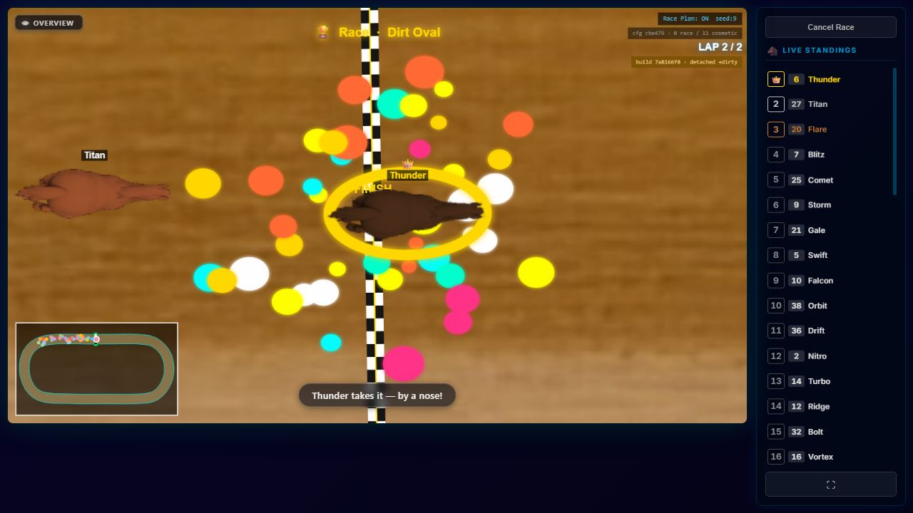 |
| after the last crossing | 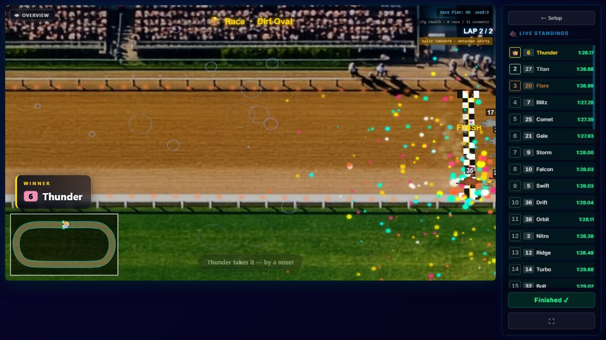 FINISHED, 103 frozen dust particles, 255 burst particles, 19 rain rings | 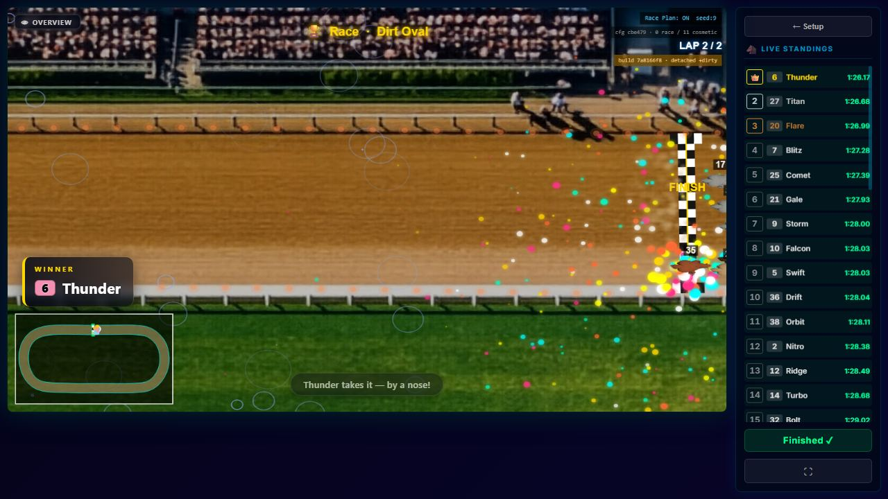 |

---

## 8 · Proposals — none implemented

Each proposal says what he would see change. None moves a race: all of them are render-only, and none
touches `defaults.js`.

1. **Cull dust with both axis scales** (`spriteHelpers.js:54-70`: read `d` and test Y with it; the same
   helper serves `splash.js:136-138` and the line generator's segment test at `line.js:109-120`, so all three get
   the fix). *He would see:*
   dust behind the pack on the bottom straight, the turns and in battle and comeback shots, where today there is
   essentially none; the same amount as today on the top straight. Cost: none. It also stops the off-canvas blits.
2. **Spawn rain over the world, not the canvas**: pass the world size (`worldWidth` × `worldHeight`) to
   `create` at `index.jsx:479`, or have the effect spawn in the visible world rectangle. *He would see:* rain in
   every shot, everywhere on the track. Note that at the configured rate over a world about 6.8× the area, the ring
   density per screen drops by the same factor. Holding today's density where it does rain would mean raising
   `count` in the track's effect config, which is the operator's choice.
3. **Keep a finished racer's dust fading**: run `update` for finished racers too; only spawning should stop.
   *He would see:* the haze at the finish line clears within the sand class's own lifetime (22 frames, under half a
   second at 60 fps) instead of standing until the page closes.
4. **Dust and rain read on their background.** Dust colour and alpha against dirt, and rain line width in
   *screen* pixels rather than world units, are visual choices. The measured contrast (about 1.3) is the input for his
   eye, not a threshold this report may set. *He would see:* whatever he asks for. The screenshots above
   are the "before".
5. **Finish burst.** Pending his answer to what he means by it not working. The measured candidates are §6's
   four bullets: size in screen pixels, frame-rate-independent life, drawn above the racers, fewer frames off
   screen at PHOTO_FINISH.

★ **Not proposed:** unifying the two particle systems. "One particle system instead of two" was **closed,
reopenable, by the owner on 2026-09-25** (see [OPEN.md](../../docs/OPEN.md) §1). Proposals 1–3 fix each
system where it stands.

★ **What no instrument covers.** `scripts/render-fingerprint.mjs` does not reach `RaceScreen/index.jsx`,
and its header names particles and trails as blind. The probe above was a one-off in a throwaway clone.
**Nothing in the tree would notice a regression here.** A durable guard, for example a unit test of
`isVisible` on an anisotropic transform and of rain's spawn area against the world size, belongs with the fix,
not with this measurement.

---

## 9 · What was left behind, and what was not

- **On this branch:** this report, its twelve screenshots, one open row in `docs/BACKLOG.md` PART ONE and the
  re-derived `docs/OPEN.md`. Also the new directory's `INDEX.md`, its row in `reports/README.md`, and its
  registration in the index guard (`scripts/check-index.mjs`, `REGISTERED`), which failed the pre-merge run on an
  undeclared directory until then. **No product source file changed.**
- **Deleted when done:** the clone `C:/tmp/pv1`, the probe directory `C:/tmp/pv1-probe` (patch scripts, specs, raw
  per-frame JSON), and the clone's data directories `C:/tmp/pv1-data-prod` and `C:/tmp/pv1-data2-prod` (each with
  a throwaway e2e account and the replayed races). Nothing was written to the owner's data. `races.sqlite`
  was opened read-only.
- **The owner's servers** on 4000, 4173 and 5173 ran throughout and were neither stopped, restarted nor reconfigured. The branch was
  committed from the clone and pushed without switching the owner's working tree, so the dev server's badge was
  not moved.
