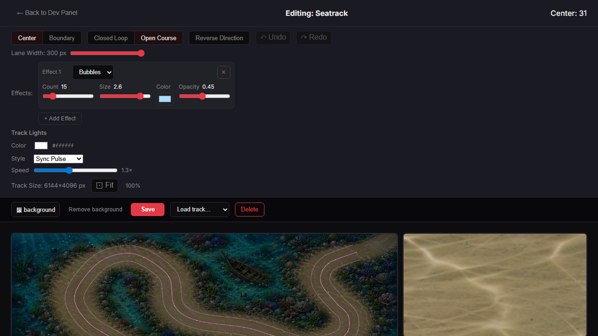
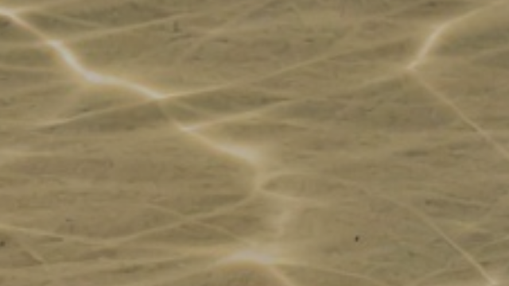
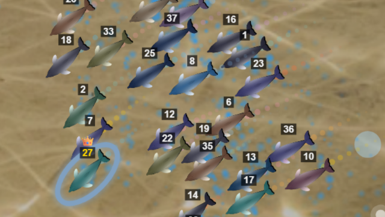
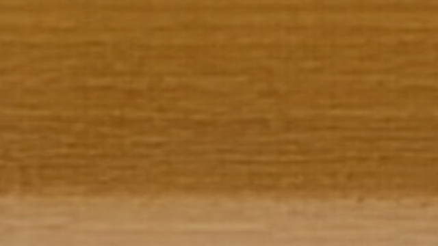
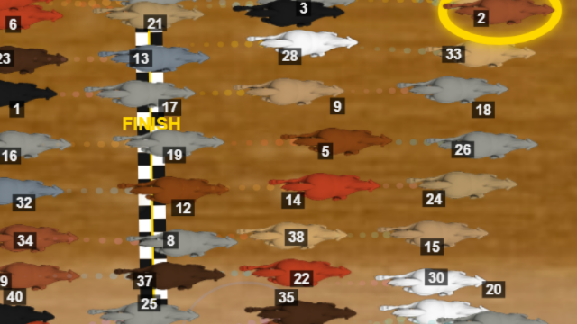

# PARTICLES-VISIBILITY-10 — a race-view panel in the Track Editor

**Built 2026-09-29 on branch `fix/particles-visibility`, on top of PARTICLES-VISIBILITY-9 (`ea9864b3`). Code commit
`99be7f50`. Not merged: the owner looks first.**

**Owns:** the Track Editor's race-view panel, and the measurement of how well it predicts the race. Open row:
[BACKLOG.md](../../docs/BACKLOG.md) PART ONE, *2026-09-28 — added (PARTICLES-VISIBILITY-1)*.

**The owner's decision of 2026-09-29.** After PARTICLES-VISIBILITY-9 the editor's whole-track preview is honest, but it
cannot show how large and how dense effects appear during the race, because the race camera is much closer. Of the two
options offered, he chose to add a preview at race-camera distance in the editor, and not to change how effects are sized
or counted.

---

## 0 · The answer

- **Beside the whole-track view, the editor now has a race-view panel.** It shows the same track, with the race's own
  background and every configured effect, at the race camera's ordinary racing zoom. It opens on the track's start;
  a click on a track point centres it there. It moves live with every effect slider, because it draws the same effect
  instances as the existing preview.
- **The zoom is the camera's own, not a number chosen here.** It is the director's conversion for its racing state, from
  the camera settings the race itself loads. With the owner's camera settings it is **2.82 screen px per world px** on
  Seatrack and Space Sprint, and **3.35 across × 2.82 down** on Dirt Oval. MEASURED: that is exactly the race camera's
  scale in the racing frames captured beside it (§2).
- **The panel predicts the race's density at that zoom.** MEASURED over 60 s of panel against 15–25 s of racing:
  - Seatrack bubbles: 0.22 on the panel against 0.20 in the race, per 100,000 canvas px²;
  - Dirt Oval rain: 0.15 against 0.16.
- **What the race shows over a whole race is wider on average**, because the camera also takes wider shots, and those
  pack more world into each pixel. The panel shows the ordinary racing shot, the one the camera returns to (§2).
- **Nothing the race runs on moved.** `engine-reach --check` places all eight changed files outside the engine hull.
  No fingerprint can move, and none was minted.

*The editor at its usual window size (1280×720), Seatrack loaded. On the right is the race view: one third of the row,
here 393 CSS px wide next to the 827-px whole-track view.*

---

## 1 · The zoom: its source, and its value per track

**A callable exists, so the decision rule's fallback (a measured median zoom) was not needed.** The director turns every
state's setting into a zoom through one method, and the panel calls the same functions in the same way:

| step | the camera's own code |
| --- | --- |
| the director's one conversion | `CameraDirector._computeZoomForCorridors`, `client/src/modules/camera/CameraDirector.js:522` |
| setting → camera zoom | `resolveZoomForCorridors`, `client/src/modules/camera/zoomUnit.js:160` |
| the corridor width the setting is measured in | `referenceWidthFor`, `client/src/modules/camera/zoomUnit.js:83` |
| each state's setting and the reference width | `resolveFramingConfig`, `client/src/modules/camera/framingConfig.js:99` |
| the track's world→screen mapping (open or closed) | `projectionForTrack`, `client/src/modules/camera/projection.js:179` |
| the camera settings, as the race reads them | `loadCameraConfig`, `client/src/modules/cameraConfig.js:83` (the race: `RaceScreen/index.jsx:230`) |

**Which state.** The ordinary racing shot is `LEADER_ZOOM`, which `defaults.js` calls "the reference shot". The wider
(overview) and tighter (battle, comeback) states are the exceptions the camera cuts to.

The director applies guarantees on top of the state's zoom each frame (corridor, pair, company). They can only widen a
shot to keep racers in it. There are no racers in the editor, so the panel does not apply them. That is why the race is
wider on average (§2).

**The values**, with the owner's camera settings as his stored races record them (the racing shot 0.85 corridor widths of
300 world px, where the shipped setting is 0.75). The editor reads whatever camera settings the browser holds, so in his
browser it is his.

| track | topology, world | corridor | camera zoom | panel scale, race-canvas px per world px (across × down) | world in a full race frame |
| --- | --- | --- | --- | --- | --- |
| Seatrack | open, 6144×4096 | 300 | 1.882 | **2.824 × 2.824** | 453 × 255 |
| Space Sprint | open, 6000×4000 | 300 | 1.882 | **2.824 × 2.824** | 453 × 255 |
| Dirt Oval | closed, 3072×2047 | 178 → 300 (the reference is larger) | 8.027 | **3.345 × 2.824** | 383 × 255 |

By the camera's own construction the short axis always shows corridors × reference = 0.85 × 300 = 255 world px. That is
why the vertical scale is the same on all three tracks. A closed track stretches its horizontal axis by its own aspect.
With the shipped setting (0.75) every figure would be 3.2 down instead (225 world px). Unit tests hold all of these
numbers (§4).

---

## 2 · How well the panel predicts the race — MEASURED

**Setup.**
- **Build:** the production build of a throwaway clone of `99be7f50`, with probes in the clone only. They record the race
  camera's world→screen transform per frame, and, per rendered frame, how many bubbles or rain rings have their centre on
  the canvas.
- **Tracks:** the owner's current stored tracks, copied read-only into a throwaway data directory: Seatrack bubbles count
  36,000 (level 15), size 2.6, opacity 0.45, and Dirt Oval rain 200 (level 5).
- **Camera:** his 11 camera overrides.
- **The race:** one measurement race per track, built from his latest stored race `VY7KKE` (40 racers, seed 9, his world
  config). On Dirt Oval that is his race as stored. On Seatrack it is moved onto the track with the dolphin and its 60 s,
  as in PARTICLES-VISIBILITY-9.

**The zoom matches.**

| track | panel | race frame captured 1.5 s into racing | race, median over racing | race, p10 / p90 |
| --- | --- | --- | --- | --- |
| Seatrack | 2.824 | 2.824 | 2.824 (693 frames) | 1.600 / 2.824 |
| Dirt Oval | 3.345 × 2.824 | 3.345 × 2.824 | 2.631 × 2.221 (451 frames) | wider / 3.345 |

- **Seatrack:** the race sits at the panel's zoom for most of its racing frames. The p10 of 1.60 is the camera's wide
  overview shots.
- **Dirt Oval:** the panel's zoom is the race's p90, its closest ordinary shot. The median frame shows 27% more world on each axis:
  with 40 horses in a tight field, the guarantees widen the shot more often.

**The density matches at the same zoom.** Items with their centre on the canvas, per 100,000 canvas px²:

| track | panel (60 s, ~3,300 frames) | race frames at the panel's zoom | all racing frames |
| --- | --- | --- | --- |
| Seatrack bubbles | **0.22** | **0.20** (381 frames) | 0.32 (695 frames) |
| Dirt Oval rain | **0.15** | **0.16** (124 frames) | 0.31 (453 frames) |

- Per frame this is about **0.5 bubbles** in the panel's area and **about 2** in a full race frame at that zoom. That
  agrees with the arithmetic: 600 per second × about 0.8 s alive = about 480 on the whole track, and the measured
  whole-track count in the editor was 486.
- All racing frames together are denser per pixel than the panel, because the wider shots put more world into each pixel.
- **The first, 12 s panel sample read 0.09 for Seatrack.** It saw only a handful of bubbles, each alive under a second,
  so it was noise. The 60 s figure above replaces it. Both are recorded so the correction is visible.

**A finding about what the owner sees in the race, MEASURED.** The Seatrack race frame below is full of small blue dots,
but the probe counts a median of 2 bubbles in a full frame. So almost all of those dots are **the dolphins' water
trails**, the racers' surface effect from the Dev Screen's surface classes, not the track's bubbles. The panel draws
track effects only, so it does not show the trails. Whether the owner has been judging the bubbles by those dots is NOT
PROVEN; it is a possibility he can check with the panel.

---

## 3 · Side by side

Each pair is the panel's own canvas (640×360) next to the centre half of a racing frame from the real race, 1.5 s into
racing, rescaled from the displayed race to the same 640×360 canvas scale.
- **Seatrack:** the race frame's centre is 387 world px along the track from the panel's centre (the racers have moved
  off the start).
- **Dirt Oval:** 24 world px.

*Seatrack, bubbles 36,000 per minute, size 2.6, opacity 0.45. Top: the panel. Bottom: the race. The background is at the
same scale in both. The panel shows no bubble in this frame; it averages 0.5. A bubble at its largest is 10.4 world px,
29 canvas px here. The blue dots in the race are the dolphins' trails (§2).*

*Dirt Oval, rain at level 5, at the start/finish line. The same stretch of dirt at the same scale; no ring is drawn in
either at this instant (the panel averages 0.35 per frame).*

**What a still image cannot show**, and why the numbers in §2 carry the comparison: at these settings a single frame
holds between none and a few items, so any one pair of frames is a coin toss. The panel runs live in the editor, and
watching it for a few seconds shows the rate.

---

## 4 · Tests and sabotage

**New tests:**
- `raceView.test.js`:
  - the zoom equals the camera's own conversion;
  - the owner's settings give the scales in §1 on all three tracks;
  - the shipped setting gives 225 world px;
  - the default centre is the start;
  - an item at a world position lands at the matching panel position, at the race's pixel size.
- `TrackEditor.effects.test.jsx`:
  - the panel draws with the world size and the derived zoom (an item 50 / 30 world px from the centre lands 50 × scale /
    30 × scale from the panel centre);
  - a click on a track point recentres the panel on it, and the first point is the default.

The Track Editor suites give 10 files and 141 tests, all passing. Each sabotage below was applied alone and restored:

| sabotage | red |
| --- | --- |
| the zoom taken from the wide OVERVIEW state instead of the racing state | 5, every zoom test |
| a click does not recentre | the recentre test |
| the panel not centred on its centre point | 3, every position test |
| the effects created without the world size | 3, including the panel's |

**Fingerprints:** none expected, and none can move. `node scripts/engine-reach.mjs --check` with all eight changed paths
passed explicitly reports *none of 8 path(s) carry a change that can reach the race engine — 8 outside the hull*.
**`npm run verify -- --premerge`, on the final tree (code and these documents): PASS 32, FAIL 0, SKIP 4.** The four
skipped guards are the camera and render fingerprints, `check-container-paths` and `check-seed-versions`, all *nothing
changed* in their import closure.

---

## 5 · What was built, where, and what it reuses

| file | lines before → after | what |
| --- | --- | --- |
| `client/src/screens/TrackEditor/raceView.js` | new, 111 | The zoom (the camera's functions, cited in its comment), the default centre, and the panel's draw. It has its own header. |
| `client/src/screens/TrackEditor/TrackEditor.jsx` | 1,153 → 1,268 | The panel's canvas and caption; its zoom and centre; drawing in the existing preview loop, or once (retrying while the background loads) when no effect runs; the recentre on a point click; a loaded track opens on its start. Header extended; inline comments at the zoom source and the recentre. |
| `client/src/screens/TrackEditor/TrackEditor.module.css` | 351 → 377 | The row: the whole-track view two thirds, the race view one third, wrapping when the row is narrower than about 900 px. |
| `client/src/screens/TrackEditor/raceView.test.js` | new, 168 | The unit tests above. |
| `client/src/screens/TrackEditor/TrackEditor.effects.test.jsx` | 609 → 707 | The two panel tests. The PARTICLES-VISIBILITY-9 helpers moved out of that test block so both blocks share them, and each canvas now gets its own context. |
| `TrackEditor.{loadmode,shortcuts,trackLights}.test.jsx` | +4 each (473→477, 113→117, 288→292) | Their 2D-context stubs gain the gradient and ellipse methods the race background draws with. The effects test's stub gained the same (counted in its row). |

**Reused, not copied:**
- the camera's zoom functions (§1);
- the race's camera config loader;
- the race's background drawing (`drawEditorBackground`, `RaceScreen/drawing/trackRendering.js`) and its image cache
  (`bgImageCache.js`);
- the effects' own `render` and culling (`cullBounds` and `isVisible`, already in every effect);
- the editor's preview instances from PARTICLES-VISIBILITY-9, created with `create(canvas, config, world)`. The panel draws
  those same instances and creates none of its own, so its effects are the whole-track view's effects at another zoom.

**The panel's size, as chosen.**
- **Canvas:** 640×360, the centre half (each axis) of a 1280×720 race frame at the race canvas's own pixel scale. An item
  is exactly as many canvas pixels across as in the race, and as many fall on each area; only less of the frame is shown.
  A shrunken whole race frame would have made every item a third of its race size, which is exactly the misreading the
  owner asked to avoid.
- **On the page:** one third of the editor row, at most 640 CSS px. At the editor's usual 1280-px window that is 393 CSS
  px, beside an 827-px whole-track view. The race canvas itself displays at 1,036–1,676 CSS px depending on the window,
  so at the same window size an item looks about three quarters as large on the panel as in the race (0.61 against 0.81 of canvas scale at a 1280-px window). The proportions and the density are the race's.

**Nothing else about the editor changed.** Every click does what it did. The recentre rides on the one click that already
edits nothing, a click on an existing track point, which only selects it. A click elsewhere still inserts or appends a
point and does not move the panel.

---

## 6 · Noticed, and left

- **Recentring works on track points, not on any spot of the track.** Every other click on the editor canvas edits the
  track, and the brief kept the editor's controls unchanged. A free "look here" click would need a new gesture, which is
  a decision for the owner.
- **The panel shows the ordinary racing shot only.** The race's wider shots (overview, and the guarantees that widen a
  shot around a tight field) are not in it. On Dirt Oval with 40 horses the race's median frame shows 27% more world on each axis (§2).
- **No racers, trails, lights or finish gate are drawn in the panel.** It shows track effects over the race background,
  as the brief asked. So the dolphins' water trails, which dominate what one sees on Seatrack, are absent from it (§2).
- **Boundary-mode tracks have no corridor width in the editor**, so their panel uses the camera's reference width
  alone. That is the same result for any corridor up to 300 px, and all ten shipped tracks are at most 300. The race
  would use the track's measured width.
- **The race background makes a darkened, world-sized copy of the image once per track and size**
  (`getBgCanvasReady`). On Seatrack that is 6144×4096, about 100 MB. The race already pays this; the editor now pays it
  too while a track with a background is open.
- **The panel is redrawn every frame only while an effect runs.** With no effect, it redraws when the track or its centre
  changes, and while its background image loads.
