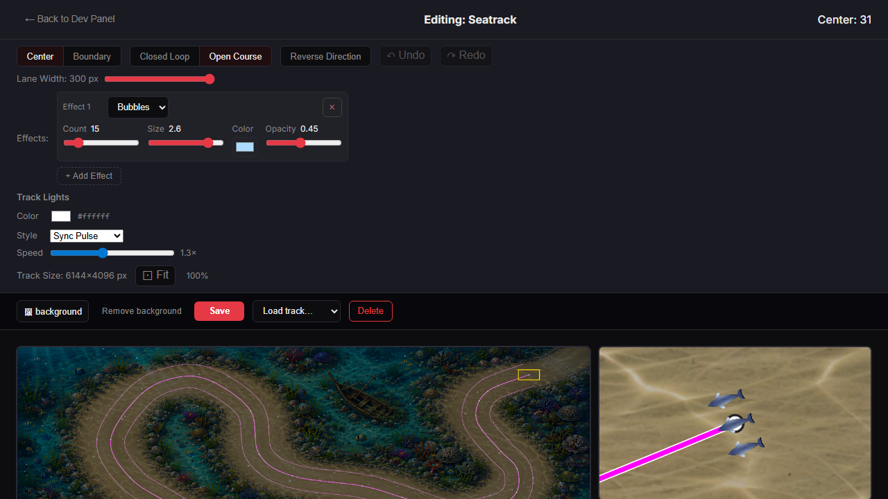
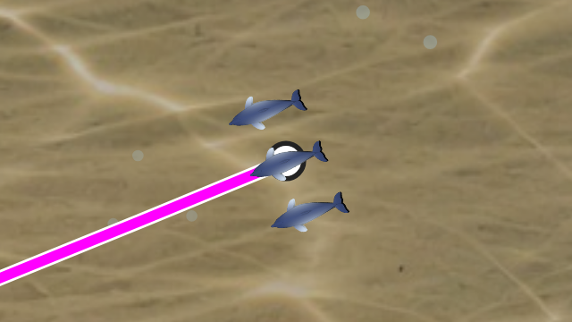
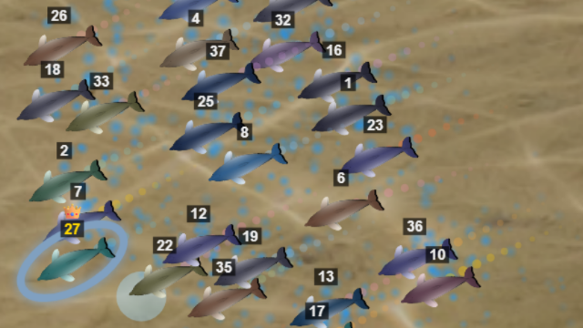
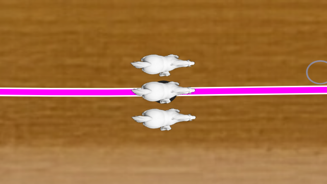
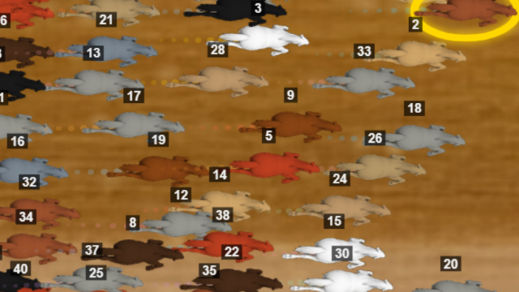
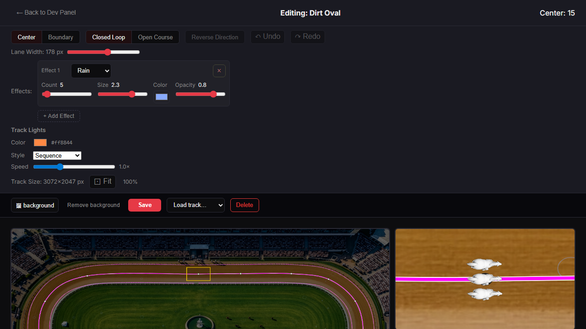

# PARTICLES-VISIBILITY-11 — reference points in the race-view panel

**Built 2026-09-29 on branch `fix/particles-visibility`, on top of PARTICLES-VISIBILITY-10 (`edb5ec2f`). Code commits
`e8bad085` and `3965dd2d`. Not merged: the owner looks first.**

**Owns:** the race-view panel's three reference points, and the measurement that its racers are drawn at race size.
Open row: [BACKLOG.md](../../docs/BACKLOG.md) PART ONE, *2026-09-28 — added (PARTICLES-VISIBILITY-1)*.

**The owner's observation of 2026-09-29:** the race-view panel from PARTICLES-VISIBILITY-10 showed only background and
effects. With no racer, no track and nothing else to compare against, size could not be judged.

---

## 0 · The answer

The panel now carries three reference points, all drawn by existing code:

1. **Track lines.** The main view's own lines and control points, drawn at the panel's zoom, so the course is visible.
2. **Three racers of the track's racer type**: dolphins on Seatrack, horses on Dirt Oval. They stand still side by side
   across the track at the panel centre, facing along it, in three neighbouring slots of the race's start row. They are
   sized exactly as the race sizes its racers at that zoom, and drawn by the racer type's own drawing, with no names or
   numbers.
3. **A thin yellow frame in the main view**, marking the area the panel shows. It moves whenever the panel recentres.

**MEASURED: the panel's racers are the race's size.** In the racing frames captured beside the panel, all 40 racers the
race drew had exactly the panel racers' drawn size:
- **dolphin on Seatrack: 100.09 × 100.09 screen px**, in the panel and in the race;
- **horse on Dirt Oval: 135.26 × 135.26 screen px**, in the panel and in the race.

That is the drawn sprite frame, measured on the canvas. The visible body is smaller than the frame, by the same amount
in both.

**Nothing the race runs on moved.** `engine-reach --check` places every changed file outside the engine hull. No
fingerprint can move, and none was minted.

---

## 1 · What each reference point reuses

### Track lines — the main view's own drawing

The main view drew background, darkening, lines and control points in one function, `drawStaticScene`
(`trackEditorDraw.js`). **The part above the background was split out unchanged as `drawTrackLines`.** `drawStaticScene`
now calls it, so the main view draws exactly what it drew before, and the panel calls it at its own zoom.

This touches `trackEditorDraw.js`, one file beyond the two the brief named. It was the only way to reuse the lines
without copying them.

Widths are in world units, as everywhere in that scene. At the racing zoom (2.8 screen px per world px) the centre line
is about 11 px wide and a control point about 20 px across, so the lines read heavier in the panel than in the main
view (§6).

### Racers — the race's own sizing and drawing

**Size.** The race derives a racer's drawing scale in two steps, and the panel calls the same two:
1. `deriveSpriteGeometry` (`client/src/modules/raceParams.js:85`), which `buildRaceCoreParams` calls with the track
   width × `startSpreadRange`, the field size and the auto-scale config;
2. `computeRenderDisplayScale` (`client/src/modules/autoSpriteScale.js:107`), which `renderRaceFrame.js` calls every
   frame with the X-axis zoom, the size ceiling and the readability floor.

The inputs are read the way the race reads them:
- `getRacerType`, with the owner's type overrides applied;
- `loadAutoScaleConfig`, `loadRaceBehaviorConfig` and `loadCameraConfig`;
- the `displaySize` pin from `KEYS.RACER_TYPE_OVERRIDES`.

The racer type follows Setup's own rule: the track's `defaultRacerTypeId`, else `horse` (`SetupScreen.jsx`).

**The field size is a choice, and it matters.** The race has no racer size of its own. It sizes every racer from the
field, packing the start grid across the track. At the racing zoom, with the shipped configs:

| field size | dolphin on Seatrack, body px | horse on Dirt Oval, body px |
| --- | --- | --- |
| 3 | 148 | 139 |
| 20 | 81 | 57 |
| **40** | **40** | **57** |
| 60 | 54 | 38 |

Three racers drawn at a three-racer race's size would be two to three times what the owner sees. **The panel sizes them
for a 40-racer field, his usual one: 28 of his 36 stored races on 2026-09-29.** The panel's caption says so. The editor
cannot know the field of the next race; the setup screen gets it from a one-shot hand-off or from racers entered there.

**Drawing.** Each racer is drawn by the type's own `drawRacer` (`SpriteRacerType.js:334`), the method the race's
`drawRacers` calls per racer. The panel calls it directly rather than through `drawRacers`, because `drawRacers` also
draws per-frame trail dots and the name tags, and the brief asked for neither.

**Before the sprite loads** (the decision rule): `drawRacer` itself draws the type's fallback, a disc of the drawn size in
the type's `fallbackColor`, and starts loading the sprite. The panel needs nothing of its own for this. Measured:
- on the first capture run, the Seatrack panel drew the fallback for its first 20 frames and the dolphin sprite from
  then on;
- on the final run, both panels drew sprites from the first frame.

**Placement.** The three racers stand in three neighbouring slots of the race's own start row, centred on the centre
line:
- the row size comes from `computeStartRowCount` (`rowLayout.js`), with the physical sprite size `deriveSpriteGeometry`
  gives, as `raceCore.js` does;
- the slots are spaced by `computeRowPhysicalY`'s even spread over ±`startSpreadRange`.

So they stand as close as the race stands them.

The first build put them a quarter of the corridor apart instead. On Seatrack's 300-px corridor that is 212 screen px
each way, so the outer two sat on the panel's edges. The second commit replaced it.

### The frame — the panel's own area

The rectangle is the panel's canvas (640×360) divided by its scales, around its centre. It is drawn in the main view's
world transform at a line width held at 1.5 screen px. It is drawn on both of the main view's draw paths (the static
draw and the effect loop), so it follows a recentre whether or not an effect is running.

---

## 2 · Layer order — the race's, checked in `renderRaceFrame.js`

The race draws:
1. its background;
2. the track effects;
3. its track markings (finish gate, lights, the open-track finish line);
4. dust and surface trails;
5. the racers.

**The brief listed track lines before effects.** The race draws its track markings AFTER the effects, and the brief also
said to follow the race. So the panel draws **background → effects → track lines → racers**. Effects are under racers in
the race, and so they are in the panel.

---

## 3 · Side by side — racer size and effect size, by eye

Each pair is the panel's own canvas next to the centre half of a racing frame from the real race, 1.5 s into racing,
rescaled from the displayed race to the same 640×360 canvas scale.

**Setup:**
- **Build:** the production build of a throwaway clone of `3965dd2d`, with a probe in `SpriteRacerType.js` only. It
  records each racer's drawn size on the canvas it is drawn on.
- **Tracks:** the owner's current stored tracks, copied read-only into a throwaway data directory: Seatrack bubbles
  36,000 per minute (level 15), size 2.6, opacity 0.45; Dirt Oval rain 200 (level 5).
- **Camera:** his 11 camera overrides.
- **The race:** built from his latest stored race `VY7KKE` (40 racers, seed 9, his world config). On Dirt Oval that is his
  race as stored; on Seatrack it is moved onto the track with the dolphin and its 60 s.

*Seatrack. Top: the panel, three dolphins across the course at the start, two bubbles visible at this instant. Bottom:
the race, dolphins of the same drawn size (MEASURED, §0), with their name tags and water trails.*

*Dirt Oval, rain at level 5, at the start/finish line. Top: the panel, three horses across the track in the default coat,
one rain ring at the right edge. Bottom: the race, horses of the same drawn size in their race coats.*

**The size comparison, MEASURED.** Screen px of the drawn sprite frame; "race" is every racer drawn in the frame just
before the capture.

| track | panel racers | race racers in the captured frame |
| --- | --- | --- |
| Seatrack | 3 dolphins, 100.09 × 100.09 | 40 dolphins, all 100.09 × 100.09 |
| Dirt Oval | 3 horses, 135.26 × 135.26 | 40 horses, all 135.26 × 135.26 |

The race's racers are this size **at the ordinary racing zoom**. Earlier in the recording, in the ceremony's other shots (wider and closer),
the same racers measured 80.6 and 29.7 px (dolphin) and 77.5 and 141.5 px (horse). The panel shows the racing shot's
size only, as it shows the racing shot's zoom (PARTICLES-VISIBILITY-10).

---

## 4 · Tests and sabotage

**New tests:**
- `raceView.test.js`:
  - the course point, direction and width at the centre;
  - three racers one slot apart across the course, facing along it;
  - the slot equals the race's own start-grid spacing (`computeStartRowCount`, `computeRowPhysicalY`);
  - the racer scale equals the race's two steps at three zooms, one of them with a size bound active;
  - the panel draws track lines and exactly three racers at the given scale, in the race's order;
  - no lines or racers when given none;
  - the frame is exactly the panel's world area at a 1.5 screen-px line.
- `TrackEditor.effects.test.jsx`:
  - the main view's frame is the panel's area, and follows a recentre with no effect running;
  - the same in the effect loop.

The Track Editor suites give 10 files and 150 tests, all passing. Each sabotage below was applied alone and restored:

| sabotage | red |
| --- | --- |
| no track lines in the panel | the lines/racers/order test |
| two racers instead of three | the same |
| racers drawn before the effects | the same |
| racer scale without the frame bounds | the racer-scale test |
| slot spacing off by one row | the slot test |
| frame width from the Y scale | the frame-area test |
| frame not redrawn on a recentre (static path) | the static frame test |

**One sabotage passed at first, and it was a gap in the test, not a finding.** "Racer scale without the frame bounds" did
not go red, because at the owner's racing zoom neither bound applies, so the two scales are equal. The test now checks
three zooms and asserts that a bound is active in at least one. The sabotage then went red.

**Fingerprints:** none expected, and none can move. `node scripts/engine-reach.mjs --check` with every changed path
passed explicitly (eight paths for the first commit, three for the second) reports each outside the hull.
**`npm run verify -- --premerge`, on the final tree (code and these documents): PASS 32, FAIL 0, SKIP 4.** The four
skipped guards are the camera and render fingerprints, `check-container-paths` and `check-seed-versions`, all *nothing
changed* in their import closure.

---

## 5 · Files, lines before → after (from `edb5ec2f`)

| file | lines | what |
| --- | --- | --- |
| `client/src/screens/TrackEditor/raceView.js` | 111 → 323 | The racer scale, the start-row slot, the course at the centre, the placements, the frame area and its draw, and the lines and racers in `drawRaceView`. Header extended; inline comments at each addition. |
| `client/src/screens/TrackEditor/TrackEditor.jsx` | 1,268 → 1,345 | The panel's lines, racer type, sizing and placements, computed with its zoom (moved above the main render effect, which now also depends on the panel's centre and zoom); the frame on both main-view draw paths; the caption names the field size. |
| `client/src/screens/TrackEditor/trackEditorDraw.js` | 177 → 190 | `drawTrackLines` split out of `drawStaticScene`, unchanged; header extended. |
| `client/src/screens/TrackEditor/raceView.test.js` | 168 → 390 | The unit tests above. |
| `client/src/screens/TrackEditor/TrackEditor.effects.test.jsx` | 707 → 785 | The frame tests. The effect item's arc now has a distinctive radius, because the panel also draws track points and racers. The tracking context records rectangles. |
| `TrackEditor.{loadmode,shortcuts,trackLights}.test.jsx` | +3 each (477→480, 117→120, 292→295) | Their 2D-context stubs gain `strokeRect` and `rotate`. The effects test's stub gained the same (counted in its row). |

---

## 6 · Noticed, and left

- **The racer size depends on the field size, and the panel assumes 40.** For a different field the panel is off by the
  table in §1: at 20 racers the dolphin is twice the size. A field-size control on the panel would fix that, and is the
  owner's call.
- **The editor's lines are heavy at race zoom.** The main view's line widths are in world units, so at 2.8× they are
  about 11 px, and a control point is a 20-px white disc under the middle racer. Holding them at a screen width would
  change `drawTrackLines` for the main view too, which the brief ruled out.
- **The panel's racers wear the type's default coat.** The race gives each racer its own coat. That changes nothing about
  size, but the panel's horses are all white.
- **The corridor edges (the dashed lines) are outside the panel on a 300-px track at this zoom.** The corridor is
  847 screen px across, more than the panel's 360-px height. The centre line and the racers show the course.
- **No finish gate, lights, trails or name tags are drawn in the panel.** The brief asked for track lines and racers; the
  race's own markings would be a further addition.
- **The throwaway clone was reused for both capture runs** and is deleted with its data (see the commit that carries this
  report).
