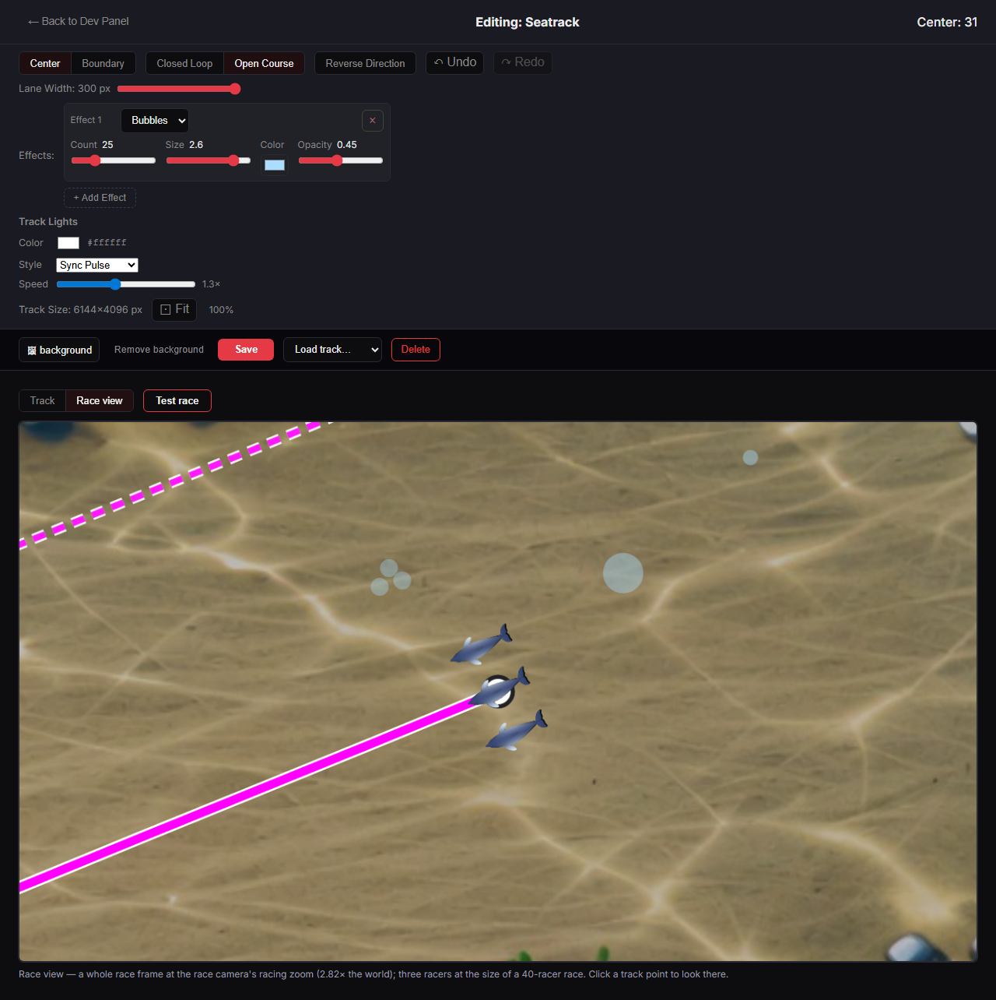
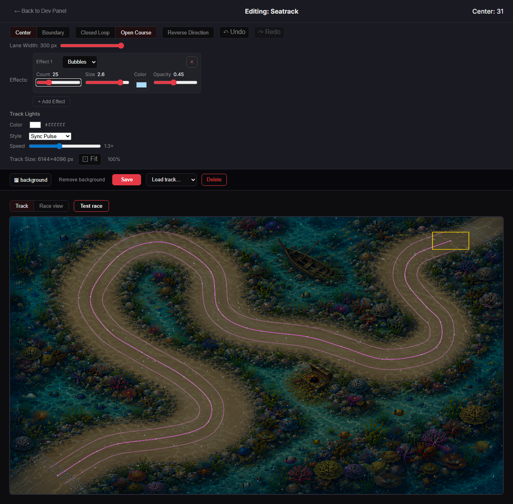
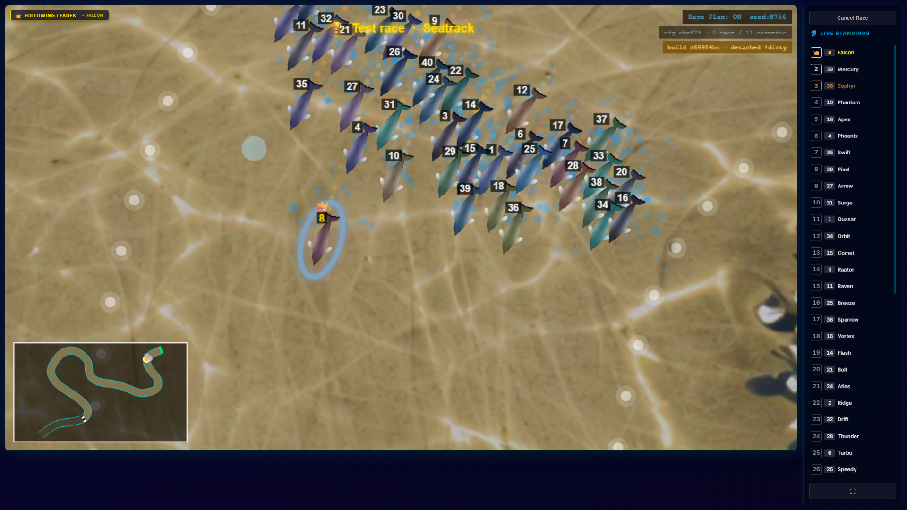
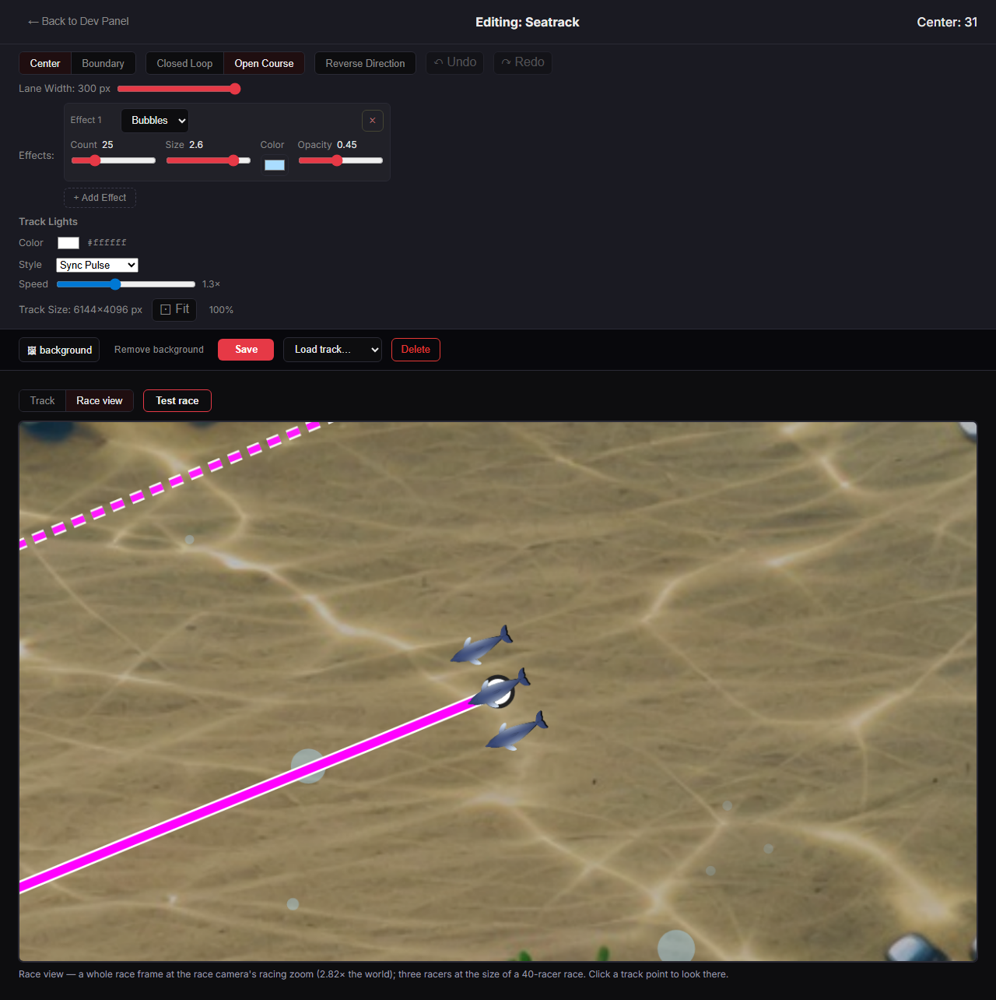

# PARTICLES-VISIBILITY-12 — a large race view and a test race in the Track Editor

**Built 2026-09-30 on branch `fix/particles-visibility`, on top of PARTICLES-VISIBILITY-11 (`ffa5061e`). Code commits
`d69984bc` and `2a6b366b`. Not merged: the owner looks first.**

**Owns:** the Track Editor's view switch, its test race, and the proof that a test race stores nothing. Open row:
[BACKLOG.md](../../docs/BACKLOG.md) PART ONE, *2026-09-28 — added (PARTICLES-VISIBILITY-1)*.

**The owner's decisions of 2026-09-29:**
- the editor gets two switchable views and a "Test race" button;
- a test race uses the editor's current, unsaved settings, and nothing is stored until he presses Save;
- the test race's field is 40 racers of the track's own racer type;
- the test race has the track's normal length.

---

## 0 · The answer

- **Two views, switched: "Track" and "Race view".**
  - The track view is the whole-track view as before, for drawing and editing points.
  - The race view is a whole 1280×720 race frame at the race camera's racing zoom, across the full editor width, with
    the track lines, the three reference racers and the effects. A click on a track point in it recentres it.
  - The small panel beside the track view is gone.
- **"Test race" starts a real race** on the track in the normal race screen, with the same camera, racers, coats, trails
  and labels as any race, using the editor's **unsaved** effect settings.
  - The field is 40 racers of the track's racer type; the length is the track's own.
  - When the race finishes, or is cancelled, the editor comes back exactly as it was.
- **Nothing is stored. MEASURED**, in the production build, with a control that shows the check can see a write (§3).
  After a test race to its end:
  - the stored track file is byte-identical;
  - the local race history is empty;
  - the server holds no race record;
  - no result was handed on.

  With the test race's two protections removed, the same flow wrote one history entry and one server race.
- **Nothing moved.** `check-fingerprints --mint` verified all four fingerprint roles against the engine, and none
  moved. `verify --premerge` passed (§5).

---

## 1 · Part 1 — two views

The switch sits above the view: "Track" and "Race view", in the editor's own toggle style, with the "Test race" button
next to it.

- **Both canvases stay mounted and drawn;** only one is shown (`TrackEditor.jsx:1456`, `:1471`). Switching therefore
  loses nothing, and the preview loop from PARTICLES-VISIBILITY-9 still advances the effects once per frame for both.
- **The race view is now a whole race frame, 1280×720 at the race canvas's own pixel scale.** An item or a racer is
  exactly as many canvas pixels across as in the race, and the full frame shows what the race's frame shows. The 640×360
  centre-half crop of the small panel is gone, along with the side-by-side layout.
- **Recentring.** In the race view, a click on a track point recentres it. The click is turned back into world units
  through the race view's own transform (`handleRaceViewClick`, `TrackEditor.jsx:918`). A click on a point in the track
  view still recentres it too, and the track view still frames the race view's area in yellow.
- **Editing controls and saving are unchanged.**

---

## 2 · Part 2 — the test race

**The decision rule held: the race path can take unsaved effects without writing them anywhere.** A race is handed to the
race screen in `sessionStorage.activeRace`, the tab-scoped hand-off every race uses, and the effects can travel in it.
Part 2 was therefore built.

**It is Quick Test's race, by Quick Test's code.**
- The part of `handleQuickTest` that turns a track, a field and a racer type into a race payload was moved, unchanged
  and with its comments, into `SetupScreen/quickTestRace.js` (`buildQuickTestRace`).
- Setup calls it where the code was (`SetupScreen.jsx:1034`), and the test race calls it too
  (`TrackEditor/testRace.js:63`, `buildTestRace`).
- Setup keeps what is its own: the geometry and capacity refusals, the racer-type selector and the name filling.
- The Setup suites pass unchanged (156 tests).

**What the test race adds to Quick Test's payload:**
- 40 racers named from the default name set;
- the track's `defaultRacerTypeId`, else horse (Setup's rule);
- a freshly drawn seed;
- `eventName: 'Test race'`;
- `testRace: { effects }`, the editor's unsaved effects.

Its `raceSource` stays Quick Test's `quick-test`, the value that already means "not a real race", so even a copy of it
that were recorded could never count as one.

**The race screen**, two changes, both effective only for a test race:
- It draws the carried effects instead of the stored track's (`RaceScreen/index.jsx:486`).
- It hands no result on (`:1234`) and returns to the Track Editor:
  - from the finish, whether it advances by itself or on a click (`:1292`, `:2031`);
  - from Cancel (`:1948`).

  It therefore never reaches the result screen, which is where a race is recorded (`recordFinishedRace`).

The return route lives in an import-free module (`testRaceRoute.js`), so the race screen reaches nothing else of the
editor's or Setup's.

**Blocked, with the reason shown next to the button:**
- the track has never been saved: a test race runs the saved track;
- a newly uploaded background waits for Save: a browser `File` cannot survive the page change;
- the host's field cap is below 40: Quick Test refuses there too.

**What the test race runs, measured in the browser** (Seatrack, the bubbles slider moved from level 15 to 25 and not
saved):

| | payload |
| --- | --- |
| racers | 40 |
| racer type | dolphin (Seatrack's own) |
| length | 60 s, Seatrack's own (open track) |
| effects | bubbles 60,000 per minute (level 25), size 2.6, opacity 0.45 — the unsaved values |
| raceSource | quick-test |

*The test race, 21 s after the start: "Test race · Seatrack", the owner's 11 camera settings in effect ("0 race / 11
cosmetic"), 40 dolphins, and the bubbles at the unsaved level 25.*

**One thing the test race does not run: unsaved point edits.** The race runs the stored geometry, as every race does. The
test race tests the effects, as the brief asks.

---

## 3 · Part 3 — nothing is stored, and the editor comes back as it was

**How the state travels.**
- `handleTestRace` (`TrackEditor.jsx:881`) hands the editor's state to `startTestRace` (`testRace.js:95`). That writes
  exactly two sessionStorage keys, `activeRace` and `trackEditorTestRaceReturn`, and goes to `/race`.
- The carried state is:
  - the undo history's own snapshot (points, width, mode, name, background, effects, lights);
  - the loaded track's ids;
  - the dirty flag;
  - the viewport (world size, zoom, pan);
  - the view and the race-view centre.
- On return, the editor reads it in a state initializer **without removing it** (`TrackEditor.jsx:166`,
  `peekEditorReturn`, `testRace.js:105`), because an initializer may run twice. A mount effect then applies it and
  removes it (`TrackEditor.jsx:404-415`), using `applySnapshot` and a new `restoreViewport` (`useViewport.js:134`).
- The draft offer ("An unsaved track … was found") does not fire over a returning state (`TrackEditor.jsx:367`).

**The proof, MEASURED** in the production build of a throwaway clone of `d69984bc`, with throwaway data holding a copy of
the owner's Seatrack and his camera settings. The flow was: load Seatrack; move the bubbles amount up without saving;
switch to the race view; start a test race; let it run to its end, where it hands back by itself.

| | before | after the test race |
| --- | --- | --- |
| stored track file (sha256) | `8b05ee77…10645d5` | `8b05ee77…10645d5` — **identical** |
| local race history (`racearena:raceHistory`) | none | **none** |
| server races (`races.sqlite` in the data dir) | no database | **no database** — never written |
| result hand-off (`raceResults`) | — | **none** |
| carried editor state left behind | — | **none** (removed on return) |

| back in the editor | |
| --- | --- |
| route | `/track-editor` |
| view | Race view (as left) |
| bubbles amount | Count 25 — the unsaved value |
| track | Editing: Seatrack |
| dirty flag | leaving asks "You have unsaved changes. Leave anyway?" |

**The control, MEASURED.** The same flow on a build with the two protections removed (the finish returns to `/results`
and the result is handed on). The test race then went to `/results` and wrote:
- **1** local history entry;
- **1** server race row (the database was created);
- the result hand-off.

The "none" in the table above is therefore a check that can see a write, not an absence it could not detect.

---

## 4 · Tests and sabotage

**New tests:**
- `TrackEditor/testRace.test.js`:
  - the payload on a closed and an open track: 40 racers, the track's type, the unsaved effects, and Quick Test's own
    race otherwise;
  - the track's own length;
  - horses when the track names no type;
  - the four blocked cases;
  - the start writes the two session hand-offs and nothing in localStorage;
  - reading back does not remove the state, clearing does.
- `RaceScreen/testRace.test.jsx`:
  - a test race draws its carried effects (bubbles), not the stored track's (rain);
  - a cancelled test race returns to the Track Editor and hands no result on;
  - both with the ordinary race as the control (rain; back to Setup).
- `TrackEditor.effects.test.jsx`:
  - the switch shows one view at a time;
  - back from a test race, the carried view, effects, name and race-view centre are restored, the carried state is
    removed, and no draft is offered, even with a draft in storage.

The Track Editor, race screen and Setup suites give 57 files and 745 tests, all passing twice in a row. One earlier run,
started from the repository root with `--prefix`/`--root`, reported a single failure that did not recur in two runs
from `client/`. It is recorded here as not reproduced.

**Each sabotage below was applied alone and restored; all went red:**

| sabotage | red |
| --- | --- |
| the switch always shows the race view | the switch test |
| the payload does not carry the effects | 3 — payload and start tests |
| the race ignores the carried effects | the race-screen effects test |
| 39 racers | 2 — payload tests |
| always horses | the payload test |
| one lap more than the track's | 3 — payload and length tests |
| the start writes localStorage | the start test |
| the snapshot is not restored | the round-trip test |
| a draft is offered over the carried state | the round-trip test |
| **the finish records a test race** (in the browser) | the control above: 1 history entry, 1 server race |

The last one is sabotaged in the browser, not in jsdom, because a race cannot be run to its finish in a unit test.

---

## 5 · Fingerprints and verify

**Engine reach.** `node scripts/engine-reach.mjs --check` with every changed path passed explicitly reported **2 of 13
paths can change the race**: `RaceScreen/index.jsx`, deliberately (the effect source and the exits), and the one-line
route module it imports.

A first version imported the route from `testRace.js`, which pulled the Quick Test builder and the Setup modules into
the race screen's import graph. The route was moved into its own import-free module to keep that out.

**Mint tripwire.** Because the race screen is in the hull, the fingerprints were checked. `node
scripts/check-fingerprints.mjs --mint`, which verifies and writes nothing, reported *4 role(s) re-minted against the
engine*, exit 0, and left the tree clean. **No fingerprint moved.** Nothing was minted or recorded.

**`npm run verify -- --premerge`, on the final tree: PASS 32, FAIL 0, SKIP 4 (third run).**
- The world fingerprint ran and passed.
- The camera and render fingerprints, `check-container-paths` and `check-seed-versions` were skipped, all *nothing
  changed* in their import closure; `check-fingerprints --mint` above had verified all four roles anyway.

The three runs, all recorded:
- **First run:** failed `engine-reach-doc`, `ceremony-counts` and `script-suite`, for the regeneration described below.
- **Second run:** failed only `script-suite`, on `scripts/fingerprint-default.test.mjs` ("the same flag AFTER a label is
  accepted and reaches the sim": the spawned script's output came back empty). Alone, that test passed twice, 4 of 4.
  Nothing in this work touches the script it spawns.
- **Third run:** passed.

That one failure is recorded as a failure under the suite's parallel load that did not recur. It is NOT PROVEN to be
unrelated beyond that.

The new route module is one more file in the race hull (the closure is now 204), so the generated blocks were
regenerated: `docs/SIM.md` (`node scripts/gen-engine-reach-doc.mjs`) and the counts in `docs/SHIP-CEREMONY.md`
(`node scripts/gen-ceremony-costs.mjs --counts`). The first verify run caught this (`engine-reach-doc`, `ceremony-counts`
and `script-suite` red).

The commit hook caught six line citations in `docs/FORCE-MAP.md` and `docs/branding.md` that the code change had moved
(Rule F). They were repaired in the same commit.

---

## 6 · Files, lines before → after (from `ffa5061e`)

| file | lines | what |
| --- | --- | --- |
| `client/src/screens/TrackEditor/TrackEditor.jsx` | 1,345 → 1,490 | The view state and switch; the test race (blocked reason, hand-over); the restore; the race view's click. The small panel's layout is gone. Header rewritten. |
| `client/src/screens/TrackEditor/TrackEditor.module.css` | 377 → 404 | The column layout, the view bar and the button; the race view full width. The side-by-side row is gone. |
| `client/src/screens/TrackEditor/raceView.js` | 323 → 323 | The race view is a whole race frame (the crop's two constants and their comment). |
| `client/src/screens/TrackEditor/useViewport.js` | 147 → 161 | `restoreViewport`. |
| `client/src/screens/TrackEditor/testRace.js` | new, 117 | The test race's payload, blocked reasons, hand-over and the carried state. |
| `client/src/screens/TrackEditor/testRaceRoute.js` | new, 11 | The return route, import-free. |
| `client/src/screens/SetupScreen/quickTestRace.js` | new, 106 | Quick Test's payload builder, moved out of SetupScreen.jsx unchanged. |
| `client/src/screens/SetupScreen/SetupScreen.jsx` | 1,850 → 1,806 | `handleQuickTest` calls the builder. |
| `client/src/screens/RaceScreen/index.jsx` | 2,147 → 2,163 | A test race's effect source, exits and skipped result hand-off. |
| `client/src/screens/TrackEditor/testRace.test.js` | new, 145 | Unit tests. |
| `client/src/screens/RaceScreen/testRace.test.jsx` | new, 154 | Race-screen tests. |
| `client/src/screens/TrackEditor/TrackEditor.effects.test.jsx` | 785 → 878 | The switch and round-trip tests. |
| `client/src/screens/TrackEditor/raceView.test.js` | 390 → 392 | The frame-area test reads the constants instead of the crop's numbers. |
| `docs/FORCE-MAP.md`, `docs/branding.md` | unchanged length | Six line citations moved with the code. |
| `docs/SIM.md`, `docs/SHIP-CEREMONY.md` | generated blocks only | Regenerated for the one new hull file. |

**Reused, not copied:**
- Quick Test's race builder;
- the `activeRace` hand-off and the /race route;
- the race screen;
- the undo history's `getSnapshot` and `applySnapshot`;
- the race view from PARTICLES-VISIBILITY-10/11;
- Setup's racer-type rule and field cap (`fieldCapFor`);
- Quick Test's seed resolution (`resolveQuickTestSeed`).

---

## 7 · Noticed, and left

- **Unsaved point edits are not in a test race.** The race runs the stored geometry. Racing the unsaved track as well
  would carry the geometry in the payload too, and that is a further decision.
- **The draft prompt the owner reported (2026-09-29) is not addressed here.** It is outside this brief. What is visible
  from this work:
  - after loading a track, the editor clears `?load=` from the address, so the draft key it writes under becomes the
    new-track key;
  - that would explain why the prompt comes back whether or not he saved.

  NOT PROVEN, and not changed.
- **A test race draws a fresh seed each time**, like Quick Test with an empty seed field, so two test races are two
  different races.
- **`loadCameraConfig` may prune stored camera keys equal to their defaults** whenever the editor or a race loads it. It
  did so before this work. A test race adds nothing to it.
- **The throwaway clone and its data** are deleted with the commit that carries this report.
