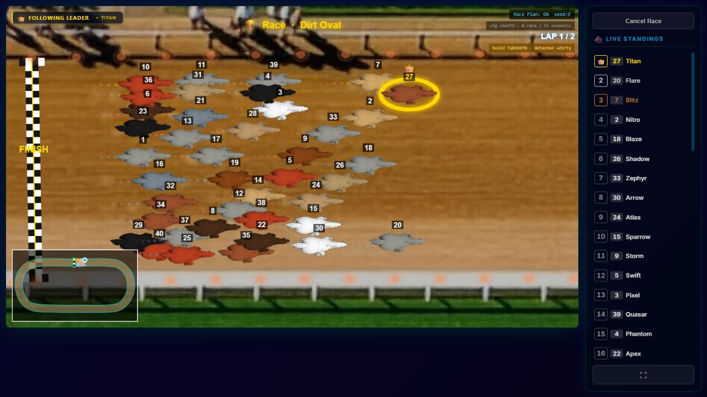
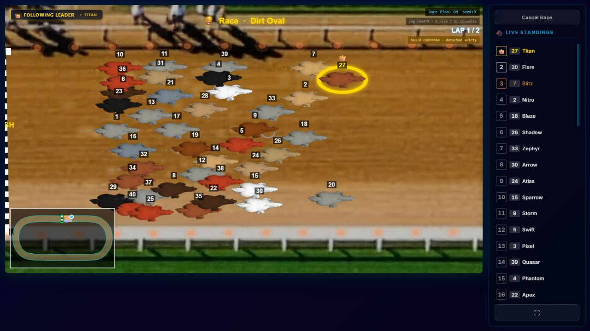
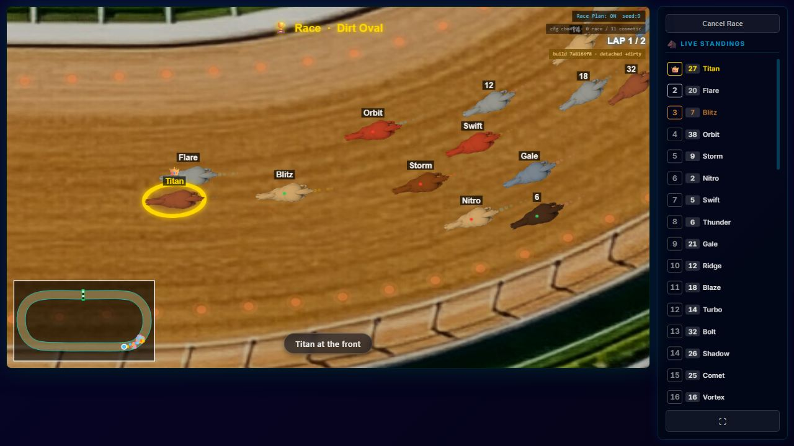
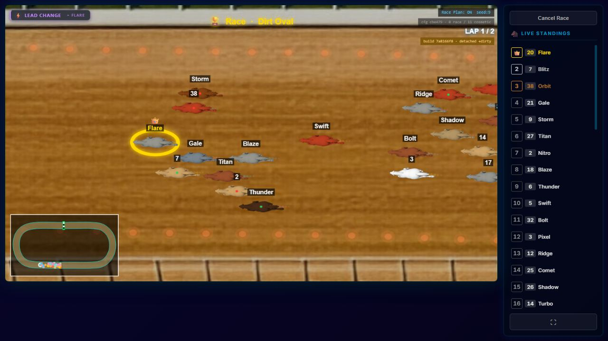
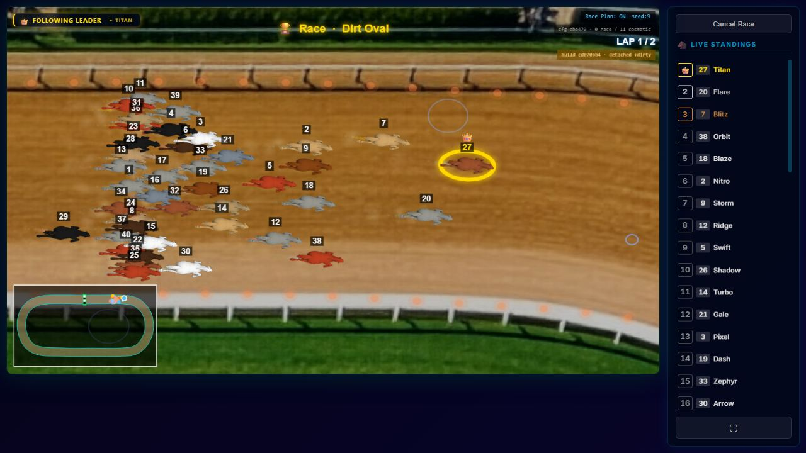
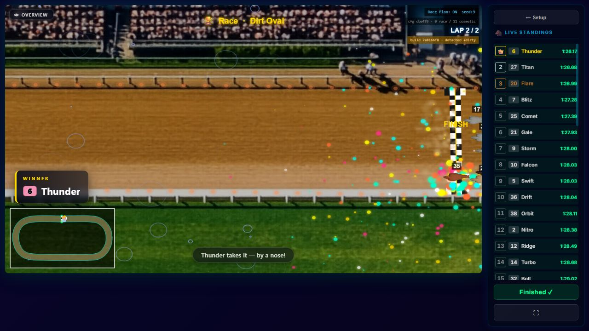
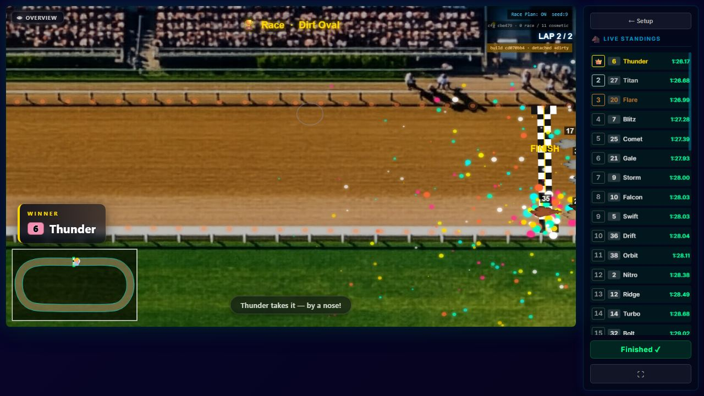

# PARTICLES-VISIBILITY-2 — dust culling, finished racers' dust, and track effects over the whole track

**Built and measured 2026-09-28 on branch `fix/particles-visibility`. Code commit `cd070bb4`, on top of
PARTICLES-VISIBILITY-1 (`c38fe4bf`). Not merged: the owner looks first.**

**Owns:** the three fixes and their before/after measurement on the owner's race `VY7KKE`. The diagnosis is
[PARTICLES-VISIBILITY-1](PARTICLES-VISIBILITY-1.md). The open row is [BACKLOG.md](../../docs/BACKLOG.md) PART ONE,
*2026-09-28 — added (PARTICLES-VISIBILITY-1)*.

**The owner's decisions of 2026-09-28, recorded as facts:**
- Rain must fall over the whole track, and its amount stays his to set per track.
- The finish burst stays exactly as it is; he has no complaint about it.
- The world-placement fix is extended from rain to **every** track effect.

---

## 0 · Before and after, on his race

| | before (`7a8166f8`) | after (`cd070bb4`) |
| --- | --- | --- |
| On-screen dust actually drawn, camera on the **bottom** straight side | **9.3%** (1,486 frames) | **100.0%** (1,532 frames) |
| On-screen dust actually drawn, camera on the **top** straight side | 90.8% (2,184 frames) | **100.0%** (2,237 frames) |
| Racing frames with at least one rain ring on screen | **26.8%** (1,302 of 4,855) | **87.2%** (4,326 of 4,962) |
| Frames with dust alive more than 1 s after its racer finished | **674** of 729 (max 124 particles) | **0** of 744 |
| Rain rings on screen when there are any, median | 19 (camera in the old corner) | 2–4 (anywhere) |

Both arms replayed `VY7KKE` with his 11 camera overrides. Both matched the stored race **40 of 40 in finishing
order and 40 of 40 in finishing time**, so the race did not move. The last row is the price of the rain
fix, and his decision to own: **the same rain setting is now spread over a world 6.8× the old area, so each
screen holds fewer rings.** The same applies to every effect on every track, and more strongly on the open
tracks (§6).

---

## 1 · The brief's readings, checked at source

| reading | at source | verdict |
| --- | --- | --- |
| `cullBounds` (~:54) keeps only `a`; `isVisible` (~:63-68) uses it for Y | `spriteHelpers.js:54-57` and `:63-70` | **right** |
| `renderRaceFrame.js` (~:158) scales X and Y differently | `renderRaceFrame.js:158`, `ctx.scale(cam.zoom * bsX, cam.zoom * bsY)` | **right** |
| the segment test has the same defect | `isSegmentVisible`, `spriteHelpers.js:73-82`: `m`, `sy1`, `sy2` all used `ez` | **right, changed** |
| spawn AND update sit inside `if (!r.finished)` (~:1469) | `index.jsx:1469-1477` | **right, and incomplete:** the FINISHED branch (`:1517-1534`) advanced no dust at all, so everyone's dust also froze after the last crossing. The fix covers both. |
| effects created with the screen canvas (~:479), drawn inside the world transform (~:161-165) | `index.jsx:479`; `renderRaceFrame.js:161-165` | **right** |
| rain drop positions ~:31-32 | `rain.js:33-34` | **right, lines off by two** |

**Cull helpers changed:** `cullBounds`, `isVisible` and `isSegmentVisible`, which is all three in the file.
`createBlobSprite` does no culling. `cloud.js` and `splash.js` (through `isVisible`) and `line.js` (through
`isSegmentVisible`) inherit the fix unchanged. The grass `particle` generator does not cull.

---

## 2 · The three fixes

1. **Cull with both axis scales** (`client/src/modules/surface-effects/generators/spriteHelpers.js`).
   `cullBounds` returns `sx` (the transform's `a`) and `sy` (its `d`). `isVisible` and `isSegmentVisible` test
   and pad each axis with its own scale. The field `ez` is gone; nothing else read it.
2. **A finished racer's dust keeps fading until it is gone** (new `client/src/screens/RaceScreen/racerDust.js`,
   called from `client/src/screens/RaceScreen/index.jsx` in both the RACING and the FINISHED branch). Only the
   spawn is gated on `r.finished`; the surface `update` and the fallback pool's advance run for everyone. The
   spawn/advance code was **moved, not rewritten**. It had to move because it is now needed in two branches,
   and a second copy would be two homes for one rule. Nothing else about finished racers changes: the burst
   code beside it is untouched.
3. **Track effects placed over the world** (all seven in `client/src/modules/track-effects/effects/`). Decision
   rule applied: *pass the world size through the existing create path.* `create(canvas, config)` gained an
   optional third argument, `world`. `index.jsx:477-485` passes `{ width: worldWidth, height: worldHeight }`, and
   each effect does `const { width, height } = world ?? canvas`. That one line feeds placement and the edge
   rules too: dust's wrap and fireflies' clamp now use the world. **The track editor** (`TrackEditor.jsx:503`)
   draws effects in **screen** space, after restoring its world transform, so it passes nothing and keeps the
   canvas, which is correct there. No setting changes meaning and no default changes: every `count` is still
   "per second", "per minute" or "items" (§6) over the area the effect is drawn in.

---

## 3 · Tests — red on the old code, green now

| test file | what it holds | old code / sabotage |
| --- | --- | --- |
| `client/src/modules/surface-effects/__tests__/spriteHelpers.cull.test.js` (8 tests) | a 2:1 transform; a particle at screen y 80 is kept, one at 150 is culled; x still uses the x scale; radius padded per axis; same for segments | run against `spriteHelpers.js` from `HEAD` (the old file): **4 red** (the four y-scale tests) |
| `client/src/modules/track-effects/effects/worldPlacement.test.js` (14 tests) | each of the seven effects, given a 3000×2000 world and a 100×60 canvas, draws past half the world in x and y and stays within its bounds; without a world (the editor) it stays on the canvas | run against all seven effects from `HEAD`: **7 red** (every "whole world" test); the seven editor tests stay green, as they should |
| `client/src/screens/RaceScreen/racerDust.test.js` (4 tests) | a finished racer spawns nothing; its dust gets fainter every step and is gone within its lifetime; the fallback pool fades out and gets no new dust from a finished racer | the function is new, so the old code cannot run it. **Sabotage** that puts the old gate back (`if (!r.finished)` on the update): **1 red**, the fade-out test |

After each run the files were restored and the working diff checked byte-identical. Neighbouring suites:
surface-effects, track-effects and the new dust test, **184 of 184 green**.

---

## 4 · Fingerprints — none moved, and one cannot see this change at all

- **Hull check:** `node scripts/engine-reach.mjs --check` with all 13 changed paths passed explicitly
  reported **3 of 13 can change the race**: `spriteHelpers.js`, `RaceScreen/index.jsx` and `racerDust.js`. This
  is reach by import closure. It is conservative by design and does not say that they do change the race.
- **Minted against the engine:** `node scripts/check-fingerprints.mjs --mint` re-ran all **4** roles (`world`,
  `camera`, `render`, `world-off`) on the changed tree. **All 4 identical to `docs/fingerprints.json`.** Nothing
  moved, so no round-trip was needed and nothing was re-minted.
- **The render fingerprint is structurally blind to all three fixes.** Its harness passes **`effects: []`**
  (`scripts/render-fingerprint.mjs:466`), never attaches a surface emitter, and has empty particle buffers.
  Its own header lists particles and surface trails as not exercised. Its unchanged value proves nothing here.
  **The unit tests above are the only guard.**

---

## 5 · The measurement

Production build of a measurement clone, one per arm (`7a8166f8` and `cd070bb4`), each with the **same**
probe. Its hook points exist unchanged in both versions. Run in headless Chromium at 1280×720 on the
production arm's own port (4599), with a fresh data directory per arm. `VY7KKE` was replayed through the
setup screen's identifier door, from its record read **read-only** from the owner's `races.sqlite`,
with his 11 camera overrides written into the browser's camera store. Every rendered frame was sampled.

### 5a · Dust — share of the on-screen dust that is actually drawn (RACING frames)

"On screen" means the particle's circle touches the canvas under the frame's real transform, with both scales.
"Drawn" means it passed the cull and was blitted. Particle-frames are the sum over frames of on-screen particles.

| camera centre, world Y | before: frames · particle-frames · drawn | after: frames · particle-frames · drawn |
| --- | --- | --- |
| 0–700 (top straight side) | 2,184 · 150,457 · **90.8%** | 2,237 · 138,109 · **100.0%** |
| 700–1100 | 618 · 24,525 · **45.1%** | 609 · 23,551 · **100.0%** |
| 1100–1400 | 566 · 20,800 · **21.8%** | 563 · 21,181 · **100.0%** |
| 1400–2100 (bottom straight side) | 1,486 · 87,982 · **9.3%** | 1,532 · 95,879 · **100.0%** |

### 5b · Rain — rings on screen by where the camera looks (RACING frames)

| camera centre | before: frames with ≥1 ring · median (p90) rings | after: frames with ≥1 ring · median (p90) rings |
| --- | --- | --- |
| inside the old 1280×720 corner | 953 / 953 (**100.0%**) · 19 (56) | 914 / 996 (**91.8%**) · 4 (15) |
| anywhere else on the track | 349 / 3,902 (**8.9%**) · 0 (0) | 3,412 / 3,966 (**86.0%**) · 2 (5) |
| whole race | 1,302 / 4,855 (**26.8%**) · 0 (20) | 4,326 / 4,962 (**87.2%**) · 2 (7) |

The spawn area read back from the live effect: before `1280 × 720`, after **`3072 × 2047`**. Drops alive per
frame, median: **102 before and 102 after** (N = 5,949 / 6,125 frames). The same rate, spread over the whole
world, which is why the per-screen count fell.

### 5c · Dust after a racer finishes

| | before | after |
| --- | --- | --- |
| RACING frames after the first crossing with any particle more than 1 s past its racer's finish | 355 of 410 (max 99) | **0 of 420** |
| FINISHED frames (after the last crossing) with any such particle | 319 of 319 (max 124) | **0 of 324** |
| dust alive in the last FINISHED frame | 124 | **0** |

### 5d · Screenshots — the same race, the same moments

| moment | before | after |
| --- | --- | --- |
| just after the start (top straight) |  67 on screen, 50 drawn |  105 on screen, 105 drawn |
| wide shot, right turn / bottom |  39 on screen, **3 drawn**, 0 rings |  36 on screen, **36 drawn**, 1 ring |
| follow shot, bottom straight |  61 on screen, **0 drawn**, 0 rings |  53 on screen, **53 drawn**, a ring bottom right |
| rain away from the old corner | no frame met this condition (≥4 rings with the camera centre right of world x 1500) |  camera on the top straight's right half, 4 rings |
| after the last crossing |  124 dust particles standing, 99 of them >1 s stale |  4 left, none stale |

The dust is still **faint**: colour, size, alpha and contrast were deliberately not touched. The measured
contrast ratio of about 1.3 (PARTICLES-VISIBILITY-1 §6) is unchanged, and it is his eye's question.

---

## 6 · Track effects on every track, and where their amounts are set

**Which effects are on, read from the stored track data** (`server/data/tracks/*.json`, the running API's data
directory on the owner's machine, read 2026-09-28; the race reads `geometry.effects` through `extractEffects`,
`client/src/screens/TrackEditor/trackEditorSave.js:135-144`). **This directory is not in git** (`.gitignore:29`,
`server/data/**`). The paths below are his live data, not repository files, and a clone does not have them:

| track | effects switched on | amount setting today | source | world vs old canvas area |
| --- | --- | --- | --- | --- |
| City Circuit | none | — | `server/data/tracks/city-circuit.json:1698` | — |
| **Dirt Oval** | **rain** | **count 200** (drops per second) | `server/data/tracks/dirt-oval.json:1697` | 3072×2047: **6.8×** |
| Garden Path | none | — | `server/data/tracks/garden-path.json:1694` | — |
| Ice Track | none | — | `server/data/tracks/ice-track.json:1699` | — |
| Luger hill | none | — | `server/data/tracks/luger-hill.json:1726` | — |
| Mountainstreet | none | — | `server/data/tracks/mountainstreet.json:1777` | — |
| River Run | none | — | `server/data/tracks/river-run.json:1718` | — |
| Searound | none | — | `server/data/tracks/searound.json:1721` | — |
| **Seatrack** | **bubbles** | **count 100** (bubbles per minute; **the slider's maximum**) | `server/data/tracks/seatrack.json:1753` | 6144×4096: **27.3×** |
| **Space Sprint** | **stars** | **count 360** (stars on the track at once) | `server/data/tracks/space-sprint.json:1766` | 6000×4000: **26.0×** |

No track uses the legacy single-effect fields (`effectId` / `effectConfig`, read at
`client/src/modules/track-editor/trackStorage.js:149`). The last column is how much larger the area each
effect now covers is than the 1280×720 corner it covered before. At an unchanged setting, each screen holds
about that factor less. **Only Dirt Oval was measured in the browser** (§5). Seatrack and Space Sprint are
open tracks and were not replayed.

**Where the owner sets an effect's amount for a track, and what the number means.** All seven are set in the same
place: **Track Editor → the toolbar's _Effects:_ row** (`client/src/screens/TrackEditor/TrackEditorToolbar.jsx:126-129`,
up to three effects per track). Pick the effect in its dropdown (`client/src/components/EffectConfig/EffectConfig.jsx:96-102`),
then set the **Count** slider (`EffectConfig.jsx:44-56`), and save the track. The slider's range is the
effect's own schema line:

- **Rain** — a **rate: drops per second** (`rain.js:30`, `1 / count`). Count slider 50–500 (`rain.js:9`).
  **Dirt Oval today: 200, at `server/data/tracks/dirt-oval.json:1697`.** At the same setting it shows about 6.8×
  fewer rings per screen than before, but in every part of the track.
- **Bubbles** — a **rate: bubbles per minute** (`bubbles.js:29`, `60 / count`). Count slider 10–100 (`bubbles.js:9`).
  **Seatrack is already at 100, the maximum**, so the owner cannot raise it to compensate. See §8.
- **Mud** — a **rate: blobs per minute** (`mud.js:28`, `60 / count`). Count slider 10–100 (`mud.js:9`).
- **Dust** (the track effect, not the racers' dust) — a **fixed number** of particles (`dust.js:30`). Count slider 10–500 (`dust.js:9`).
- **Fireflies** — a **fixed number** (`fireflies.js:31`). Count slider 10–500 (`fireflies.js:9`).
- **Stars** — a **fixed number** (`stars.js:29`). Count slider 50–500 (`stars.js:9`). Space Sprint: 360.
- **Wave** — a **fixed number** of ripples, each recycled to a new place when it ends (`wave.js:22`). Count slider 2–20 (`wave.js:9`).

Line numbers are for `cd070bb4`, in `client/src/modules/track-effects/effects/`. **No amount and no default was changed.**

---

## 7 · Source hygiene

| file | lines before → after | change |
| --- | --- | --- |
| `client/src/modules/surface-effects/generators/spriteHelpers.js` | 82 → 95 (+30 −17) | fix 1 |
| `client/src/screens/RaceScreen/index.jsx` | 2,172 → 2,147 (+12 −37) | fix 2 (block moved out), fix 3 (world passed), one import |
| `client/src/screens/RaceScreen/racerDust.js` | new, 52 | fix 2 |
| `client/src/modules/track-effects/effects/rain.js` | 67 → 76 (+11 −2) | fix 3, with the parameter documented |
| `.../effects/bubbles.js`, `dust.js`, `fireflies.js`, `mud.js`, `stars.js`, `wave.js` | 88→92, 72→76, 82→86, 78→82, 66→70, 67→71 (each +6 −2) | fix 3 |
| `client/src/modules/surface-effects/__tests__/spriteHelpers.cull.test.js` | new, 66 | tests |
| `client/src/modules/track-effects/effects/worldPlacement.test.js` | new, 102 | tests |
| `client/src/screens/RaceScreen/racerDust.test.js` | new, 91 | tests |
| `docs/FORCE-MAP.md` | 510 → 510 (+2 −2) | two `index.jsx` line citations moved +5 with the added lines. `check-fallback-agreement` rule F caught them at commit |
| `docs/SIM.md`, `docs/SHIP-CEREMONY.md` | generated blocks | `racerDust.js` is a new race-hull file (202 → 203). Regenerated with `node scripts/gen-engine-reach-doc.mjs` and `node scripts/gen-ceremony-costs.mjs --counts`, which the pre-merge run asked for |

Every touched file keeps its header; the new files have one. Each fix carries an inline `PARTICLES-VISIBILITY-2`
comment at the change. Removed as dead by the move: the block-local `rt`, `dtFrames`, `spawnX` and `spawnY`
in `index.jsx`, and the `ez` field. No variable is left unused.

**Reused:** the production Playwright arm and its isolated server; the setup screen's identifier door and
`encodeRaceIdentifier`; `splitConfigDiffs` to recover his camera overrides; the cloud generator itself as the
test emitter; `engine-reach` and `check-fingerprints --mint` for the fingerprint question; `sharp` for the
screenshots. **Built new and thrown away:** the per-frame probe, the replay spec, and the comparison script.

## 8 · Noticed and left

- **Bubbles on Seatrack are at the slider's maximum (100)** and will look about 27× thinner. Raising the cap is a
  schema change, which is not part of this work. **His call.** Rain (200 of 500) and stars (360 of 500) have some
  headroom, but less than their area factors.
- **Effect sizes are in world units.** A ring, bubble or star is drawn larger when the camera is close and smaller
  in a wide shot. That was already true inside the old corner, and it was left as it was.
- **Racers' dust is still faint**: contrast about 1.3, untouched by order.
- **Other `RaceScreen/index.jsx` line citations** in documents that carry no symbol are shifted by this change.
  They are invisible to rule F by design, so only the two symbol citations were repaired.
- The finish burst was not touched, by his decision.
- Carried from PARTICLES-VISIBILITY-1: the headless browser ran below 60 fps in a large share of frames. Dust
  counts depend on frame rate; the drawn **shares** and the rain **placement** do not.

## 9 · Verification and what was left behind

- `npm run verify -- --premerge`: the result of the run on the final tree is stated in the commit message and
  in the task report, not here, because this file is part of that tree.
- The measurement clone `C:/tmp/pvm`, its data directories, the probe, specs and raw dumps are deleted. The
  owner's `races.sqlite` was only ever opened read-only.
- The production preview on port 4173 is served from a clone of this branch (see the task report), so the
  owner can look without his working tree or dev server changing branch.
