# PARTICLES-VISIBILITY-3 — every track effect from off to many, and an opacity control for racer trails

**Built and measured 2026-09-28 on branch `fix/particles-visibility`. Code commit `181f62d5`, on top of
PARTICLES-VISIBILITY-2 (`ea69c2e5`). Not merged: the owner looks first.**

**Owns:** the new amount ranges of the seven track effects, the opacity control of the four racer-trail
generators, and the measurements behind both. Open row: [BACKLOG.md](../../docs/BACKLOG.md) PART ONE,
*2026-09-28 — added (PARTICLES-VISIBILITY-1)*.

**The owner's decisions of 2026-09-28, recorded as facts:**
- An effect that cannot be seen is of no use.
- Every track effect's amount must be settable from off, through some visible, to many visible.
- He gave no numbers and will judge the ends by eye.
- Rain as it looks now on Dirt Oval is acceptable and must remain reachable.
- The racer dust cloud is only faintly visible. He wants an opacity control in the Dev Screen's
  surface-class editor, built for all four racer-trail generators.

---

## 0 · The answer

| effect | old range | new range | unit (unchanged) | many visible at the max? | label |
| --- | --- | --- | --- | --- | --- |
| rain | 50–500 | **0–2,000** | drops per second | **some–many** (median 17–25 on screen); 4,000 would give ~30–37 but measurably slows frames | MEASURED |
| mud | 10–100 | **0–80,000** | blobs per minute | **many** (29–40) | MEASURED |
| bubbles | 10–100 | **0–240,000** | bubbles per minute | **many** (41) | MEASURED |
| dust | 10–500 | **0–4,000** | particles on the track at once | **many** (46–61) | MEASURED |
| fireflies | 10–500 | **0–4,000** | fireflies on the track at once | **many** (43–59) | MEASURED |
| stars | 50–500 | **0–2,000** | stars on the track at once | **some–many** (22–28); 4,000 gave ~40–57 and slowed frames in one of two runs | MEASURED |
| wave | 2–20 | **0–500** | ripples on the track at once | **some** (median 10–27 depending on zoom); 1,000 already slows frames | MEASURED |

**0 is off for every effect.** The code already made it so: bubbles, mud and rain stop spawning at `count <= 0`;
dust, fireflies, stars and wave build an empty set. Only the sliders' minimum had to move. No value changed
meaning, no default changed and no stored track changed, so **every track looks exactly as it did on this
branch before**, rain on Dirt Oval at 200 included.

**Racer trails:** each of the four generators has an `opacity` setting, 0–1 in steps of 0.05. Its default is
exactly the constant it hard-coded: cloud 0.6, line 0.7, particle 0.8, splash 0.85. It appears in
**Dev Screen → Surface Classes → (a class) → Opacity** and moves the live preview. Stored classes without the key
look exactly as before. **At 1.0 the Sand dust on Dirt Oval is only slightly stronger**; see §5 for why.

---

## 1 · The brief's readings, checked at source

| reading | at source | verdict |
| --- | --- | --- |
| bubbles' maximum 100 at `bubbles.js:9` | yes | right |
| one bubble every 0.6 s at `bubbles.js:29` | `60 / count` is at `bubbles.js:33` since PARTICLES-VISIBILITY-2 added its comment | right, line drifted |
| lives ~0.7–0.9 s at `:31-37` | rise 500 ms × 0.8–1.2 + pop 300 ms (`bubbles.js:24-25, 35-41`) | right |
| constants at `cloud.js:56` 0.6, `line.js:43` 0.7, `particle.js:38` 0.8, `splash.js:67` 0.85 | yes | right |
| "use it where the constant is used today" | cloud, particle and splash use it twice (start alpha, fade rate). **line uses it four times**: also in its alpha buckets (`line.js:114-117`) and each bucket's drawn alpha (`:130`). All four now read the setting, or the buckets would misclassify. | right, with two more places |
| a validator might drop an unknown key | **none does**: the server stores a class's config whole (`server/src/routes/surfaceClasses.js:77-78`); a racer-type override is stored whole (`client/src/racer-types/index.js:279-284`) and spread over the class config (`client/src/modules/surface-effects/trailResolver.js:40-43`) | no extension needed |
| **not in the brief:** the server refuses a track whose effect `count` exceeds 1000 | `server/src/routes/tracks.js:124-127`, `EFFECT_COUNT_MAX`, "2× the highest slider max" | **would have blocked every new setting above 1000.** Raised by its own rule to 2 × 240,000 = **480,000**, tests moved with it |
| **not in the brief:** nothing merges a generator's defaults into a stored class config | `registry.js:37-43` and `trailResolver.js:40-43` pass the config as stored | so each generator falls back itself: `const opacity = config.opacity ?? defaultConfig.opacity` at the top of `create` |

---

## 2 · How the maxima were found — MEASURED

The measurement clone's production build, headless Chromium at 1280×720, on the production arm's own port
(4599), with a fresh data directory per race, and the owner's 11 camera overrides in the camera store (the
camera he actually sees). **Dirt Oval** is his race `VY7KKE`, replayed through the setup screen's identifier
door. **Seatrack** and **Space Sprint** are a Quick Test with seed 9. Mud, dust, fireflies and wave, which
no track uses, were run on Dirt Oval. A probe **in the clone only** swapped the race's track effects for the
effect under test mid-race; no track, stored or copied, was edited. Each race stepped through settings in
9 s segments; a segment's frames count only after 1.5 s, when rate-based effects have settled.

Per frame: **items on screen** (item centre inside the canvas under the frame's real transform), the
**effect's own time** (update + draw, JavaScript), and the **frame gap** (rAF to rAF).

**Three rounds:**
1. A scan per effect with doubling counts.
2. A confirmation run: off, low, mid, max, then off and max back to back.
3. A **ladder** per effect: each level with an OFF segment on either side, in the same part of the race.

The ladder decides. **The maximum is the highest level whose median frame gap equals its neighbouring off
segments'**, provided the effect's own time stays within 5 ms p90. That cap is this report's rule, about a
third of a 60 fps frame. "Clearly many" is also this report's reading: a median of about 40 items on screen.
**Neither threshold is the owner's**; he judges by eye.

**Two things the rounds taught, both needed to read the numbers:**
- **Frame gap is the cost measure, not JavaScript time.** Wave at 4,000 took 2.3 ms of JavaScript while the
  frame gap went 33 → 67 ms. Stroking thousands of large rings costs rasterisation that JavaScript timing
  does not see.
- **Late segments of a race are slower on their own** (the run-in and crossings). Only the ladder's
  neighbouring-off comparison is fair. The scan's single "off" segment is not.

**Headless Chromium on this machine already runs at about 30 fps with no effect** (median frame gap 33 ms),
so a few extra milliseconds cross the next vsync step (33 → 50 ms). **The caps are therefore conservative for
this machine.** The owner's browser with a GPU may afford more; that is NOT PROVEN either way.

---

## 3 · Per effect — MEASURED

On-screen items: median / p90, with N frames. Frame gap: median / p90 / max ms, with N frames.
"Neighbouring off" is the ladder's off segments on either side of that level.

| effect (track) | low: on screen | mid (= max/2): on screen | max: on screen | frame gap at max · neighbouring off | effect ms at max (med / p90 / max) |
| --- | --- | --- | --- | --- | --- |
| rain (Dirt Oval) | 500: **10 / 15** (N 202) | 1,000: **25 / 32** (N 204) | 2,000: **17 / 25** (N 191) | 33.4 / 50.0 / 83.3 (N 191) · 33.3 / 50.0 (N 410) | 0.60 / 0.80 / 3.9 |
| mud (Dirt Oval) | 5,000: **5 / 7** (N 199) | 40,000: **18 / 26** (N 180) | 80,000: **29 / 36** (N 180) | 33.4 / 50.1 / 66.8 (N 180) · 33.3 / 50.0 (N 1,221) | 4.10 / 4.60 / 5.8 |
| bubbles (Seatrack) | 20,000: **4 / 7** (N 144) | 120,000: not run — 80,000 **7 / 11** (N 159), 160,000 **11 / 17** (N 169) | 240,000: **41 / 54** (N 150) | 50.0 / 66.6 / 66.7 (N 150) · 50.1 / 66.7 (N 257) | 3.60 / 4.20 / 5.9 |
| dust (Dirt Oval) | 250: **12 / 17** (N 199) | 2,000: **32 / 38** (N 183) | 4,000: **46 / 67** (N 192) | 33.4 / 50.0 / 66.7 (N 192) · 33.4 / 50.0 (N 1,198) | 1.60 / 1.80 / 3.1 |
| fireflies (Dirt Oval) | 250: **11 / 15** (N 205) | 2,000: **27 / 36** (N 179) | 4,000: **43 / 59** (N 182) | 33.4 / 50.0 / 66.7 (N 182) · 33.3 / 50.0 (N 1,228) | 3.20 / 3.60 / 4.4 |
| stars (Space Sprint) | 250: **2 / 2** (N 164) | 1,000: **11 / 31** (N 175) | 2,000: **28 / 41** (N 177) | 49.9 / 50.1 / 83.3 (N 177) · 50.0 / 50.1 (N 338) | 2.30 / 2.70 / 3.5 |
| wave (Dirt Oval) | 128: **3 / 4** (N 191) | 250: ≈ 256 **11 / 15** (N 196) | 500: **27 / 34** (N 194) | 33.4 / 50.0 / 100.0 (N 194) · 33.4 / 50.1 (N 358) | 0.30 / 0.40 / 0.6 |

**The level above each maximum, and why it was not taken** (ladder, same comparison):
- **rain 4,000:** frame gap 49.9 / 50.1 against off 33.4 / 50.0 (N 177 / 394), so slower. The confirmation
  run agrees at 8,000.
- **wave 1,000:** 49.9 / 50.1 against 33.3 / 50.0 (N 172 / 408), so slower.
- **stars 4,000:** unchanged in the ladder (50.0 against 49.9, N 173 / 1,430), but **slower in the
  confirmation run** (50.0 against 33.5, N 334 / 1,665). Capped at 2,000, the conservative reading.
- **bubbles 320,000:** the effect's own time is 5.0 / 5.9 ms, over the cap. No frame-gap change on Seatrack at
  any level: its baseline is already about 50 ms, which hides small costs.
- **mud 160,000:** the effect's own time is 7.9 / 9.1 ms (scan), over the cap.
- **Dust and fireflies** had room left at 4,000 (1.8 and 3.6 ms p90, no frame-gap change) and were already
  clearly many. 8,000 was not tried with a ladder.

**Steps.** Each step divides the effect's default and every stored value, so they sit on the slider's grid:
rain 10 (Dirt Oval 200), bubbles 20 (Seatrack 100), stars 10 (Space Sprint 360); mud 20, dust 10, fireflies
10, wave 1. **"A few visible" near the bottom is reachable:** with the slider's arrow keys every step is
reachable, and the low settings above sit at 6–26% of each range.

**Bubbles are the one to flag:** "many" means about **240,000 bubbles per minute** (4,000 per second). The
unit is unchanged, as the brief required, and the slider works; it just shows large numbers. The owner may prefer a
per-second unit, which would change the meaning of Seatrack's stored 100. Not done.

### 3a · Screenshots — low and maximum, from a race

| effect | low | maximum |
| --- | --- | --- |
| rain, Dirt Oval |  500 | 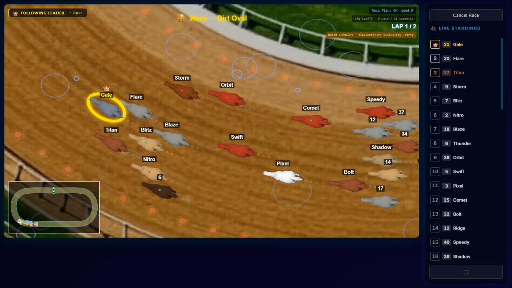 2,000 |
| mud, Dirt Oval | 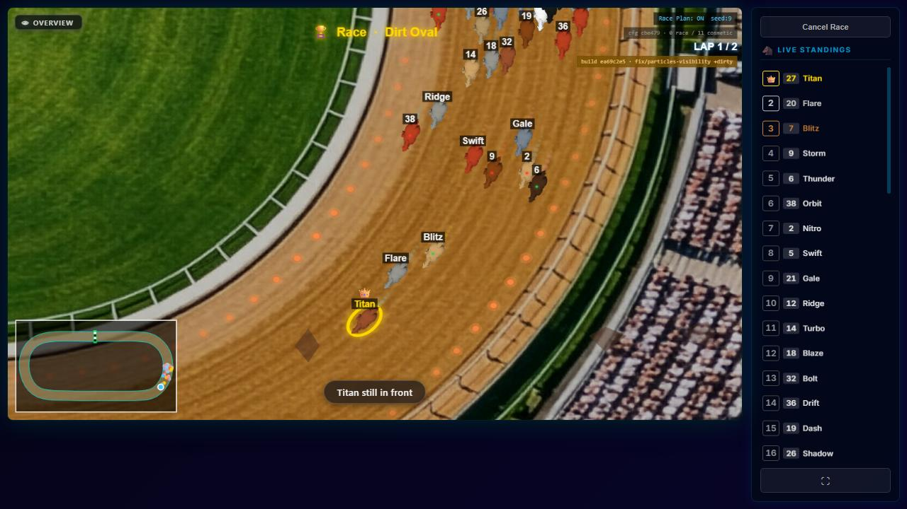 5,000 | 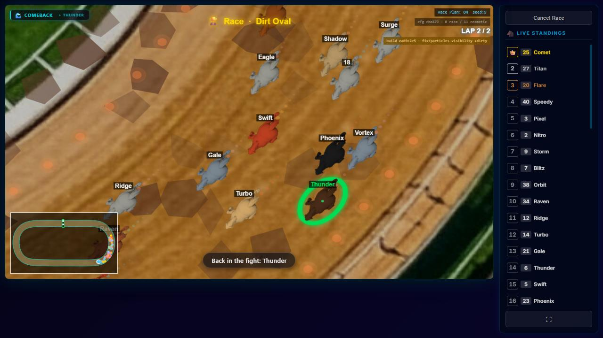 80,000 |
| bubbles, Seatrack | 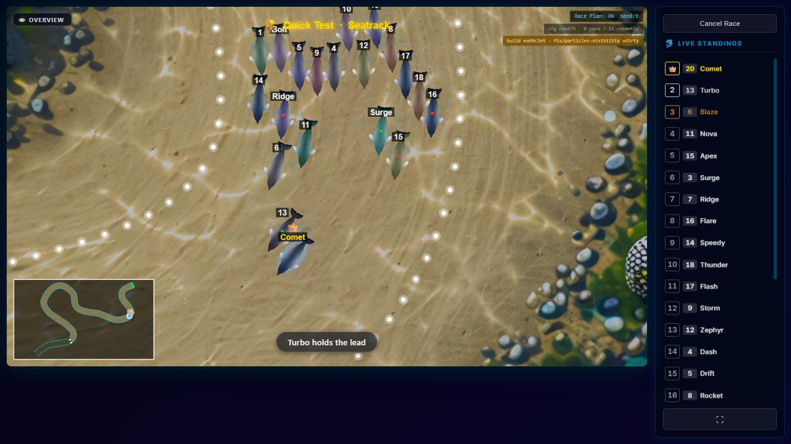 20,000 | 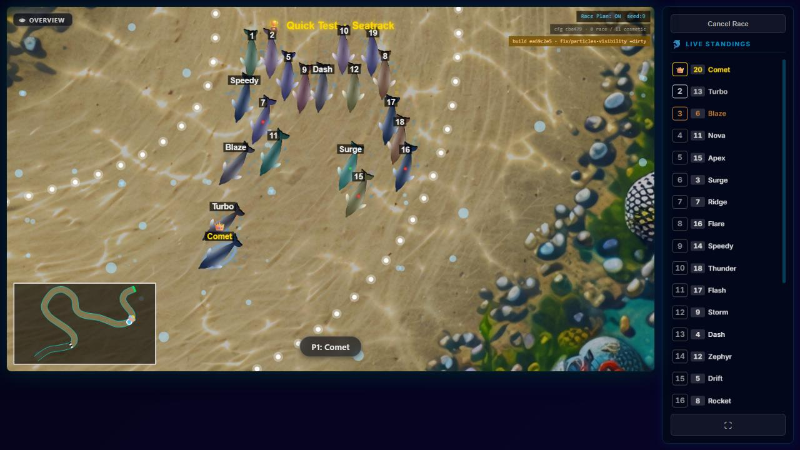 240,000 |
| dust, Dirt Oval | 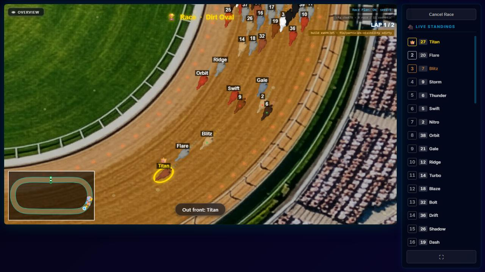 250 | 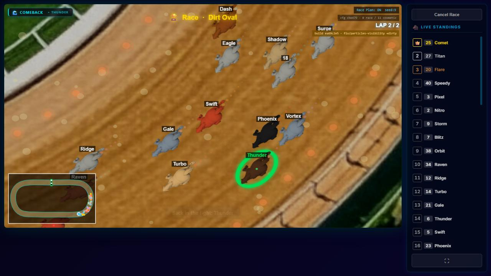 4,000 |
| fireflies, Dirt Oval | 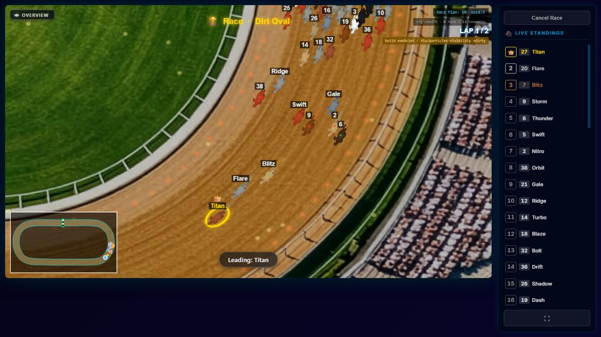 250 | 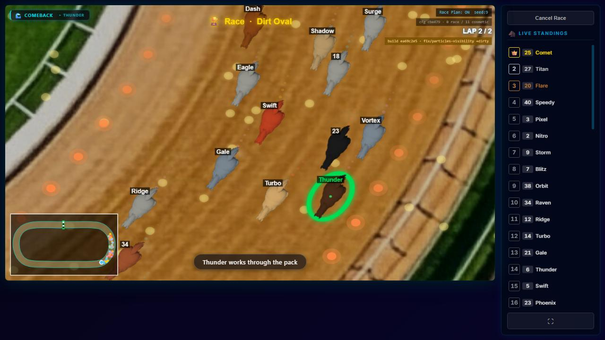 4,000 |
| stars, Space Sprint | 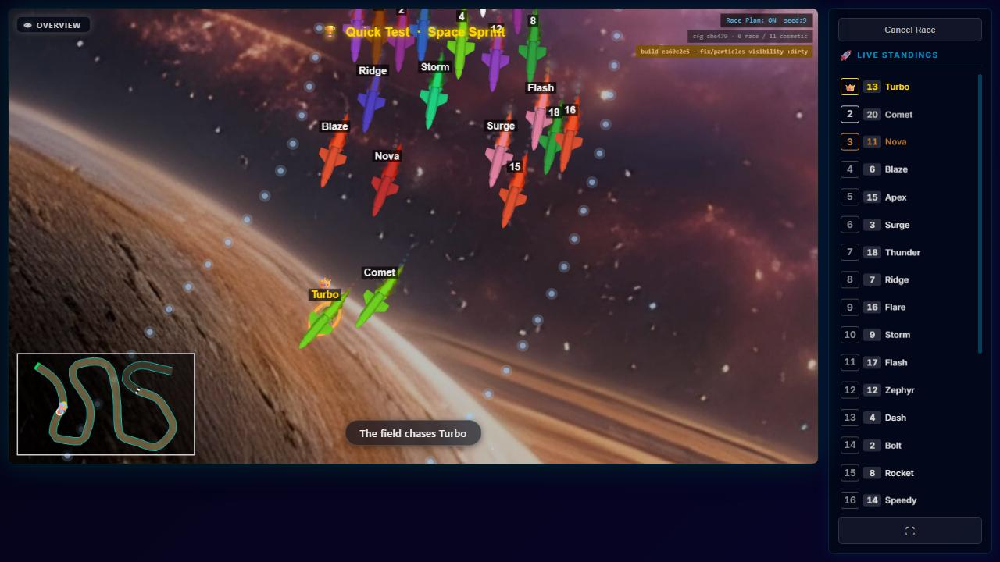 250 | 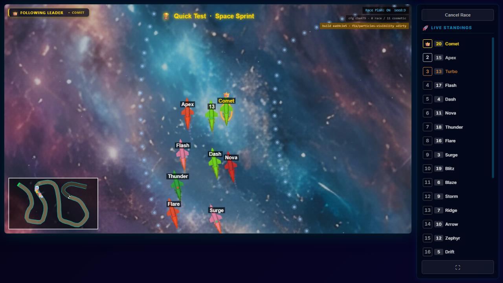 2,000 |
| wave, Dirt Oval | 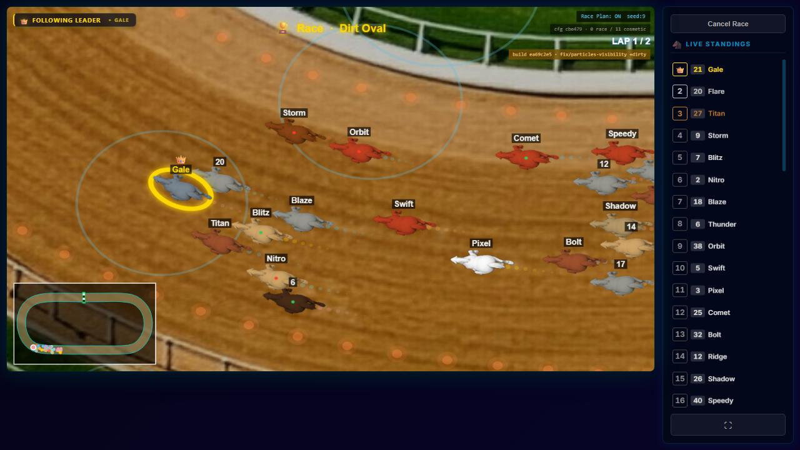 128 | 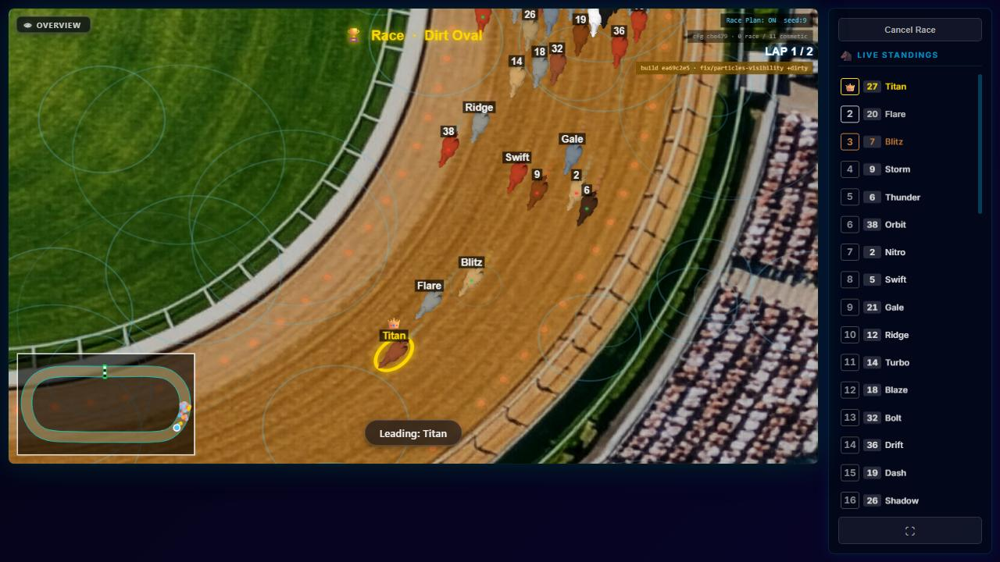 500 |

The builds in these screenshots are the measurement clone's (`ea69c2e5+dirty`). The effects' drawing code there is
identical to `181f62d5`; only the sliders' ranges differ, and the probe set each count directly.

### 3b · Which tracks use which effect — unchanged

Read from the owner's live track data (`server/data/tracks/`, not in git), 2026-09-28:
- Dirt Oval: rain 200 per second (`dirt-oval.json:1697`).
- Seatrack: bubbles 100 per minute (`seatrack.json:1753`).
- Space Sprint: stars 360 (`space-sprint.json:1766`).
- The other seven tracks have no effect.

**None was changed.** All three are inside their new ranges and on their grids. At those values bubbles on
Seatrack stay invisible, as they were; the slider now reaches far enough for the owner to raise them.

---

## 4 · The opacity control — where it is and what it reaches

- **Where the owner sets it:** Dev Screen → *View: All* → **Surface Classes** → pick a class → **Opacity**,
  then Save. The form shows `config.opacity ?? default`
  (`client/src/screens/DevScreen/sections/SurfaceClassManager.jsx:71`), so a class without the key shows its
  default. The live preview (`SurfaceClassPreview.jsx:64-68`) re-creates its generator on any config change,
  so the slider moves it. Screenshot: 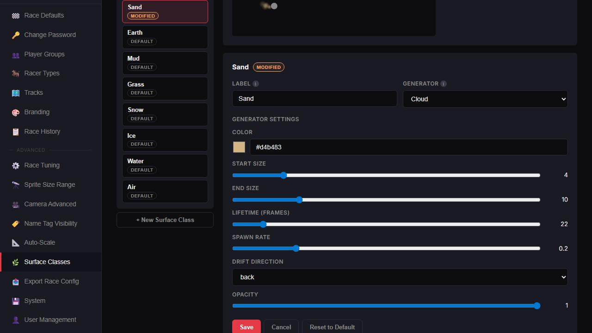
- **Where else the schema surfaces:** nowhere. The trail generators' schemas are rendered only by this
  editor (`SurfaceClassManager.jsx:293`, `:452-458`). **The racer edit modal's "cloud effect overrides" do NOT
  use the schema.** They are three hard-coded fields, density, cloud size and lifetime
  (`client/src/screens/DevScreen/sections/RacerEditModal.jsx:41-43`), and it saves only those three
  (`:374-378`). Opacity cannot be set per racer type there. Nothing was built there, per the brief.

---

## 5 · Sand at its default opacity and at 1.0 — the owner's race

`VY7KKE` on Dirt Oval, his camera. The 1.0 run stored a Sand override through the product's own route
(`PUT /api/surface-classes/sand`) in the clone's **isolated** server, then opened Dev Screen → Surface Classes
→ Sand. **The screenshots are MEASURED to be at the stated opacity:** the browser cache the race reads held Sand
opacity **1** in the 1.0 run and no override in the default run, asserted by the spec before racing.

| moment | Sand at default (0.6) | Sand at 1.0 |
| --- | --- | --- |
| just after the start | 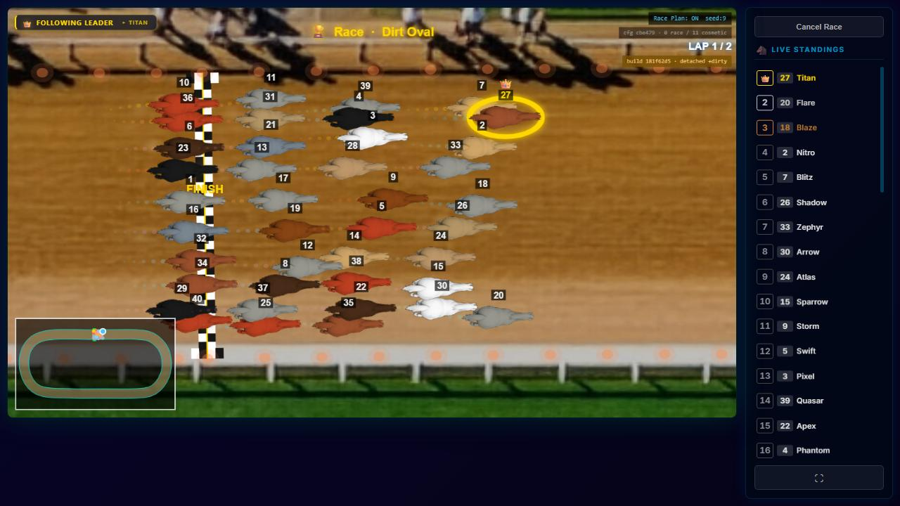 | 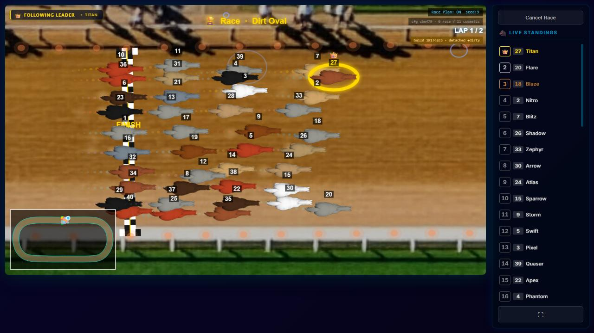 |
| bottom straight | 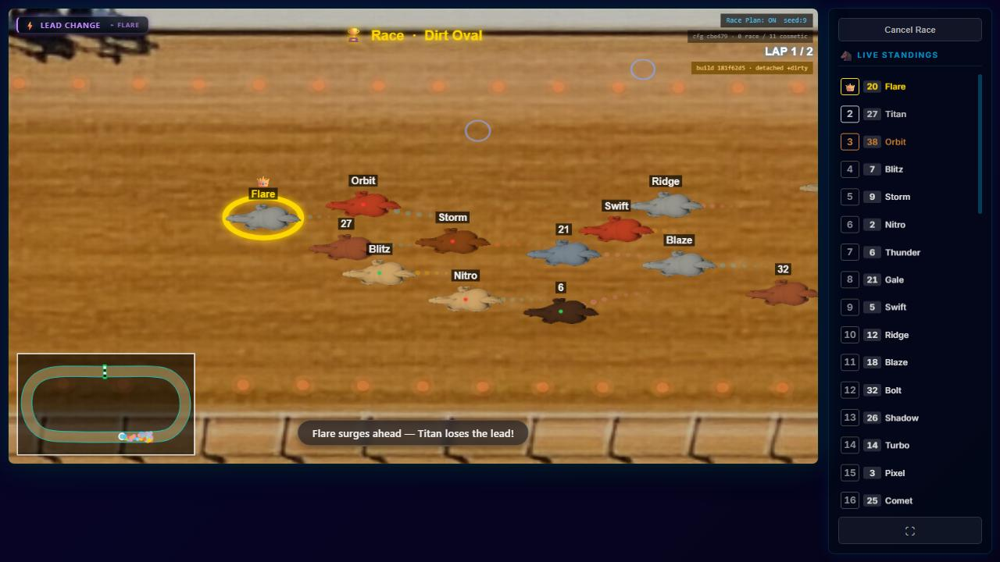 |  |

**What it shows:** at 1.0 the puffs behind the pack are a little stronger, but the difference is small. Mean
brightness of the pack band moves by about 0.1 on a 0–255 scale, while the pixel-by-pixel difference is
dominated by small position shifts between the two runs. **The reason is the colour, not the opacity.** Sand's
`#d4b483` is almost the colour of the dirt: the contrast ratio is about 1.3 (PARTICLES-VISIBILITY-1 §6), and the blob's
gradient peaks at 90% of its alpha. **Colour is set in the same editor**, one row above Opacity. Whether 1.0 is
enough, or a darker colour is wanted, is his call. **NOT PROVEN** either way.

**A product detail found on the way.** The race screen does not fetch surface classes. It reads them from
the browser cache (`client/src/screens/RaceScreen/index.jsx:796`), which only a screen using
`useSurfaceClasses` fills: the Dev Screen's Surface Classes, Tracks or Racer Types editors, and the racer
editor. A class saved in the Dev Screen is therefore used by the next race in that browser, which is how the
owner works. A class stored some other way (another browser, a direct API call) is not used until one of
those screens has been opened. Noticed, not changed.

---

## 6 · Tests, fingerprints, verification

| test file | holds | sabotage |
| --- | --- | --- |
| `client/src/modules/track-effects/effects/countRange.test.js` (21) | per effect: slider 0..new max; default on the step grid; count 0 draws nothing after 3 s | dust spawning at least one at 0: **1 red**; stars max put back to 500: **1 red** |
| `client/src/modules/surface-effects/__tests__/generators.opacity.test.js` (12) | per generator: opacity 0..1, default = old constant; a config without the key starts at the old constant; drawn alpha scales with the setting | cloud's start alpha hard-coded again: **1 red**; splash default moved to 0.9: **2 red** |
| `server/src/routes/tracks.test.js` (145) | count 480,001 refused; 240,000 (highest slider) and 480,000 (cap) accepted; 0 accepted (existing) | cap put back to 1000: **2 red** |

Every sabotage was restored and the diff checked byte-identical. Client surface- and track-effect suites:
**213 of 213**. Server track suite: **145 of 145**.

**Fingerprints:** `node scripts/engine-reach.mjs --check` with all 15 changed paths reported **4 of 15 can change
the race**, the four trail generators, by import closure. `node scripts/check-fingerprints.mjs --mint`
re-ran all **4** roles: **all identical to `docs/fingerprints.json`**. Nothing moved and nothing was re-minted. The
render fingerprint passes no track effects and has empty particle buffers, so it cannot see either part.

`npm run verify -- --premerge`: the result on the final tree is in the commit message and the task report.

---

## 7 · Source hygiene

| file | lines before → after |
| --- | --- |
| `client/src/modules/track-effects/effects/bubbles.js` · `dust.js` · `fireflies.js` · `mud.js` · `rain.js` · `stars.js` · `wave.js` | 92→97 · 76→81 · 86→91 · 82→87 · 76→81 · 70→75 · 71→76 (each +6 −1) |
| `client/src/modules/surface-effects/generators/cloud.js` · `line.js` · `particle.js` · `splash.js` | 131→135 (+8 −4) · 139→143 (+11 −7) · 116→120 (+8 −4) · 154→159 (+8 −3) |
| `server/src/routes/tracks.js` | 652 → 654 (+5 −3) |
| `server/src/routes/tracks.test.js` | 1671 → 1671 (+6 −6) |
| `client/src/modules/track-effects/effects/countRange.test.js` | new, 76 |
| `client/src/modules/surface-effects/__tests__/generators.opacity.test.js` | new, 92 |

Every touched file keeps its header. Each range change and each opacity entry carries an inline
`PARTICLES-VISIBILITY-3` comment saying what changed and why. The four `START_ALPHA` constants are removed and
no reference remains. **Reused:** the effects' own `configSchema` as the single source for both editors; the
existing `?? field.default` in both forms; the server bound's own "2× the highest slider" rule; the
production Playwright arm; the identifier door and `encodeRaceIdentifier`; the product's
`PUT /api/surface-classes`; the Dev Screen's own editor, to fill the race's cache. **Built and thrown away:** the
effect-swap probe, the scan, confirmation and ladder runners, and the Sand spec.

## 8 · Noticed and left

- **Effects draw every item in the world, on screen or not.** Their cost grows with the track's area, not
  with what is seen, which is why Seatrack and Space Sprint cap lower than their visible counts would
  suggest. A viewport cull in the effects would raise every ceiling. Not asked for; not done.
- **Bubbles' per-minute unit** makes its slider's numbers large (§3).
- **The race uses cached surface classes** (§5).
- **The racer edit modal's overrides** are three hard-coded cloud fields, not the schema (§4).
- **Rain, stars and wave are capped below "clearly many"** by frame cost on this machine (§3). The
  owner's browser may afford more. NOT PROVEN.
- **Sand dust stays faint at opacity 1.0**, because of its colour (§5).

## 9 · Clean-up

The measurement clone `C:/tmp/pvm`, all its data directories (each with a throwaway account, and in two of
them a throwaway Sand override), the probe, specs, runners and raw dumps are deleted. The owner's
`races.sqlite` and track data were only read. No track or surface class of his was written.
