# PARTICLES-VISIBILITY-4 — track effects draw only what is on screen, and draw it cheaper

**Built and measured 2026-09-28 on branch `fix/particles-visibility`, on top of PARTICLES-VISIBILITY-3
(`3861b1c5`). Not merged: the owner looks first.**

**Owns:** off-screen culling in all seven track effects, the cheaper drawing kept in four of them, the
measurement of what each saved, and the re-measured slider ceilings. Open row: [BACKLOG.md](../../docs/BACKLOG.md)
PART ONE, *2026-09-28 — added (PARTICLES-VISIBILITY-1)*.

**The owner's decision of 2026-09-28, recorded as a fact:** effects must never make the race stutter, which
has been a problem before. Ways must be found to still show them, for example by drawing differently or only in
the visible area.

---

## 0 · The answer

| effect | culling | cheaper drawing kept | old max → **new max** | on screen at new max (race camera, med / p90) | race camera at max: same as off? | whole track at max: same as off? |
| --- | --- | --- | --- | --- | --- | --- |
| rain | yes | **yes** — 8 alpha tiers, one stroke each | 2,000 → **4,000** /s | 31 / 38 | **yes** | **yes** |
| stars | yes | **yes** — 16 twinkle tiers, one fill each | 2,000 → **8,000** | 63 / 89 | **yes** | **yes** |
| wave | yes | no (measured no gain) | 500 → **1,000** | 17 / 21 | **yes** | **yes** |
| bubbles | yes | **yes** — 8 alpha tiers, one fill each | 240,000 → **240,000** /min | 17 / 32 | **yes** | **yes** (was not before) |
| mud | yes | no (tiers measured SLOWER) | 80,000 → **80,000** /min | 100 / 131 | **yes** | **no — one frame step slower** |
| dust | yes | no (measured no gain) | 4,000 → **4,000** | 68 / 196 | **yes** | **no — one frame step slower** |
| fireflies | yes | **yes** — one path, one glow | 4,000 → **4,000** | 164 / 190 | **yes** | **no — one frame step slower** (was 3–4 steps) |

All MEASURED; the numbers behind each cell are in §4–§5.

**What that means for stutter.**
- **In the ordinary race camera, no effect at any slider position up to its maximum changes the frame time.**
  That is what the owner sees in a race.
- **With the whole track in view** (a forced worst case; the race camera's widest shot is much closer), four
  effects are clean at their maximum.
- **Mud, dust and fireflies** are one frame step (about 17 ms) slower at the maxima PARTICLES-VISIBILITY-3
  set. This block may not lower a maximum. So the owner's rule, never stutter, is **met in the race camera for
  every effect, and not yet in the whole-track worst case for these three at their top settings**. At lower
  settings they are clean there too (fireflies from before this block: 117 ms frames at 4,000; now 33 ms).

**The test browser runs at about 30–60 fps on this machine**, varying with load (median frame gap 16.7–33 ms with no
effect). The limits are therefore conservative for the owner's machine and **not proven there**.

---

## 1 · What PARTICLES-VISIBILITY-3 claimed, checked

| claim | at source / in measurement | verdict |
| --- | --- | --- |
| every track effect draws every item on the whole track, off screen included | each `render()` looped over all items with no viewport test (read at `3861b1c5`) | **right** |
| the cost is in drawing, not in JavaScript | **half right.** The "JavaScript" figure is the time to *issue* the draw calls, and culling cut it hard in the race camera (dust 1.7 → 0.2 ms, stars 2.4 → 0.2, mud 3.2 → 0.7). The rasterisation cost it cannot see is real too: fireflies with the whole track in view took 3.4 ms of JavaScript and 117 ms frames. | corrected |
| rain, stars and wave hit the frame-time limit before many visible | confirmed at `3861b1c5`, and **lifted** by this block: rain ×2, stars ×4, wave ×2 | right |

---

## 2 · What was built

**Off-screen culling, all seven effects.** Each `render()` asks `cullBounds(ctx)` once and skips any item
for which `isVisible(cull, x, y, margin)` is false. Both helpers are reused from
`client/src/modules/surface-effects/generators/spriteHelpers.js`, which is both-axis since PARTICLES-VISIBILITY-2.
The margin is the item's drawn size:
- rain and wave: ring radius + half the line width;
- bubbles: pop spread + droplet radius, `14 × size`;
- dust: particle radius;
- stars: star radius;
- mud: largest vertex radius, `1.4 × 12 × size`;
- fireflies: body radius + the glow, whose shadow blur is in **screen** pixels and is converted with the
  smaller axis scale.

**Updating is untouched**, so off-screen items keep moving and nothing pops in when the camera turns. The
track editor draws effects in screen space with an identity transform, so the same test culls against its
own canvas there.

**Cheaper drawing, kept only where it measurably helped and the look did not change:**
- **rain:** rings grouped into 8 alpha tiers and stroked once per tier instead of once per ring. Each ring
  takes its tier's midpoint alpha, at most 1/16 of the opacity from its own.
- **stars:** 16 twinkle tiers, one fill each, from flat reusable arrays.
- **bubbles:** 8 alpha tiers, one fill each, bubbles and droplets together.
- **fireflies:** every fly shares one colour, alpha and glow, so the state is set once and all visible flies
  are **one path with one fill**. The shadow blur, the expensive part, is computed once per frame instead of
  once per fly.

**Tried and dropped, by the brief's rule or because it measured worse:**
- **A pre-rendered disc sprite stamped with `drawImage`** (bubbles, dust, stars) made the whole-track shot
  **slower**: bubbles' own time went 4.0 → 18.9 ms, dust 1.2 → 6.3, stars 2.8 → 6.5 (§4, rows C). Removed
  entirely, helper included.
- **Mud in alpha tiers** was slower too: whole track 2.6 → 8.9 ms at 80,000, because thousands of polygons in one
  fill cost more than separate fills. Mud keeps culling only.
- **Dust as one path, and wave in tiers**, measured no gain over culling alone, so neither is kept.

**Look.** Before/after screenshots at the same settings (§6) are unchanged **by eye**. That is NOT PROVEN by pixel
comparison: the two builds show different race moments, because a slower build stretches the race in wall time.
Where items of one tier overlap, one fill draws their union instead of stacking their alpha. That is visible
only where two items of the same tier overlap, and none was seen.

---

## 3 · How it was measured

The same method as PARTICLES-VISIBILITY-3:
- **Build and races:** the measurement clone's production build, headless Chromium at 1280×720, the
  production arm's own port, a fresh data directory per race, and the owner's 11 camera overrides.
- **Tracks:** Dirt Oval is his race `VY7KKE` via the identifier door; Seatrack and Space Sprint are a Quick
  Test with seed 9. Mud, dust, fireflies and wave run on Dirt Oval.
- **Effect swap:** a probe, in the clone only, swapped the race's effect mid-race.

**New here, the worst shot:** the probe can force the camera to show **the whole world fitted to the canvas**
(on a closed track the identity camera, on an open one the fitting zoom). Every schedule alternates **off and
on, in the race camera and in the whole-track view**, so each "on" segment has an "off" segment of the same shot
beside it. Frames count 1.5 s after a switch, and only inside the scheduled window.

**Criterion for a maximum:** the highest ladder level at which, **in both shots**, the frame gap's median and p90 with
the effect on are no worse than the neighbouring off segment. The single-frame maximum is reported but not used:
one hiccup sets it.

**Builds compared at one high count per effect (§4):**
- **A** = `3861b1c5` as it was;
- **B** = + culling;
- **C** = + culling + first drawing changes, with sprites;
- **C2** = sprites replaced by tiers or one path;
- **C3** = mud in tiers.

**The kept code is:** rain and fireflies from C, bubbles and stars from C2, dust, mud and wave from B.

**One effect the measurement surfaced, stated so nobody is surprised:** a slow frame slows the *race*
(physics advances at most two 16 ms steps per rendered frame). Seatrack took 88 s of wall time in build A and 65 s in C.
Heavy effects therefore do not just stutter, they stretch the race.

---

## 4 · Where the cost went — MEASURED

One high count per effect, alternating off/on, twice in each shot. Each row: N frames and frame gap
(median / p90 / max ms) with the effect ON, the same for the neighbouring OFF segments of that shot, the effect's
own time with it on (ms, median / p90), and items on screen (median / p90). **Compare ON with OFF within a row.** Across
rows the machine's load differed (baseline 16.7 or 33 ms), which is why every row carries its own off.

#### rain

| build | shot | count | ON: N · frame gap med / p90 / max | OFF: N · frame gap med / p90 / max | effect ms ON med / p90 | on screen med / p90 |
| --- | --- | --- | --- | --- | --- | --- |
| A | race camera | 4000 | 716 · 16.7 / 33.3 / 50.0 | 729 · 16.7 / 33.4 / 66.7 | 0.70 / 1.00 | 36 / 95 |
| A | whole track | 4000 | 583 · 33.2 / 33.4 / 50.0 | 689 · 16.7 / 33.4 / 66.6 | 0.80 / 1.10 | 2050 / 2070 |
| B | race camera | 4000 | 431 · 33.3 / 50.0 / 66.7 | 451 · 33.3 / 50.0 / 66.7 | 0.30 / 0.40 | 41 / 102 |
| B | whole track | 4000 | 319 · 50.0 / 50.1 / 83.4 | 448 · 33.3 / 50.0 / 66.7 | 1.60 / 1.80 | 2089 / 2111 |
| C | race camera | 4000 | 751 · 16.7 / 33.3 / 33.5 | 760 · 16.7 / 33.3 / 33.4 | 0.20 / 0.40 | 35 / 101 |
| C | whole track | 4000 | 645 · 16.7 / 33.4 / 33.4 | 721 · 16.7 / 33.3 / 50.0 | 1.10 / 1.50 | 2046 / 2065 |

#### mud

| build | shot | count | ON: N · frame gap med / p90 / max | OFF: N · frame gap med / p90 / max | effect ms ON med / p90 | on screen med / p90 |
| --- | --- | --- | --- | --- | --- | --- |
| A | race camera | 80000 | 503 · 33.3 / 33.5 / 66.7 | 647 · 16.7 / 33.4 / 50.1 | 3.20 / 4.30 | 47 / 140 |
| A | whole track | 80000 | 347 · 49.9 / 50.0 / 66.7 | 519 · 33.3 / 33.5 / 66.7 | 3.90 / 5.10 | 2691 / 2718 |
| B | race camera | 80000 | 440 · 33.3 / 50.0 / 66.7 | 442 · 33.3 / 50.0 / 66.7 | 0.70 / 0.90 | 53 / 139 |
| B | whole track | 80000 | 305 · 50.0 / 66.6 / 66.8 | 437 · 33.3 / 50.0 / 66.7 | 4.70 / 5.60 | 2692 / 2712 |
| C | race camera | 80000 | 719 · 16.7 / 33.4 / 50.0 | 747 · 16.7 / 33.3 / 50.0 | 0.40 / 0.60 | 50 / 130 |
| C | whole track | 80000 | 554 · 33.3 / 33.4 / 50.0 | 712 · 16.7 / 33.4 / 50.0 | 2.60 / 3.80 | 2682 / 2706 |
| C3 | race camera | 80000 | 720 · 16.7 / 33.3 / 50.0 | 725 · 16.7 / 33.3 / 33.5 | 0.40 / 0.60 | 47 / 132 |
| C3 | whole track | 80000 | 412 · 33.3 / 50.0 / 66.7 | 676 · 16.7 / 33.4 / 50.0 | 8.50 / 10.40 | 2689 / 2710 |

#### bubbles

| build | shot | count | ON: N · frame gap med / p90 / max | OFF: N · frame gap med / p90 / max | effect ms ON med / p90 | on screen med / p90 |
| --- | --- | --- | --- | --- | --- | --- |
| A | race camera | 240000 | 365 · 33.4 / 50.0 / 116.6 | 387 · 33.4 / 50.0 / 83.3 | 2.90 / 3.80 | 41 / 53 |
| A | whole track | 240000 | 264 · 50.0 / 66.7 / 83.4 | 366 · 33.4 / 50.0 / 66.7 | 4.00 / 5.00 | 3298 / 3312 |
| B | race camera | 240000 | 354 · 49.9 / 50.1 / 66.7 | 378 · 33.4 / 50.1 / 83.4 | 0.60 / 0.90 | 45 / 56 |
| B | whole track | 240000 | 255 · 66.6 / 66.7 / 83.4 | 353 · 49.9 / 50.1 / 66.8 | 4.00 / 5.10 | 3303 / 3315 |
| C | race camera | 240000 | 594 · 16.8 / 33.4 / 66.7 | 624 · 16.7 / 33.4 / 66.5 | 0.60 / 1.00 | 42 / 114 |
| C | whole track | 240000 | 171 · 50.0 / 50.0 / 50.1 | 503 · 33.3 / 33.4 / 50.0 | 18.90 / 23.10 | 3288 / 3302 |
| C2 | race camera | 240000 | 581 · 33.2 / 33.4 / 100.0 | 656 · 16.7 / 33.4 / 50.0 | 0.50 / 0.70 | 39 / 112 |
| C2 | whole track | 240000 | 224 · 33.3 / 33.4 / 50.1 | 490 · 33.3 / 33.4 / 50.1 | 2.20 / 3.20 | 3266 / 3282 |

#### dust

| build | shot | count | ON: N · frame gap med / p90 / max | OFF: N · frame gap med / p90 / max | effect ms ON med / p90 | on screen med / p90 |
| --- | --- | --- | --- | --- | --- | --- |
| A | race camera | 4000 | 432 · 33.3 / 50.0 / 66.8 | 436 · 33.3 / 50.0 / 83.2 | 1.70 / 2.00 | 73 / 206 |
| A | whole track | 4000 | 318 · 50.0 / 50.1 / 100.0 | 425 · 33.3 / 50.0 / 66.7 | 1.90 / 2.20 | 3922 / 3958 |
| B | race camera | 4000 | 749 · 16.7 / 33.3 / 33.4 | 737 · 16.7 / 33.3 / 33.5 | 0.20 / 0.40 | 68 / 196 |
| B | whole track | 4000 | 544 · 33.3 / 33.4 / 50.1 | 685 · 16.7 / 33.4 / 50.0 | 1.20 / 1.70 | 3910 / 3964 |
| C | race camera | 4000 | 751 · 16.7 / 33.3 / 50.0 | 734 · 16.7 / 33.3 / 50.0 | 0.40 / 0.90 | 67 / 194 |
| C | whole track | 4000 | 435 · 33.3 / 50.0 / 66.7 | 714 · 16.7 / 33.3 / 49.9 | 6.30 / 9.20 | 3925 / 3966 |
| C2 | race camera | 4000 | 716 · 16.7 / 33.3 / 50.0 | 731 · 16.7 / 33.3 / 50.1 | 0.30 / 0.40 | 69 / 197 |
| C2 | whole track | 4000 | 549 · 33.3 / 33.4 / 50.1 | 666 · 16.7 / 33.4 / 50.1 | 1.60 / 2.30 | 3923 / 3968 |

#### fireflies

| build | shot | count | ON: N · frame gap med / p90 / max | OFF: N · frame gap med / p90 / max | effect ms ON med / p90 | on screen med / p90 |
| --- | --- | --- | --- | --- | --- | --- |
| A | race camera | 4000 | 411 · 33.3 / 50.0 / 83.4 | 444 · 33.3 / 50.0 / 83.4 | 3.10 / 3.60 | 69 / 191 |
| A | whole track | 4000 | 133 · 116.6 / 133.4 / 166.7 | 435 · 33.3 / 50.0 / 66.8 | 3.40 / 4.40 | 4000 / 4000 |
| B | race camera | 4000 | 424 · 33.3 / 50.0 / 66.7 | 520 · 33.3 / 33.4 / 83.3 | 0.70 / 1.20 | 77 / 190 |
| B | whole track | 4000 | 151 · 100.0 / 116.7 / 133.4 | 434 · 33.3 / 50.0 / 66.7 | 2.70 / 4.10 | 4000 / 4000 |
| C | race camera | 4000 | 620 · 16.7 / 33.4 / 50.1 | 756 · 16.7 / 33.3 / 50.0 | 0.50 / 0.80 | 63 / 204 |
| C | whole track | 4000 | 397 · 33.4 / 50.0 / 50.1 | 665 · 16.7 / 33.4 / 50.1 | 1.60 / 2.40 | 4000 / 4000 |

#### stars

| build | shot | count | ON: N · frame gap med / p90 / max | OFF: N · frame gap med / p90 / max | effect ms ON med / p90 | on screen med / p90 |
| --- | --- | --- | --- | --- | --- | --- |
| A | race camera | 4000 | 647 · 16.7 / 33.4 / 33.5 | 644 · 16.7 / 33.4 / 83.3 | 2.40 / 3.30 | 53 / 98 |
| A | whole track | 4000 | 363 · 33.4 / 66.7 / 83.3 | 562 · 33.3 / 33.4 / 50.1 | 3.10 / 5.60 | 4000 / 4000 |
| B | race camera | 4000 | 674 · 16.7 / 33.4 / 50.1 | 649 · 16.7 / 33.4 / 49.9 | 0.20 / 0.30 | 44 / 81 |
| B | whole track | 4000 | 440 · 33.3 / 50.0 / 66.7 | 582 · 33.3 / 33.4 / 33.5 | 2.80 / 3.90 | 4000 / 4000 |
| C | race camera | 4000 | 638 · 16.7 / 33.4 / 66.8 | 662 · 16.7 / 33.4 / 33.5 | 0.30 / 0.50 | 50 / 67 |
| C | whole track | 4000 | 379 · 33.4 / 50.0 / 66.8 | 573 · 33.3 / 33.4 / 50.1 | 6.50 / 8.60 | 4000 / 4000 |
| C2 | race camera | 4000 | 684 · 16.7 / 33.4 / 33.5 | 650 · 16.7 / 33.4 / 50.0 | 0.20 / 0.30 | 48 / 82 |
| C2 | whole track | 4000 | 506 · 33.3 / 33.4 / 50.1 | 578 · 33.3 / 33.4 / 50.0 | 1.70 / 2.50 | 4000 / 4000 |

#### wave

| build | shot | count | ON: N · frame gap med / p90 / max | OFF: N · frame gap med / p90 / max | effect ms ON med / p90 | on screen med / p90 |
| --- | --- | --- | --- | --- | --- | --- |
| A | race camera | 2000 | 370 · 33.4 / 50.0 / 66.8 | 450 · 33.3 / 49.9 / 66.6 | 1.00 / 1.30 | 40 / 102 |
| A | whole track | 2000 | 271 · 50.0 / 66.7 / 99.9 | 444 · 33.3 / 49.9 / 66.8 | 1.20 / 1.50 | 2000 / 2000 |
| B | race camera | 2000 | 645 · 16.7 / 33.4 / 50.1 | 739 · 16.7 / 33.3 / 33.4 | 0.20 / 0.40 | 36 / 108 |
| B | whole track | 2000 | 522 · 33.3 / 33.4 / 50.1 | 680 · 16.7 / 33.4 / 50.0 | 0.80 / 1.10 | 2000 / 2000 |
| C | race camera | 2000 | 623 · 16.7 / 33.4 / 50.0 | 717 · 16.7 / 33.3 / 50.0 | 0.30 / 0.40 | 33 / 107 |
| C | whole track | 2000 | 570 · 33.3 / 33.4 / 50.1 | 669 · 16.7 / 33.4 / 50.0 | 1.00 / 1.50 | 2000 / 2000 |

**Read across the builds (MEASURED):**

| effect | culling (A → B), race camera, own time | drawing change, whole track | verdict |
| --- | --- | --- | --- |
| rain | 0.7 → 0.3 ms | tiers: whole-track frames on = off (C) where culling alone was one step slower (B) | **tiers kept** |
| stars | 2.4 → 0.2 ms | tiers (C2): whole-track 1.7 ms own, on = off; sprite (C) 6.5 ms, slower | **tiers kept** |
| bubbles | 2.9 → 0.6 ms | tiers (C2): 2.2 ms, on = off; sprite (C) 18.9 ms | **tiers kept** |
| fireflies | 3.1 → 0.7 ms | one path, one glow (C): whole-track frames 117 → 33 ms | **kept** |
| dust | 1.7 → 0.2 ms | sprite (C) slower; one path (C2) no better than B | **culling only** |
| mud | 3.2 → 0.7 ms | tiers (C3) 8.9 ms against 2.6 ms culled | **culling only** |
| wave | 1.0 → 0.2 ms | tiers (C) no better than B | **culling only** |

**Culling is what makes the race camera clean; the drawing changes are what make the whole-track shot clean**
for rain, stars, bubbles, and much better for fireflies.

---

## 5 · The ceilings, on the kept code — MEASURED

Ladder per effect: each level with an off segment beside it, in the race camera and with the whole track in view,
5 s segments. "Same as off?" applies the criterion in §3.

#### rain (dirt-oval)

| level | shot | ON: N · gap med / p90 / max | OFF beside it: N · gap med / p90 / max | effect ms ON med / p90 | on screen med / p90 | same as off? |
| --- | --- | --- | --- | --- | --- | --- |
| 2000 | race camera | 176 · 16.7 / 33.3 / 50.0 | 160 · 16.7 / 33.4 / 33.5 | 0.20 / 0.30 | 41 / 55 | yes |
| 2000 | whole track | 149 · 16.7 / 33.4 / 50.0 | 140 · 16.7 / 33.4 / 50.0 | 0.50 / 0.80 | 1025 / 1043 | yes |
| 4000 | race camera | 174 · 16.7 / 33.3 / 33.5 | 162 · 16.7 / 33.3 / 33.4 | 0.20 / 0.30 | 31 / 38 | yes |
| 4000 | whole track | 149 · 16.7 / 33.4 / 50.1 | 157 · 16.7 / 33.4 / 50.0 | 1.00 / 1.50 | 2046 / 2065 | yes |
| 8000 | race camera | 155 · 16.7 / 33.4 / 50.0 | 164 · 16.7 / 33.3 / 50.0 | 0.40 / 0.50 | 71 / 87 | yes |
| 8000 | whole track | 113 · 33.3 / 33.4 / 50.1 | 165 · 16.7 / 33.3 / 50.0 | 2.40 / 3.20 | 4123 / 4150 | **no** |

Levels passing in BOTH shots: 2000, 4000.

#### mud (dirt-oval)

| level | shot | ON: N · gap med / p90 / max | OFF beside it: N · gap med / p90 / max | effect ms ON med / p90 | on screen med / p90 | same as off? |
| --- | --- | --- | --- | --- | --- | --- |
| 80000 | race camera | 162 · 16.7 / 33.4 / 50.0 | 152 · 16.7 / 33.4 / 49.9 | 0.50 / 0.80 | 100 / 131 | yes |
| 80000 | whole track | 131 · 33.3 / 33.4 / 50.0 | 164 · 16.7 / 33.3 / 33.4 | 2.60 / 3.90 | 2671 / 2699 | **no** |
| 160000 | race camera | 183 · 16.7 / 33.3 / 33.4 | 176 · 16.7 / 33.3 / 33.4 | 0.60 / 0.80 | 80 / 91 | yes |
| 160000 | whole track | 107 · 33.3 / 33.5 / 50.1 | 166 · 16.7 / 33.4 / 33.4 | 4.60 / 6.20 | 5353 / 5403 | **no** |
| 320000 | race camera | 161 · 16.7 / 33.4 / 33.5 | 171 · 16.7 / 33.3 / 33.4 | 1.40 / 2.10 | 170 / 190 | yes |
| 320000 | whole track | 79 · 50.0 / 50.1 / 66.7 | 163 · 16.7 / 33.4 / 33.4 | 8.20 / 10.70 | 10746 / 10805 | **no** |

Levels passing in BOTH shots: none.

#### fireflies (dirt-oval)

| level | shot | ON: N · gap med / p90 / max | OFF beside it: N · gap med / p90 / max | effect ms ON med / p90 | on screen med / p90 | same as off? |
| --- | --- | --- | --- | --- | --- | --- |
| 4000 | race camera | 156 · 16.7 / 33.4 / 33.4 | 158 · 16.7 / 33.3 / 50.1 | 0.60 / 0.80 | 164 / 190 | yes |
| 4000 | whole track | 92 · 33.4 / 50.0 / 50.1 | 139 · 16.8 / 33.4 / 66.6 | 1.70 / 2.50 | 4000 / 4000 | **no** |
| 8000 | race camera | 147 · 16.7 / 33.4 / 50.1 | 172 · 16.7 / 33.3 / 50.0 | 0.90 / 1.20 | 122 / 130 | yes |
| 8000 | whole track | 60 · 66.6 / 66.7 / 83.4 | 164 · 16.7 / 33.4 / 33.4 | 3.60 / 4.90 | 8000 / 8000 | **no** |
| 16000 | race camera | 120 · 33.3 / 33.4 / 50.1 | 159 · 16.7 / 33.4 / 66.7 | 1.80 / 2.40 | 304 / 321 | **no** |
| 16000 | whole track | 44 · 83.3 / 100.0 / 1599.9 | 154 · 16.7 / 33.4 / 50.0 | 5.90 / 8.10 | 16000 / 16000 | **no** |

Levels passing in BOTH shots: none.
#### bubbles (seatrack)

| level | shot | ON: N · gap med / p90 / max | OFF beside it: N · gap med / p90 / max | effect ms ON med / p90 | on screen med / p90 | same as off? |
| --- | --- | --- | --- | --- | --- | --- |
| 240000 | race camera | 134 · 33.3 / 33.4 / 50.0 | 136 · 33.2 / 33.4 / 50.0 | 0.40 / 0.60 | 17 / 32 | yes |
| 240000 | whole track | 103 · 33.3 / 33.4 / 50.0 | 123 · 33.3 / 33.4 / 50.0 | 2.20 / 3.40 | 3270 / 3285 | yes |
| 480000 | race camera | 142 · 16.7 / 33.4 / 50.0 | 137 · 33.3 / 33.4 / 33.4 | 0.70 / 1.10 | 33 / 81 | yes |
| 480000 | whole track | 80 · 33.4 / 66.7 / 83.3 | 121 · 33.3 / 33.4 / 33.5 | 4.70 / 8.20 | 6575 / 6610 | **no** |
| 960000 | race camera | 149 · 16.7 / 33.4 / 33.4 | 157 · 16.7 / 33.4 / 50.0 | 1.60 / 2.10 | 95 / 123 | yes |
| 960000 | whole track | 63 · 50.0 / 66.7 / 66.8 | 129 · 33.3 / 33.4 / 33.5 | 7.80 / 10.50 | 13196 / 13233 | **no** |

Levels passing in BOTH shots: 240000.

#### stars (space-sprint)

| level | shot | ON: N · gap med / p90 / max | OFF beside it: N · gap med / p90 / max | effect ms ON med / p90 | on screen med / p90 | same as off? |
| --- | --- | --- | --- | --- | --- | --- |
| 2000 | race camera | 163 · 16.7 / 33.4 / 33.4 | 147 · 16.7 / 33.4 / 33.4 | 0.10 / 0.20 | 19 / 31 | yes |
| 2000 | whole track | 125 · 33.3 / 33.4 / 50.0 | 130 · 33.3 / 33.4 / 50.0 | 0.80 / 1.30 | 2000 / 2000 | yes |
| 4000 | race camera | 145 · 16.7 / 33.4 / 49.9 | 158 · 16.7 / 33.4 / 50.0 | 0.20 / 0.30 | 52 / 82 | yes |
| 4000 | whole track | 116 · 33.3 / 33.4 / 50.0 | 129 · 33.3 / 33.4 / 50.0 | 1.70 / 2.60 | 4000 / 4000 | yes |
| 8000 | race camera | 158 · 16.7 / 33.4 / 50.0 | 156 · 16.7 / 33.4 / 33.4 | 0.30 / 0.40 | 63 / 89 | yes |
| 8000 | whole track | 105 · 33.3 / 33.4 / 50.0 | 135 · 33.3 / 33.4 / 50.1 | 3.30 / 4.70 | 8000 / 8000 | yes |

Levels passing in BOTH shots: 2000, 4000, 8000.
#### wave (dirt-oval)

| level | shot | ON: N · gap med / p90 / max | OFF beside it: N · gap med / p90 / max | effect ms ON med / p90 | on screen med / p90 | same as off? |
| --- | --- | --- | --- | --- | --- | --- |
| 500 | race camera | 181 · 16.7 / 33.3 / 33.4 | 167 · 16.7 / 33.3 / 33.4 | 0.10 / 0.10 | 17 / 25 | yes |
| 500 | whole track | 152 · 16.7 / 33.4 / 33.4 | 162 · 16.7 / 33.4 / 33.4 | 0.20 / 0.40 | 500 / 500 | yes |
| 1000 | race camera | 173 · 16.7 / 33.3 / 33.4 | 172 · 16.7 / 33.4 / 33.4 | 0.10 / 0.20 | 17 / 21 | yes |
| 1000 | whole track | 143 · 16.7 / 33.4 / 33.5 | 125 · 33.3 / 33.4 / 50.0 | 0.40 / 0.60 | 1000 / 1000 | yes |
| 2000 | race camera | 156 · 16.7 / 33.4 / 33.4 | 169 · 16.7 / 33.4 / 33.4 | 0.20 / 0.30 | 36 / 40 | yes |
| 2000 | whole track | 120 · 33.3 / 33.4 / 66.6 | 151 · 16.7 / 33.4 / 50.0 | 0.80 / 1.10 | 2000 / 2000 | **no** |

Levels passing in BOTH shots: 500, 1000.

#### dust (Dirt Oval) — kept code is culling only (build B), measured in §4 at its maximum

| level | shot | ON: N · gap med / p90 / max | OFF beside it: N · gap med / p90 / max | own time ON | on screen | same as off? |
| --- | --- | --- | --- | --- | --- | --- |
| 4000 | race camera | 749 · 16.7 / 33.3 / 33.4 | 737 · 16.7 / 33.3 / 33.5 | 0.20 / 0.40 | 68 / 196 | yes |
| 4000 | whole track | 544 · 33.3 / 33.4 / 50.1 | 685 · 16.7 / 33.4 / 50.0 | 1.20 / 1.70 | 3910 / 3964 | **no** |

**The decisions:**
- **rain 4,000:** 8,000 is slower with the whole track in view.
- **stars 8,000:** it passed; the ladder went no higher.
- **wave 1,000:** 2,000 is slower with the whole track in view.
- **bubbles stays at 240,000:** 480,000 is slower with the whole track in view.
- **mud, dust and fireflies stay** at PARTICLES-VISIBILITY-3's maxima: those already fail the whole-track shot
  and may not be lowered. **Flagged in §0.**

The server's count bound needs no change: bubbles' 240,000 is still the highest maximum, and the bound is 2× that.

**Screenshots of each new maximum** are the "after" images in §6 for rain and stars at their attribution counts
(4,000). The ladder itself screenshots every segment; those stay in the throwaway output and are not published.

---

## 6 · Before and after, same settings — look unchanged by eye (NOT PROVEN by pixels)

The before image is from build A, the after image from the kept code, both in the owner's camera.

| effect (count) | before — race camera | after — race camera | before — whole track | after — whole track |
| --- | --- | --- | --- | --- |
| rain (4,000/s) | 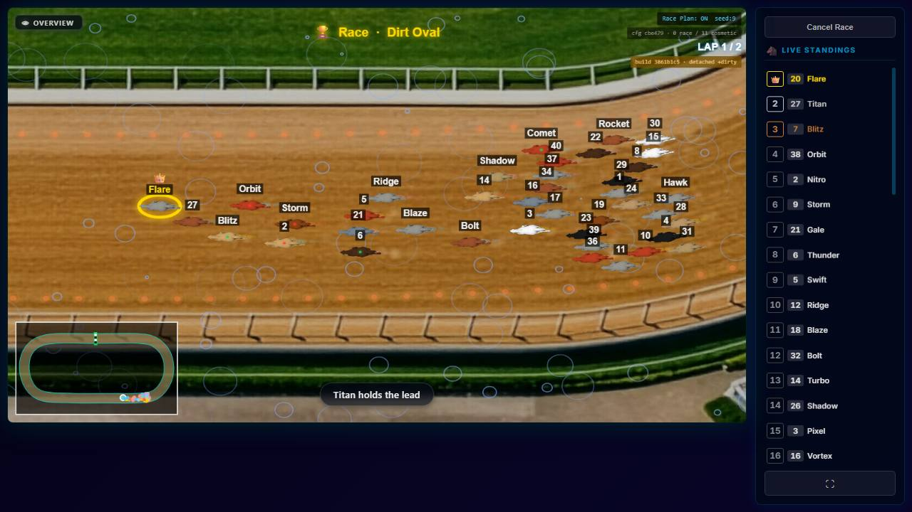 | 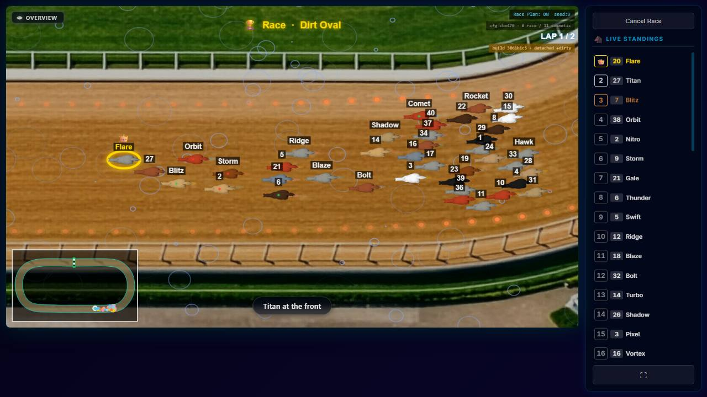 |  | 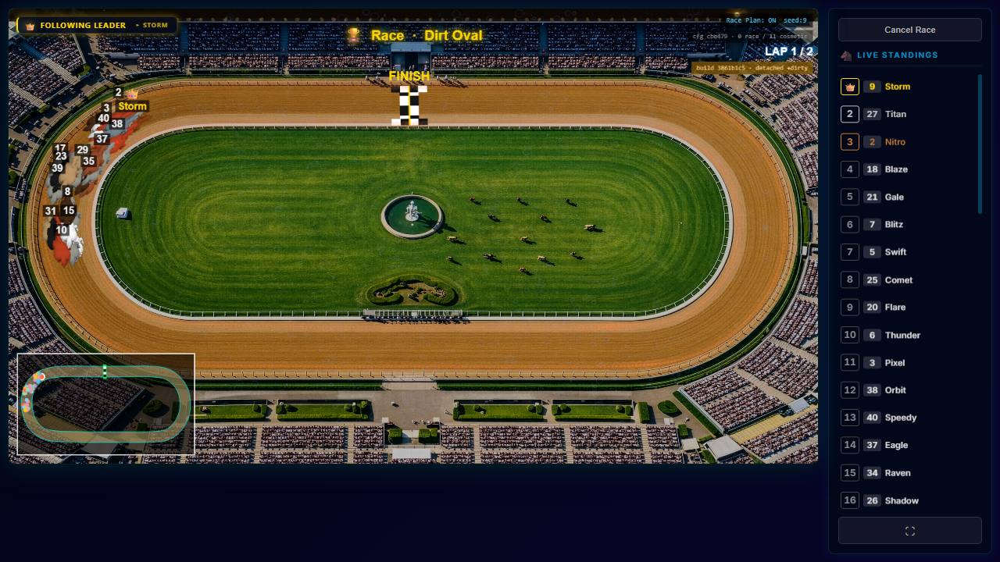 |
| stars (4,000) | 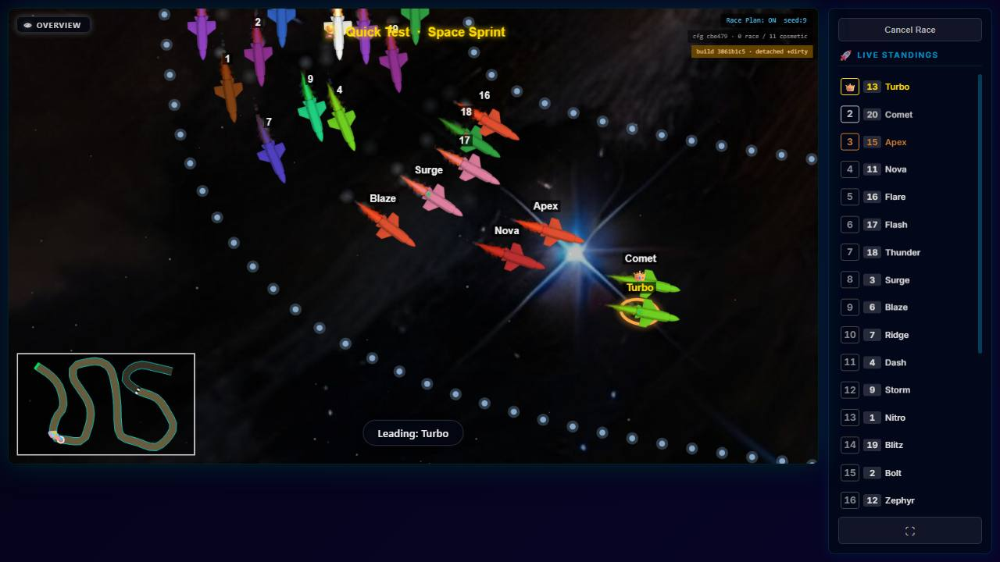 |  | 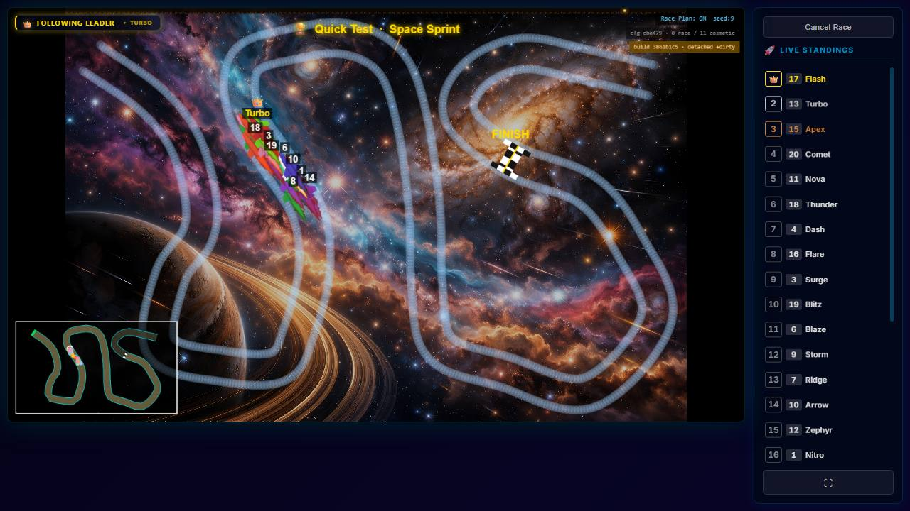 | 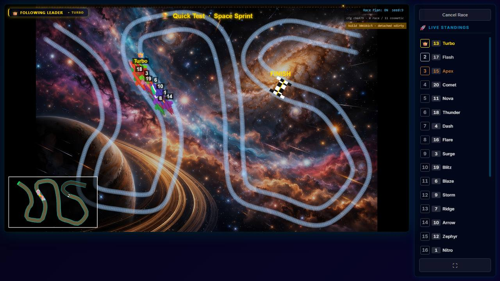 |
| bubbles (240,000/min) | 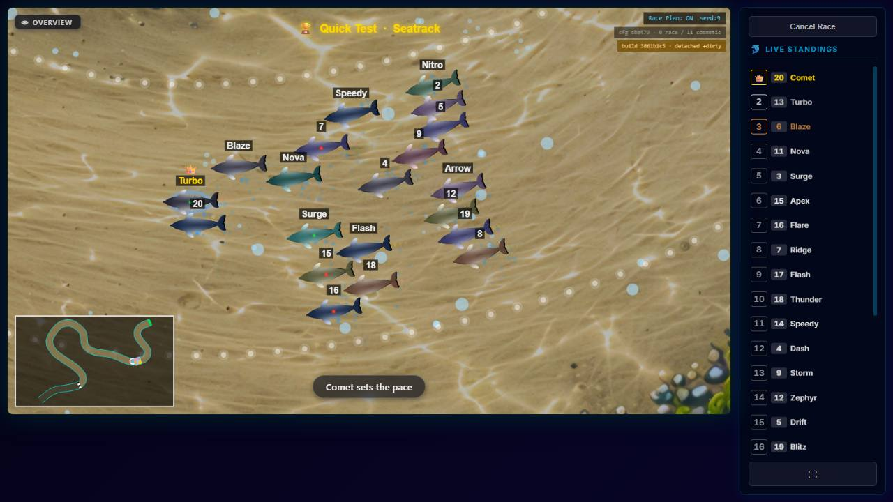 | 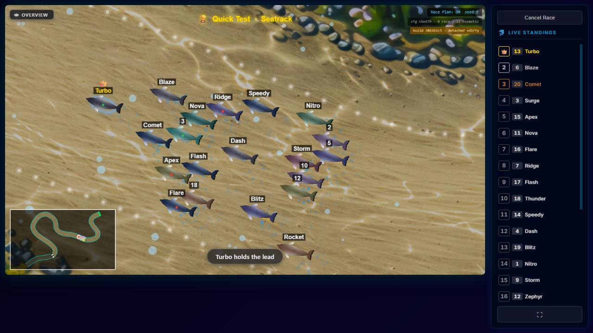 | 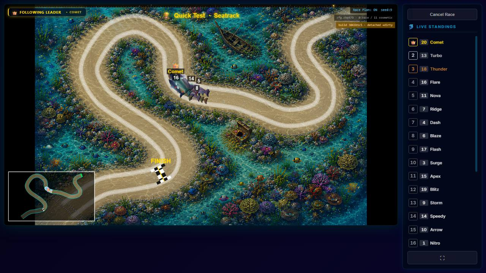 | 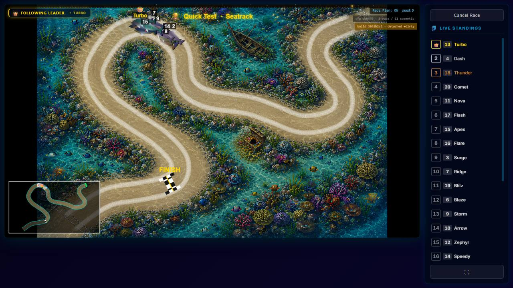 |
| fireflies (4,000) | 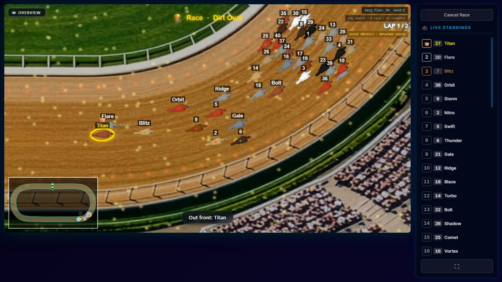 | 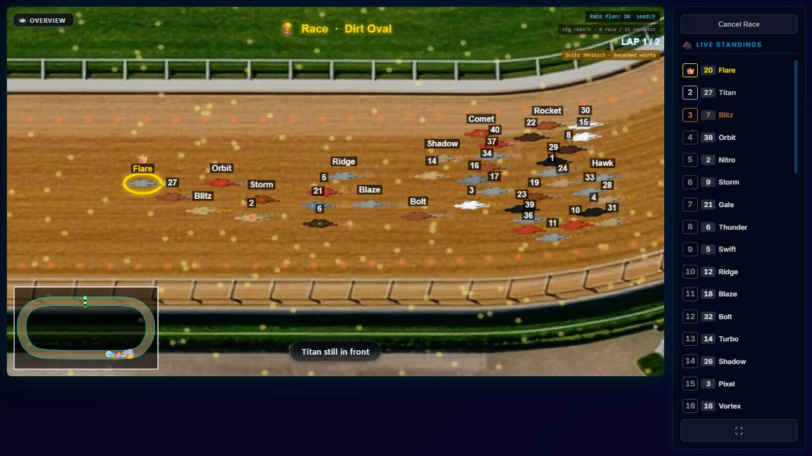 | 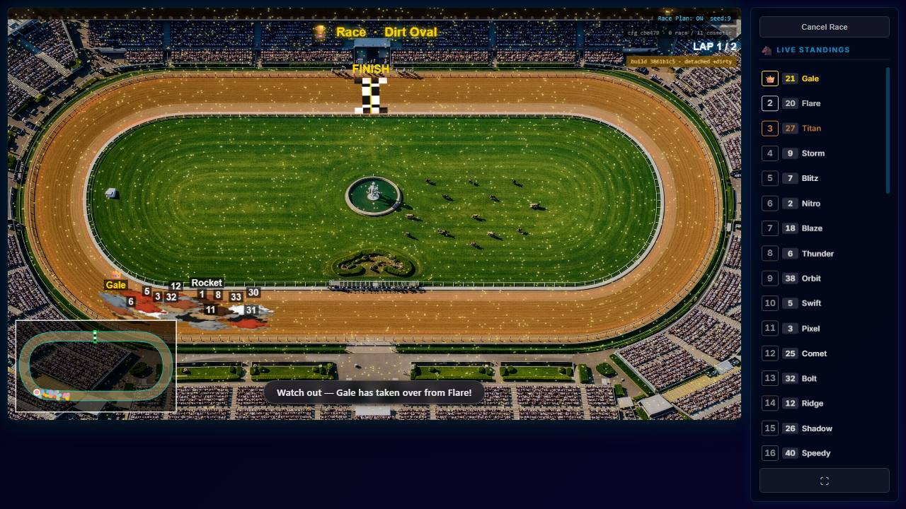 |  |
| dust (4,000), culling only | 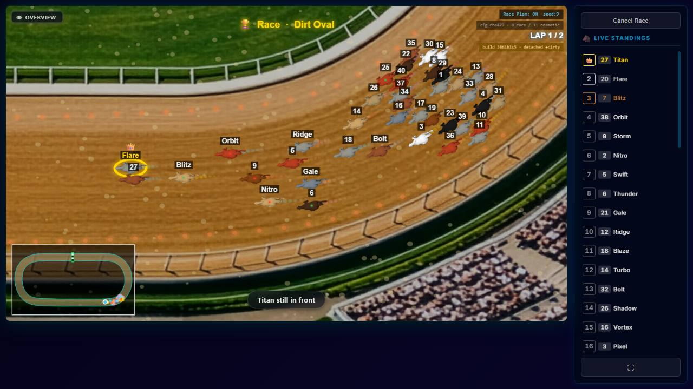 |  | — | — |
| mud (80,000/min), culling only | 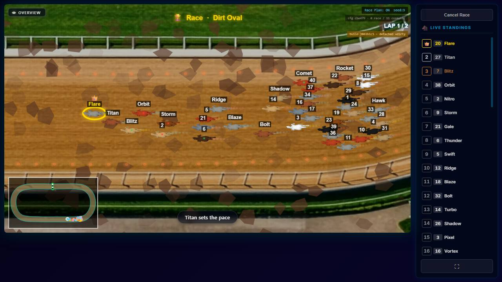 | 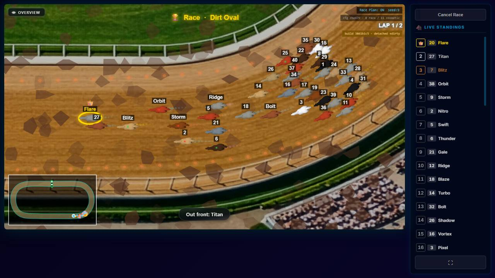 | — | — |
| wave (2,000), culling only | 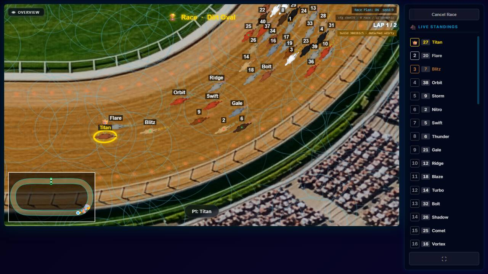 | 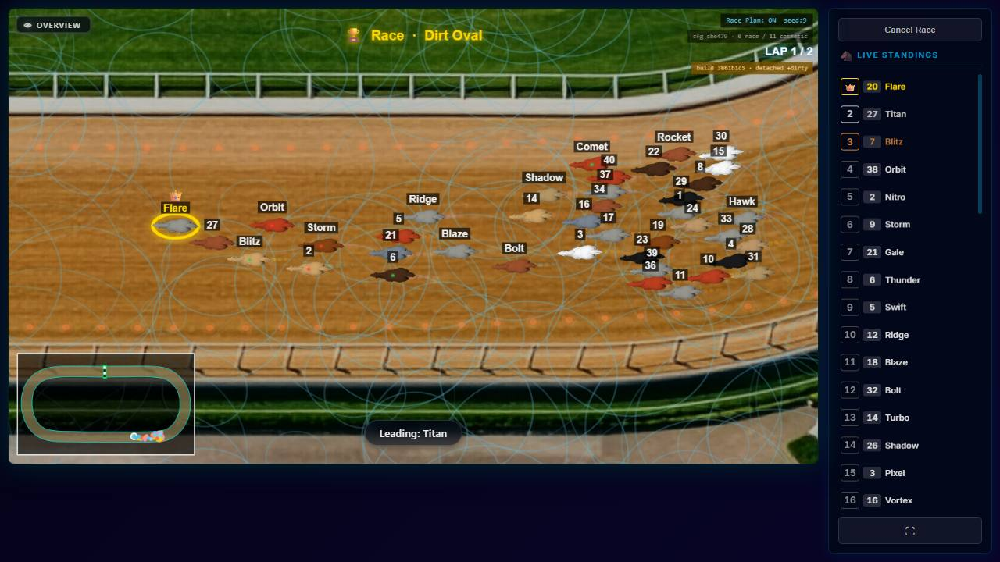 | — | — |

Culling cannot change a picture by construction: it only skips items whose drawn circle is off the canvas, with
the item's full drawn size as the margin. The three culling-only rows are there to show that.

---

## 7 · Tracks and values — unchanged

Dirt Oval rain 200/s, Seatrack bubbles 100/min, Space Sprint stars 360; the other seven tracks have no effect
(the owner's live data `server/data/tracks/`, read only). **No stored value and no default changed. Units are
unchanged, and so is the slider scale.** A simpler 0–100 scale is a separate open question for the owner.

---

## 8 · Tests, fingerprints, verification

| test | holds | sabotage |
| --- | --- | --- |
| `client/src/modules/track-effects/effects/culling.test.js` (16) | per effect, over a world twice the canvas width: nothing drawn beyond the canvas edge (plus drawn size), something drawn inside, more drawn when the canvas covers everything. Dust and stars: every item drawn exactly once at its own centre and radius, recomputed independently from a seeded `Math.random` | dust's cull removed: **2 red**; stars batched with radius × 1.01: **1 red**; stars dropping an item: **1 red** |
| the seven `*.test.js` beside the effects | their mock contexts gained a transform and a canvas (and `moveTo` where paths are batched); count assertions now say one fill/stroke **per tier** where drawing is tiered, and still one arc per item | — |
| `client/src/screens/RaceScreen/mount.test.jsx`, `cancelRace.test.jsx` | their stub 2D context returned `undefined` for `getTransform()` and `null` for `canvas`; a real context returns a matrix and the canvas. Culling reads both, so the stub now answers like a real one (identity, 1280×720). **Caught by the pre-merge client suite**, not by the effect tests | — |
| `countRange.test.js`, `worldPlacement.test.js` | new maxima; the placement recorder uses circle centres (ring paths now start with `moveTo(x + r, y)`) and a canvas that spans the area under test | — |

Every sabotage was restored and the diff checked byte-identical. Track- and surface-effect suites: **229 of 229**; whole client suite **4,853 of 4,853**.

**Fingerprints:** `node scripts/engine-reach.mjs --check` with all 18 changed paths reported **1 of 18 can change
the race**: `spriteHelpers.js`, whose only change is a header comment. `node scripts/check-fingerprints.mjs --mint`
re-ran all **4** roles: **identical** to `docs/fingerprints.json`. Nothing was re-minted.

`npm run verify -- --premerge`: the result on the final tree is in the commit message and the task report.

---

## 9 · Source hygiene

| file | lines before → after |
| --- | --- |
| `client/src/modules/surface-effects/generators/spriteHelpers.js` | 95 → 96 |
| `client/src/modules/track-effects/effects/bubbles.js` | 97 → 116 |
| `client/src/modules/track-effects/effects/bubbles.test.js` | 93 → 99 |
| `client/src/modules/track-effects/effects/countRange.test.js` | 76 → 79 |
| `client/src/modules/track-effects/effects/culling.test.js` | 0 → 153 |
| `client/src/modules/track-effects/effects/dust.js` | 81 → 88 |
| `client/src/modules/track-effects/effects/dust.test.js` | 90 → 93 |
| `client/src/modules/track-effects/effects/fireflies.js` | 91 → 108 |
| `client/src/modules/track-effects/effects/fireflies.test.js` | 86 → 91 |
| `client/src/modules/track-effects/effects/mud.js` | 87 → 96 |
| `client/src/modules/track-effects/effects/mud.test.js` | 97 → 100 |
| `client/src/modules/track-effects/effects/rain.js` | 81 → 110 |
| `client/src/modules/track-effects/effects/rain.test.js` | 94 → 100 |
| `client/src/modules/track-effects/effects/stars.js` | 75 → 107 |
| `client/src/modules/track-effects/effects/stars.test.js` | 87 → 93 |
| `client/src/modules/track-effects/effects/wave.js` | 76 → 86 |
| `client/src/modules/track-effects/effects/wave.test.js` | 93 → 96 |
| `client/src/screens/RaceScreen/mount.test.jsx` | 203 → 207 |
| `client/src/screens/RaceScreen/cancelRace.test.jsx` | 190 → 194 |
| `client/src/modules/track-effects/effects/worldPlacement.test.js` | 102 → 112 |

Every touched file keeps its header. The culling and each drawing change carry an inline `PARTICLES-VISIBILITY-4`
comment saying what and why. The per-item draw loops are gone where replaced, and the disc sprite, tried and
removed, left no helper behind: `spriteHelpers.js` differs from `3861b1c5` only in its header. **Reused:**
`cullBounds` and `isVisible` from `spriteHelpers.js`; the alpha-tier idea from the line generator's
`ALPHA_BUCKETS`; the production Playwright arm, the identifier door and `encodeRaceIdentifier`; PARTICLES-VISIBILITY-3's
effect-swap probe, extended with the whole-track camera. **Built and thrown away:** the builds A–C3, runners, spec and
dumps.

## 10 · Noticed and left

- **Mud, dust and fireflies are one frame step slower in the whole-track worst case at their maxima** (§0, §5).
  Meeting the owner's rule there would need either lower maxima (not allowed in this block) or a different way to
  draw them. Fireflies' remaining cost is the glow itself, and dust costs about as much culled as batched. His call
  which.
- **A slow frame slows the race itself** (§3). The camera's "never stutter" goal and the race's wall-clock
  length are coupled.
- **The ladders stopped at the levels tried.** Stars passed at 8,000 and might go higher; not measured.
- **`drawImage` of a pre-rendered sprite is slower than `arc` + `fill` here.** The racer-trail generators (cloud,
  splash) use exactly that pattern. With few particles per racer it has not mattered; noted, not measured.
- Carried: 8,600+ leaked `ra-test-data-*` directories in `%TEMP%`; the race reads surface classes from the
  browser cache (PARTICLES-VISIBILITY-3 §5).

## 11 · Clean-up

The measurement clone, all its data directories (each with a throwaway account), the builds' patches, probe, spec,
runners and raw dumps are deleted. The owner's `races.sqlite` and track data were only read.
