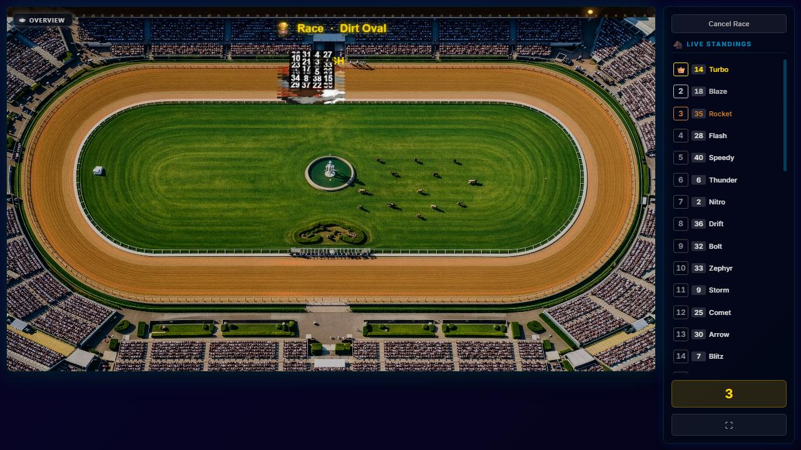
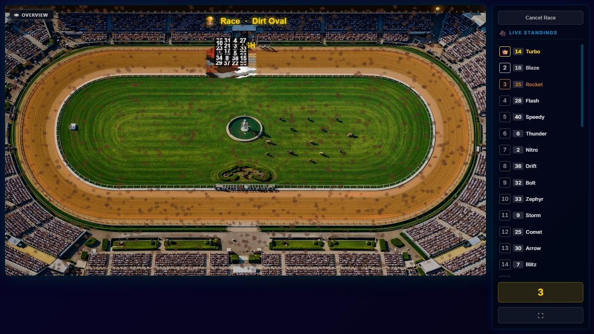
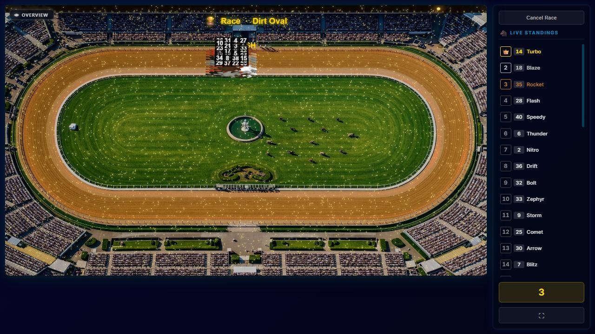

# PARTICLES-VISIBILITY-5 — does the pre-start camera flight stutter with mud, dust or fireflies at maximum?

**Measured 2026-09-28 on branch `fix/particles-visibility` at `6a87644d`. Nothing built.**

**Owns:** what the start ceremony does per frame, and how its frames behave with mud (80,000/min), dust (4,000) and
fireflies (4,000) at their slider maxima. Open row: [BACKLOG.md](../../docs/BACKLOG.md) PART ONE,
*2026-09-28 — added (PARTICLES-VISIBILITY-1)*.

**The owner's statements of 2026-09-28, recorded as facts:**
- The only phase that shows the whole track is the camera flight towards the racers before the start, while
  every racer stands still.
- A camera flight that takes longer is acceptable; stutter is not.

---

## 0 · The answer

| effect at its maximum | does the flight stutter? | does the flight take longer? |
| --- | --- | --- |
| **mud** 80,000/min | **No more than with no effect.** Median frame time unchanged in every beat. In the venue shot and the flight a larger share of frames lands on the 50 ms step instead of 33 ms (p90 33 → 50 ms), but frames at ≥ 2× the median and the largest jumps are the same as with no effect. **MEASURED** | **No** — 18.03–18.05 s against 18.00 scheduled, the same as with no effect. **MEASURED** |
| **dust** 4,000 | **No more than with no effect** — the same pattern as mud. **MEASURED** | **No** — 18.03 s. **MEASURED** |
| **fireflies** 4,000 | **Not stutter by the brief's definition, but a lower frame rate throughout.** The venue shot runs at about **15 fps** (median 67 ms against 33 ms with no effect); the flight and the rest of the ceremony at about **20 fps** (50 ms). The frames stay **even** (0–1 frames at ≥ 2× the median per run), so it is a steady lower rate, not uneven frames. At 15 fps a flight is visibly less smooth; whether that counts as stutter to the owner's eye is **NOT PROVEN**. **MEASURED** | **No** — 18.02–18.03 s. **MEASURED** |

**Why the flight cannot take longer:** it runs on elapsed time, not on frames (§1). A slower frame rate shows the same
flight in fewer frames.

**One result contradicts PARTICLES-VISIBILITY-4.** There, fireflies at 4,000 left the race camera's frame time unchanged.
Here, in the **first 10 s of racing**, fireflies at 4,000 run at about 20 fps against 30 fps with no effect (median 50 against
33 ms, 3 of 3 runs). Mud and dust are unchanged there, as PARTICLES-VISIBILITY-4 found. The two sessions differ in
the machine's baseline: 60 fps then, 30 fps now, so less headroom now. **The race-camera claim for fireflies does not hold on
this machine under this load.** **MEASURED.**

**The test browser runs at about 30–60 fps on this machine, depending on load** (about 30 fps throughout this session).
A result here is **not proof for the owner's machine**.

---

## 1 · What the start ceremony does — at source

- **The beats and their lengths on Dirt Oval with the owner's 40 racers**, from the director's own schedule
  (`client/src/modules/camera/startCeremony.js:177-225`, called by `CameraDirector.ceremonySchedule`,
  `client/src/modules/camera/CameraDirector.js:5331`), read back from the live race:

  | beat | time | zoom | what is on screen |
  | --- | --- | --- | --- |
  | brand card | 0 ms here | — | only when a brand is chosen; none in the clone |
  | **venue** | 0–3.0 s | 0.417, constant | **the whole track** (`CameraDirector.js:5264-5275`: the world box fitted to the canvas) — the same scale PARTICLES-VISIBILITY-4 forced |
  | **push** — the flight | 3.0–5.0 s | 0.417 → 3.5 | from the whole track in to the formation |
  | board | 5.0–11.0 s | 3.5 | the formation, with the start board |
  | settled | 11.0–15.0 s | 3.5 | the formation |
  | digits | 15.0–18.0 s | 3.5 | the formation, counting down |

  **Only the venue shot and the start of the push show the whole or most of the track.** The owner's statement fits,
  once "the flight" is read to include the 3 s venue shot before it moves.
- **The flight advances by elapsed time, not per frame:** `updateCountdown(racers, ts, countdownElapsed, …)`
  (`CameraDirector.js:5392-5424`) computes the zoom from `countdownElapsed = ts − countdownStart`
  (`client/src/screens/RaceScreen/index.jsx:1565-1571`), and the start signal fires when that clock reaches the total
  (`index.jsx:1005`). A slow frame draws the flight at the same point in time, only less often.
- **What else runs per frame before the start** (`index.jsx:976-1014`):
  - the track effects' `update()` (`:976`);
  - `computePositions()` (`:983`);
  - the ceremony schedule lookup (`:988`);
  - the director's `updateCountdown`;
  - the whole draw.

  **No physics step runs**: `stepRacePhysics` is only in the racing branch (`index.jsx:1090`). **No racer dust is
  spawned or advanced**: `advanceRacerDust` runs only in racing and finished (`index.jsx:1472`, `:1494`). The racers
  stand still.

---

## 2 · How it was measured

- **Build:** a throwaway plain clone of the branch head `6a87644d`, production build, headless Chromium at 1280×720,
  on the production arm's own port with a fresh data directory per race. The owner's servers on 4000, 4173 and 5173
  were not touched.
- **Race:** his race `VY7KKE` on Dirt Oval, 40 racers, replayed through the setup screen's identifier door, with his 11
  camera overrides. **The Dirt Oval "copy with the effect switched on" is a probe in the clone that replaces the race's
  effect list at creation.** Dirt Oval normally carries rain, so the "no effect" arm has an empty list. No track data was written.
- **Arms:** no track effect; mud at 80,000/min; dust at 4,000; fireflies at 4,000, each with the effect's other
  settings at their defaults. **Three runs each**, interleaved (none, mud, dust, fireflies, none, …), so load drift
  spreads over all arms.
- **Per frame:** the frame gap (rAF to rAF), the ceremony beat from the director's own schedule, the elapsed time on
  the ceremony's clock, and the zoom. **The first ceremony frame is excluded** (its gap is the page load). Racing is
  measured for its first 10 s.
- **"Longer than one 60 fps step"** is counted as **> 20 ms**, allowing for rAF timestamp jitter around 16.7 ms. On a
  machine at 30 fps nearly every frame qualifies, including with no effect, so this count is only meaningful
  **against the no-effect arm**. The stutter measures that do not depend on the baseline are **frames ≥ 2× their own
  median** and **the largest jump between consecutive frames**.
- **Mud builds up:** its blobs live 1.4–2.6 s, so during the first ~2.6 s of the venue shot mud is still filling from
  nothing. The venue numbers for mud cover a rising density, not only full density.

---

## 3 · The numbers — MEASURED

Every row is one run. N frames on every row.

#### beat: venue

| arm | run | N frames | frame gap med / p90 / max ms | frames > 20 ms | frames ≥ 2× median | largest jump ms |
| --- | --- | --- | --- | --- | --- | --- |
| none | 1 | 88 | 33.3 / 33.4 / 266.6 | 71 (81%) | 2 | 166.6 |
| none | 2 | 100 | 33.3 / 33.4 / 83.3 | 73 (73%) | 2 | 33.4 |
| none | 3 | 87 | 33.3 / 49.9 / 300.0 | 65 (75%) | 2 | 200.1 |
| mud | 1 | 80 | 33.3 / 50.0 / 250.0 | 70 (88%) | 2 | 166.7 |
| mud | 2 | 79 | 33.3 / 50.1 / 100.0 | 76 (96%) | 2 | 33.5 |
| mud | 3 | 86 | 33.3 / 50.0 / 100.0 | 66 (77%) | 2 | 50.1 |
| dust | 1 | 78 | 33.4 / 50.0 / 83.2 | 75 (96%) | 1 | 33.2 |
| dust | 2 | 69 | 33.4 / 50.0 / 266.5 | 66 (96%) | 2 | 149.7 |
| dust | 3 | 74 | 33.4 / 50.1 / 249.9 | 69 (93%) | 1 | 183.2 |
| fireflies | 1 | 46 | 66.6 / 83.3 / 166.7 | 46 (100%) | 1 | 83.4 |
| fireflies | 2 | 50 | 66.6 / 66.8 / 133.3 | 50 (100%) | 1 | 50.0 |
| fireflies | 3 | 46 | 66.7 / 83.3 / 133.2 | 46 (100%) | 0 | 66.5 |

#### beat: push

| arm | run | N frames | frame gap med / p90 / max ms | frames > 20 ms | frames ≥ 2× median | largest jump ms |
| --- | --- | --- | --- | --- | --- | --- |
| none | 1 | 69 | 33.3 / 33.4 / 50.0 | 47 (68%) | 0 | 33.3 |
| none | 2 | 68 | 33.3 / 33.4 / 49.9 | 51 (75%) | 0 | 16.8 |
| none | 3 | 69 | 33.3 / 33.4 / 50.0 | 49 (71%) | 0 | 33.3 |
| mud | 1 | 63 | 33.3 / 50.0 / 50.1 | 49 (78%) | 0 | 33.5 |
| mud | 2 | 61 | 33.3 / 49.9 / 50.0 | 49 (80%) | 0 | 33.4 |
| mud | 3 | 61 | 33.3 / 49.9 / 50.1 | 51 (84%) | 0 | 33.5 |
| dust | 1 | 59 | 33.3 / 50.0 / 50.1 | 52 (88%) | 0 | 16.8 |
| dust | 2 | 62 | 33.3 / 50.0 / 50.0 | 50 (81%) | 0 | 33.4 |
| dust | 3 | 64 | 33.3 / 33.4 / 50.1 | 51 (80%) | 0 | 33.4 |
| fireflies | 1 | 43 | 50.0 / 66.7 / 66.7 | 43 (100%) | 0 | 33.4 |
| fireflies | 2 | 48 | 33.4 / 50.1 / 66.7 | 46 (96%) | 0 | 33.5 |
| fireflies | 3 | 41 | 50.0 / 66.6 / 66.8 | 40 (98%) | 0 | 33.3 |

#### beat: board

| arm | run | N frames | frame gap med / p90 / max ms | frames > 20 ms | frames ≥ 2× median | largest jump ms |
| --- | --- | --- | --- | --- | --- | --- |
| none | 1 | 144 | 49.9 / 50.1 / 66.8 | 133 (92%) | 0 | 33.4 |
| none | 2 | 165 | 33.4 / 50.0 / 66.6 | 153 (93%) | 0 | 33.5 |
| none | 3 | 155 | 33.4 / 50.0 / 66.7 | 150 (97%) | 0 | 33.5 |
| mud | 1 | 157 | 33.4 / 50.0 / 66.6 | 149 (95%) | 0 | 33.4 |
| mud | 2 | 152 | 33.4 / 50.0 / 66.7 | 146 (96%) | 0 | 33.4 |
| mud | 3 | 125 | 50.0 / 66.6 / 66.8 | 125 (100%) | 0 | 16.9 |
| dust | 1 | 150 | 33.4 / 50.0 / 66.7 | 146 (97%) | 0 | 33.4 |
| dust | 2 | 137 | 49.9 / 50.1 / 66.8 | 134 (98%) | 0 | 33.4 |
| dust | 3 | 163 | 33.4 / 50.0 / 50.1 | 153 (94%) | 0 | 33.5 |
| fireflies | 1 | 113 | 50.0 / 66.7 / 83.4 | 112 (99%) | 0 | 33.3 |
| fireflies | 2 | 130 | 50.0 / 50.1 / 66.8 | 130 (100%) | 0 | 33.5 |
| fireflies | 3 | 117 | 50.0 / 66.7 / 66.7 | 117 (100%) | 0 | 33.5 |

#### beat: settled

| arm | run | N frames | frame gap med / p90 / max ms | frames > 20 ms | frames ≥ 2× median | largest jump ms |
| --- | --- | --- | --- | --- | --- | --- |
| none | 1 | 123 | 33.3 / 33.4 / 50.0 | 113 (92%) | 0 | 16.8 |
| none | 2 | 123 | 33.3 / 49.9 / 50.1 | 104 (85%) | 0 | 33.5 |
| none | 3 | 122 | 33.3 / 49.9 / 50.1 | 104 (85%) | 0 | 33.5 |
| mud | 1 | 115 | 33.3 / 50.0 / 50.1 | 106 (92%) | 0 | 33.5 |
| mud | 2 | 118 | 33.3 / 49.9 / 50.1 | 106 (90%) | 0 | 33.4 |
| mud | 3 | 130 | 33.3 / 49.9 / 50.1 | 96 (74%) | 0 | 33.5 |
| dust | 1 | 112 | 33.3 / 50.0 / 50.1 | 105 (94%) | 0 | 16.8 |
| dust | 2 | 140 | 33.3 / 33.4 / 50.0 | 98 (70%) | 0 | 33.4 |
| dust | 3 | 122 | 33.3 / 50.0 / 50.1 | 102 (84%) | 0 | 33.5 |
| fireflies | 1 | 101 | 33.4 / 50.1 / 66.6 | 98 (97%) | 0 | 33.4 |
| fireflies | 2 | 93 | 49.9 / 50.0 / 66.7 | 93 (100%) | 0 | 33.5 |
| fireflies | 3 | 81 | 50.0 / 66.6 / 83.3 | 81 (100%) | 0 | 33.4 |

#### beat: digits

| arm | run | N frames | frame gap med / p90 / max ms | frames > 20 ms | frames ≥ 2× median | largest jump ms |
| --- | --- | --- | --- | --- | --- | --- |
| none | 1 | 91 | 33.3 / 49.9 / 50.1 | 77 (85%) | 0 | 33.4 |
| none | 2 | 92 | 33.3 / 33.4 / 50.0 | 82 (89%) | 0 | 33.4 |
| none | 3 | 87 | 33.3 / 50.0 / 50.1 | 83 (95%) | 0 | 33.4 |
| mud | 1 | 80 | 33.4 / 50.0 / 50.1 | 76 (95%) | 0 | 33.6 |
| mud | 2 | 84 | 33.3 / 50.0 / 50.1 | 80 (95%) | 0 | 33.4 |
| mud | 3 | 87 | 33.3 / 50.0 / 66.6 | 77 (89%) | 0 | 49.9 |
| dust | 1 | 82 | 33.3 / 50.0 / 50.1 | 80 (98%) | 0 | 33.4 |
| dust | 2 | 91 | 33.3 / 49.9 / 50.1 | 77 (85%) | 0 | 33.5 |
| dust | 3 | 96 | 33.3 / 33.4 / 50.1 | 82 (85%) | 0 | 33.5 |
| fireflies | 1 | 61 | 50.0 / 66.6 / 66.7 | 61 (100%) | 0 | 16.9 |
| fireflies | 2 | 68 | 50.0 / 50.1 / 66.7 | 68 (100%) | 0 | 33.4 |
| fireflies | 3 | 61 | 50.0 / 66.7 / 66.8 | 61 (100%) | 0 | 33.6 |

#### first 10 s of racing

| arm | run | N frames | frame gap med / p90 / max ms | frames > 20 ms | frames ≥ 2× median | largest jump ms |
| --- | --- | --- | --- | --- | --- | --- |
| none | 1 | 288 | 33.3 / 50.0 / 66.7 | 254 (88%) | 2 | 33.4 |
| none | 2 | 274 | 33.4 / 50.0 / 83.4 | 254 (93%) | 1 | 50.1 |
| none | 3 | 283 | 33.3 / 50.0 / 83.4 | 250 (88%) | 3 | 49.9 |
| mud | 1 | 240 | 33.4 / 50.0 / 83.4 | 235 (98%) | 2 | 33.5 |
| mud | 2 | 266 | 33.4 / 50.0 / 83.3 | 252 (95%) | 1 | 33.4 |
| mud | 3 | 256 | 33.4 / 50.0 / 83.3 | 246 (96%) | 1 | 49.9 |
| dust | 1 | 276 | 33.3 / 50.0 / 83.4 | 245 (89%) | 2 | 33.5 |
| dust | 2 | 280 | 33.4 / 50.0 / 83.4 | 243 (87%) | 2 | 33.5 |
| dust | 3 | 283 | 33.3 / 50.0 / 66.7 | 250 (88%) | 4 | 50.0 |
| fireflies | 1 | 213 | 50.0 / 66.7 / 83.3 | 213 (100%) | 0 | 49.9 |
| fireflies | 2 | 204 | 50.0 / 66.6 / 83.3 | 204 (100%) | 0 | 49.9 |
| fireflies | 3 | 210 | 50.0 / 66.6 / 66.8 | 210 (100%) | 0 | 33.4 |

#### flight duration — first ceremony frame to the start signal

| arm | run 1 | run 2 | run 3 | scheduled |
| --- | --- | --- | --- | --- |
| none | 18016 ms | 18016 ms | 18033 ms | 18000 ms |
| mud | 18033 ms | 18049 ms | 18049 ms | 18000 ms |
| dust | 18033 ms | 18033 ms | 18033 ms | 18000 ms |
| fireflies | 18016 ms | 18016 ms | 18033 ms | 18000 ms |

**The spread across runs.** Medians agree across the three runs of an arm to within one frame step. The single-frame
maxima of 250–300 ms in the venue beat appear in **every arm, including no effect** (runs none-1 and none-3), in the first
frames of the ceremony. They come from the ceremony's own start, not from the effects.

---

## 4 · The widest moment of the flight, per arm

The middle of the venue shot (1.5 s in, zoom 0.417, the whole track), run 1 of each arm:

| no track effect | mud 80,000/min |
| --- | --- |
|  |  |
| **dust 4,000** | **fireflies 4,000** |
|  |  |

---

## 5 · Options — proposals only, none implemented

For **fireflies**, the only effect that measurably changes the flight:

1. **Lower the fireflies maximum** to a level whose venue shot keeps the no-effect frame rate. PARTICLES-VISIBILITY-4
   was not allowed to lower one; the owner may. Where that level lies is not measured here. *He would see:* fewer
   fireflies at the top of the slider, a smooth flight at every setting.
2. **Draw fireflies without the glow while the camera shows most of the track.** The glow is the expensive part
   (PARTICLES-VISIBILITY-4 §4). *He would see:* in the venue shot the fireflies as plain dots, their glow returning as
   the camera arrives. A visible change, so his call.
3. **Draw only every n-th firefly while zoomed out**, restoring all of them as the camera closes in. *He would see:*
   a thinner swarm in the venue shot. Also a visible change.

For **mud and dust** nothing is needed by the owner's rule as measured here: no added stutter, and no longer flight.

---

## 6 · What was left behind

This report, its four screenshots, one entry in [INDEX.md](INDEX.md), the backlog row and OPEN.md. **No source file changed.**
The throwaway clone, its twelve data directories, the probe, spec, runner and raw dumps are deleted. The owner's
`races.sqlite` and track data were only read. The production preview on 4173 was not touched.
