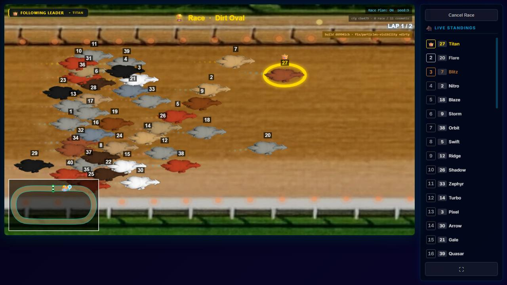
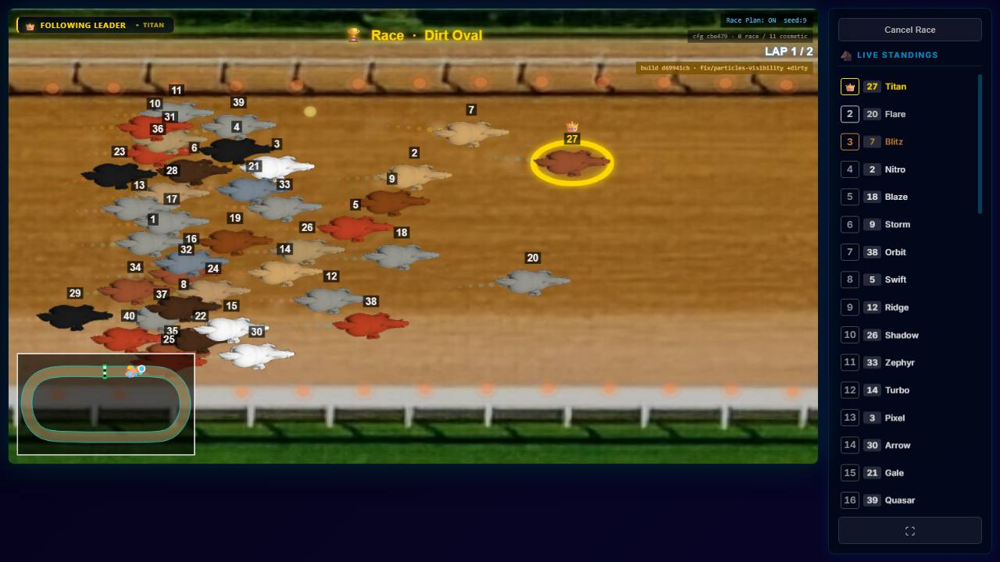
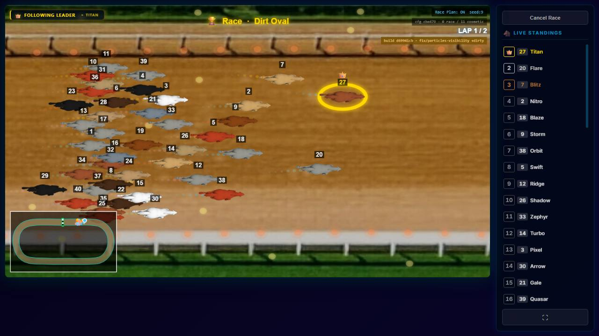
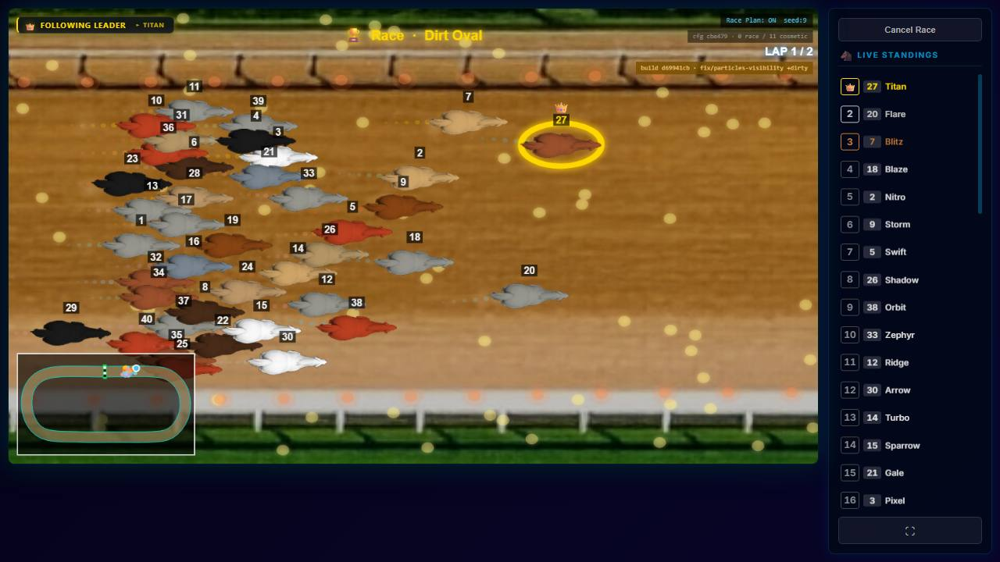

# PARTICLES-VISIBILITY-6 — lowering the fireflies maximum: no level passed the rule, so none was set

**Measured 2026-09-28 on branch `fix/particles-visibility` at `d69941cb`. No code changed.**

**Owns:** the search for a fireflies slider maximum that never slows the race or the pre-start flight, and why it
ended without one. Open row: [BACKLOG.md](../../docs/BACKLOG.md) PART ONE, *2026-09-28 — added (PARTICLES-VISIBILITY-1)*.

**The owner's decision of 2026-09-28, recorded as a fact:** of the options in PARTICLES-VISIBILITY-5, lower the fireflies
maximum; the look of the effect stays unchanged.

---

## 0 · The answer

**No fireflies level matched the no-effect baseline under the decision rule, down to and including 30, the effect's
default. So, as the brief's rule requires, no new maximum was set.** The slider stays at 0–4,000, and no code changed.
**MEASURED.**

What the numbers show, level by level (§3):

| fireflies | pre-start flight and first 10 s of racing, against no effect |
| --- | --- |
| 4,000 · 2,000 | **the frame rate drops** in every run: median 50 ms against 33 ms, p90 67 against 50 |
| 1,000 · 500 | **the frame rate drops** in most runs (median 50 in 2 of 3 runs per phase) |
| 250 and below | **median and p90 equal the baseline**; the mismatch is only in the *share* of frames longer than one step and in single-frame spikes and jumps |

**Why the low levels fail, and why that is probably not fireflies** (NOT PROVEN): at 30 fireflies there are
0–1 on screen in the race camera and a few dozen over the whole track, a drawing cost too small to register. Yet 30
fails the rule in the same way 250 does. Two other things vary more than any small effect:
- **The machine switched speed within a batch.** One no-effect run of batch 2 ran at 60 fps (median 16.7 ms) and
  the next two at 30 fps (33 ms). The baseline's own "range" therefore spans a factor of two on some numbers and
  almost nothing on others.
- **Single-frame spikes of 250–400 ms at the ceremony's start** appear at random: in the baseline too (PARTICLES-VISIBILITY-5
  §3), and here in some runs of every level.

A rule that every run of a level must lie inside the min–max of three baseline runs, on every number including the
maximum and the largest jump, cannot be met by any level on this machine, 0 excepted. It measures the noise, not the
effect.

**Where the real cost starts, on the numbers that are not noise-dominated — median and p90:** the frame rate is
unchanged at **250 and below**, and drops at **500 and above** (§3). That points to a maximum between 250 and 500. It is
**NOT set**, because the brief's rule did not allow it. **Proposals, none implemented**, all for the owner:
1. **Accept a rule on median and p90 only** (the frame rate), leaving the spikes aside because they appear without any
   effect. On these numbers the maximum would be **250**, **MEASURED**, and refinement between 250 and 500 would be
   the next step.
2. **Measure with more baseline runs** (say ten per batch) so the baseline's spread reflects the machine's real variation,
   then apply the strict rule again.
3. **Measure on the owner's machine**, whose baseline is what matters.

**The test machine is not the owner's.** It ran at about 30 fps with no effect, occasionally 60, in the same session.

---

## 1 · Checked at source

- fireflies' slider: `min: 0, max: 4000, step: 10, default: 30`
  (`client/src/modules/track-effects/effects/fireflies.js:16`), pinned by
  `client/src/modules/track-effects/effects/countRange.test.js:23`. **Unchanged.**
- **No stored track uses fireflies** (the owner's live `server/data/tracks/`, read only), so nothing lies above any
  candidate maximum.
- The server's track-save cap is 2 × the highest slider maximum, and that is bubbles' 240,000, not fireflies'
  (`server/src/routes/tracks.js:125-129`). It would not have changed; it has not.
- PARTICLES-VISIBILITY-5's background is **right as stated in the brief**: fireflies at 4,000 ran the venue shot at about
  15 fps, the rest of the ceremony at about 20 fps, and the first 10 s of racing at about 20 fps (3 of 3), against about
  30 fps with no effect. This measurement repeats it (§3, level 4,000).

---

## 2 · How it was measured

- **Build:** a throwaway plain clone of `d69941cb`, production build, headless Chromium at 1280×720, on the production
  arm's own port with a fresh data directory per race. The owner's servers were not touched.
- **Race:** his race `VY7KKE` on Dirt Oval with his 11 camera overrides. **The Dirt Oval "copy with fireflies switched
  on" is a probe in the clone that replaces the race's effect list at creation;** no track data was written.
  Fireflies' other settings are at their defaults.
- **Levels:** no effect (the baseline), then 4,000 halved each time: 2,000, 1,000, 500, 250, 120, 60 and 30, the default.
  A maximum below the default is not possible without moving the default, which the brief forbids. Three runs per level,
  **interleaved with the baseline in the same batch** (none, 4,000, 2,000, … then again), so each level shares the
  baseline's machine condition. Two batches: 4,000 to 250, then 120 to 30, each with its own three baseline runs.
- **Phases:** the pre-start flight, from the first ceremony frame (excluded: its gap is the page load) to the start signal,
  and the first 10 s of racing.
- **Numbers per run:** frame gap median / p90 / max, frames longer than one 60 fps step (counted as > 20 ms for rAF
  timestamp jitter, and compared as a share because runs differ in length), the largest jump between consecutive frames,
  and N frames.
- **Rule** (the brief's): a level matches when every one of its runs lies inside the baseline's min–max across its runs,
  on every number, in both phases.

---

## 3 · The numbers — MEASURED

### Batch 1 — 4,000 to 250

#### pre-start flight (first ceremony frame to the start signal)

Baseline range (no effect, 3 runs): median 33.3–33.4 · p90 50.0–50.0 · max 99.9–283.3 · share > 20 ms 78.3–89.7 % · largest jump 50.0–183.3 ms

| level | run | N frames | frame gap med / p90 / max ms | frames > 20 ms (share) | largest jump ms | within baseline range? |
| --- | --- | --- | --- | --- | --- | --- |
| none | 1 | 526 | 33.3 / 50.0 / 283.3 | 412 (78.3 %) | 183.3 | (baseline) |
| none | 2 | 494 | 33.3 / 50.0 / 99.9 | 443 (89.7 %) | 50.0 | (baseline) |
| none | 3 | 488 | 33.4 / 50.0 / 99.9 | 433 (88.7 %) | 50.2 | (baseline) |
| 250 | 1 | 444 | 33.4 / 50.0 / 83.3 | 421 (94.8 %) | 50.0 | **no** — max, share |
| 250 | 2 | 429 | 33.4 / 50.0 / 333.3 | 411 (95.8 %) | 200.0 | **no** — max, share, jump |
| 250 | 3 | 462 | 33.4 / 50.0 / 100.0 | 418 (90.5 %) | 66.6 | **no** — share |
| 500 | 1 | 441 | 33.4 / 50.0 / 316.6 | 426 (96.6 %) | 200.0 | **no** — max, share, jump |
| 500 | 2 | 430 | 33.4 / 50.1 / 299.9 | 407 (94.7 %) | 216.6 | **no** — p90, max, share, jump |
| 500 | 3 | 424 | 49.9 / 50.1 / 149.9 | 409 (96.5 %) | 99.9 | **no** — med, p90, share |
| 1000 | 1 | 397 | 49.9 / 66.7 / 166.6 | 383 (96.5 %) | 83.2 | **no** — med, p90, share |
| 1000 | 2 | 427 | 33.4 / 50.1 / 150.0 | 402 (94.1 %) | 116.7 | **no** — p90, share |
| 1000 | 3 | 394 | 50.0 / 66.6 / 99.9 | 377 (95.7 %) | 66.5 | **no** — med, p90, share |
| 2000 | 1 | 382 | 50.0 / 66.6 / 366.6 | 377 (98.7 %) | 233.3 | **no** — med, p90, max, share, jump |
| 2000 | 2 | 369 | 50.0 / 66.6 / 399.9 | 366 (99.2 %) | 266.6 | **no** — med, p90, max, share, jump |
| 2000 | 3 | 373 | 50.0 / 66.7 / 383.3 | 369 (98.9 %) | 233.3 | **no** — med, p90, max, share, jump |
| 4000 | 1 | 356 | 50.0 / 66.7 / 183.3 | 356 (100.0 %) | 50.2 | **no** — med, p90, share |
| 4000 | 2 | 372 | 50.0 / 66.6 / 200.0 | 370 (99.5 %) | 83.4 | **no** — med, p90, share |
| 4000 | 3 | 373 | 50.0 / 66.7 / 466.6 | 370 (99.2 %) | 333.2 | **no** — med, p90, max, share, jump |

#### first 10 s of racing

Baseline range (no effect, 3 runs): median 33.3–33.4 · p90 50.0–50.0 · max 66.8–83.4 · share > 20 ms 86.6–89.4 % · largest jump 49.9–66.6 ms

| level | run | N frames | frame gap med / p90 / max ms | frames > 20 ms (share) | largest jump ms | within baseline range? |
| --- | --- | --- | --- | --- | --- | --- |
| none | 1 | 269 | 33.4 / 50.0 / 66.8 | 233 (86.6 %) | 50.0 | (baseline) |
| none | 2 | 284 | 33.3 / 50.0 / 83.3 | 254 (89.4 %) | 66.6 | (baseline) |
| none | 3 | 260 | 33.4 / 50.0 / 83.4 | 232 (89.2 %) | 49.9 | (baseline) |
| 250 | 1 | 253 | 33.4 / 50.0 / 100.0 | 234 (92.5 %) | 49.9 | **no** — max, share |
| 250 | 2 | 261 | 33.4 / 50.0 / 83.4 | 245 (93.9 %) | 49.9 | **no** — share |
| 250 | 3 | 263 | 33.4 / 50.1 / 83.3 | 231 (87.8 %) | 50.2 | **no** — p90 |
| 500 | 1 | 215 | 50.0 / 66.6 / 83.3 | 214 (99.5 %) | 33.6 | **no** — med, p90, share, jump |
| 500 | 2 | 236 | 49.9 / 50.1 / 83.3 | 226 (95.8 %) | 49.9 | **no** — med, p90, share |
| 500 | 3 | 229 | 49.9 / 50.1 / 83.4 | 227 (99.1 %) | 33.3 | **no** — med, p90, share, jump |
| 1000 | 1 | 231 | 49.9 / 50.1 / 83.4 | 228 (98.7 %) | 33.4 | **no** — med, p90, share, jump |
| 1000 | 2 | 240 | 33.4 / 50.1 / 100.0 | 233 (97.1 %) | 50.0 | **no** — p90, max, share |
| 1000 | 3 | 220 | 50.0 / 50.1 / 83.3 | 220 (100.0 %) | 33.4 | **no** — med, p90, share, jump |
| 2000 | 1 | 217 | 50.0 / 50.1 / 83.4 | 216 (99.5 %) | 33.5 | **no** — med, p90, share, jump |
| 2000 | 2 | 195 | 50.0 / 66.7 / 100.0 | 194 (99.5 %) | 33.4 | **no** — med, p90, max, share, jump |
| 2000 | 3 | 191 | 50.0 / 66.7 / 83.4 | 189 (99.0 %) | 33.4 | **no** — med, p90, share, jump |
| 4000 | 1 | 197 | 50.0 / 66.7 / 66.8 | 196 (99.5 %) | 33.4 | **no** — med, p90, share, jump |
| 4000 | 2 | 189 | 50.0 / 66.7 / 83.3 | 189 (100.0 %) | 49.8 | **no** — med, p90, share, jump |
| 4000 | 3 | 208 | 50.0 / 66.6 / 83.2 | 208 (100.0 %) | 33.5 | **no** — med, p90, share, jump |

#### verdict per level (both phases, every run inside the baseline range on every number)

- **250**: does NOT match — flight: max, share; flight: max, share, jump; flight: share; race 0–10 s: max, share; race 0–10 s: share; race 0–10 s: p90
- **500**: does NOT match — flight: max, share, jump; flight: p90, max, share, jump; flight: med, p90, share; race 0–10 s: med, p90, share, jump; race 0–10 s: med, p90, share
- **1000**: does NOT match — flight: med, p90, share; flight: p90, share; race 0–10 s: med, p90, share, jump; race 0–10 s: p90, max, share
- **2000**: does NOT match — flight: med, p90, max, share, jump; race 0–10 s: med, p90, share, jump; race 0–10 s: med, p90, max, share, jump
- **4000**: does NOT match — flight: med, p90, share; flight: med, p90, max, share, jump; race 0–10 s: med, p90, share, jump

#### flight duration and fireflies on screen in the race camera (first 10 s of racing)

| level | flight ms per run | on screen med / p90 (N frames) per run |
| --- | --- | --- |
| none | 18033 · 18033 · 18033 | 0 / 0 (269) · 0 / 0 (284) · 0 / 0 (260) |
| 250 | 18033 · 18033 · 18016 | 5 / 9 (253) · 5 / 10 (261) · 5 / 8 (263) |
| 500 | 18032 · 18016 · 18033 | 10 / 14 (215) · 6 / 9 (236) · 9 / 16 (229) |
| 1000 | 18049 · 18049 · 18016 | 15 / 20 (231) · 23 / 30 (240) · 21 / 26 (220) |
| 2000 | 18033 · 18033 · 18033 | 36 / 48 (217) · 39 / 48 (195) · 35 / 56 (191) |
| 4000 | 18033 · 18049 · 18033 | 66 / 101 (197) · 61 / 91 (189) · 81 / 104 (208) |

### Batch 2 — 120 to 30, with its own baseline

#### pre-start flight (first ceremony frame to the start signal)

Baseline range (no effect, 3 runs): median 16.7–33.4 · p90 33.4–50.0 · max 83.3–100.0 · share > 20 ms 32.2–87.5 % · largest jump 33.4–66.7 ms

| level | run | N frames | frame gap med / p90 / max ms | frames > 20 ms (share) | largest jump ms | within baseline range? |
| --- | --- | --- | --- | --- | --- | --- |
| none | 1 | 811 | 16.7 / 33.4 / 100.0 | 261 (32.2 %) | 33.4 | (baseline) |
| none | 2 | 492 | 33.4 / 50.0 / 83.3 | 430 (87.4 %) | 66.7 | (baseline) |
| none | 3 | 528 | 33.3 / 50.0 / 83.3 | 462 (87.5 %) | 33.6 | (baseline) |
| 30 | 1 | 466 | 33.4 / 50.0 / 283.2 | 449 (96.4 %) | 149.8 | **no** — max, share, jump |
| 30 | 2 | 471 | 33.4 / 50.0 / 266.7 | 435 (92.4 %) | 150.1 | **no** — max, share, jump |
| 30 | 3 | 490 | 33.4 / 50.0 / 83.2 | 457 (93.3 %) | 50.0 | **no** — max, share |
| 60 | 1 | 440 | 33.4 / 50.1 / 233.3 | 421 (95.7 %) | 116.7 | **no** — p90, max, share, jump |
| 60 | 2 | 514 | 33.3 / 50.0 / 250.0 | 463 (90.1 %) | 149.9 | **no** — max, share, jump |
| 60 | 3 | 479 | 33.3 / 50.0 / 300.0 | 439 (91.6 %) | 200.0 | **no** — max, share, jump |
| 120 | 1 | 558 | 33.3 / 50.0 / 99.9 | 381 (68.3 %) | 49.9 | yes |
| 120 | 2 | 487 | 33.4 / 50.0 / 100.0 | 450 (92.4 %) | 66.6 | **no** — max, share |
| 120 | 3 | 467 | 33.4 / 50.0 / 316.6 | 444 (95.1 %) | 216.6 | **no** — max, share, jump |

#### first 10 s of racing

Baseline range (no effect, 3 runs): median 16.7–33.3 · p90 33.4–50.0 · max 50.0–83.4 · share > 20 ms 39.2–90.2 % · largest jump 33.4–33.5 ms

| level | run | N frames | frame gap med / p90 / max ms | frames > 20 ms (share) | largest jump ms | within baseline range? |
| --- | --- | --- | --- | --- | --- | --- |
| none | 1 | 429 | 16.7 / 33.4 / 50.0 | 168 (39.2 %) | 33.4 | (baseline) |
| none | 2 | 276 | 33.3 / 50.0 / 83.3 | 249 (90.2 %) | 33.4 | (baseline) |
| none | 3 | 291 | 33.3 / 50.0 / 83.4 | 257 (88.3 %) | 33.5 | (baseline) |
| 30 | 1 | 221 | 50.0 / 50.1 / 183.4 | 218 (98.6 %) | 133.4 | **no** — med, p90, max, share, jump |
| 30 | 2 | 268 | 33.4 / 50.0 / 83.3 | 248 (92.5 %) | 50.2 | **no** — med, share, jump |
| 30 | 3 | 281 | 33.3 / 50.0 / 66.7 | 250 (89.0 %) | 50.1 | **no** — jump |
| 60 | 1 | 280 | 33.3 / 50.0 / 83.4 | 255 (91.1 %) | 33.4 | **no** — share |
| 60 | 2 | 247 | 33.4 / 50.0 / 83.3 | 246 (99.6 %) | 50.0 | **no** — med, share, jump |
| 60 | 3 | 253 | 33.4 / 50.1 / 83.4 | 243 (96.0 %) | 49.9 | **no** — med, p90, share, jump |
| 120 | 1 | 233 | 49.9 / 50.1 / 66.8 | 231 (99.1 %) | 50.1 | **no** — med, p90, share, jump |
| 120 | 2 | 291 | 33.3 / 50.0 / 66.7 | 258 (88.7 %) | 49.9 | **no** — jump |
| 120 | 3 | 264 | 33.4 / 50.0 / 83.3 | 246 (93.2 %) | 49.9 | **no** — med, share, jump |

#### verdict per level (both phases, every run inside the baseline range on every number)

- **30**: does NOT match — flight: max, share, jump; flight: max, share; race 0–10 s: med, p90, max, share, jump; race 0–10 s: med, share, jump; race 0–10 s: jump
- **60**: does NOT match — flight: p90, max, share, jump; flight: max, share, jump; race 0–10 s: share; race 0–10 s: med, share, jump; race 0–10 s: med, p90, share, jump
- **120**: does NOT match — flight: max, share; flight: max, share, jump; race 0–10 s: med, p90, share, jump; race 0–10 s: jump; race 0–10 s: med, share, jump

#### flight duration and fireflies on screen in the race camera (first 10 s of racing)

| level | flight ms per run | on screen med / p90 (N frames) per run |
| --- | --- | --- |
| none | 18033 · 18016 · 18033 | 0 / 0 (429) · 0 / 0 (276) · 0 / 0 (291) |
| 30 | 18016 · 18016 · 18016 | 1 / 2 (221) · 0 / 1 (268) · 0 / 1 (281) |
| 60 | 18033 · 18033 · 18049 | 1 / 2 (280) · 1 / 2 (247) · 1 / 2 (253) |
| 120 | 18016 · 18033 · 18033 | 2 / 4 (233) · 1 / 3 (291) · 3 / 5 (264) |

---

## 4 · Reference: the race camera 5 s into racing, per level (run 1)

There is no new maximum to show. These show what each level looks like, and that the look is unchanged. Only the
count changes.

| 30 (default) | 250 |
| --- | --- |
|  |  |
| **1,000** | **4,000 (the maximum today)** |
|  |  |

---

## 5 · What was built, tested and left

- **Nothing was built.** The fireflies schema, its pin in `countRange.test.js`, the server cap, the drawing and the
  default are unchanged. So there is no pin to sabotage, and nothing for `engine-reach` or the fingerprints to see.
- `npm run verify -- --premerge` ran on the final tree; the result is in the commit message and the task report.
- **Noticed and left:**
  - The test machine flips between about 60 and 30 fps within one batch. Any rule comparing frame times across
    runs needs either many baseline runs or a machine held at one speed.
  - Single-frame spikes of 250–400 ms at the ceremony's start occur with and without effects.
- **Clean-up:** the throwaway clone, its 30 data directories, the probe, spec, runner and raw dumps are deleted. The
  owner's `races.sqlite` and track data were only read.
