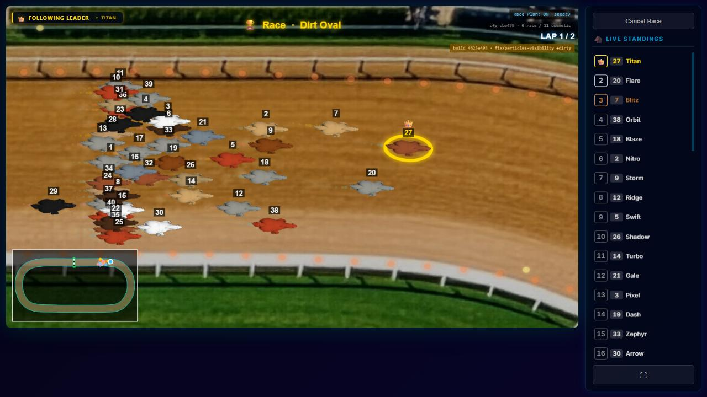

# PARTICLES-VISIBILITY-7 — the fireflies maximum, set with a corrected measuring rule: 250

**Measured and built 2026-09-28 on branch `fix/particles-visibility`, on top of PARTICLES-VISIBILITY-6 (`4623a493`).
Not merged: the owner looks first.**

**Owns:** the new fireflies slider maximum and the measurement behind it. Open row:
[BACKLOG.md](../../docs/BACKLOG.md) PART ONE, *2026-09-28 — added (PARTICLES-VISIBILITY-1)*.

**The owner's decision of 2026-09-28 stands:** lower the fireflies maximum, the look unchanged.

**The method — recorded as the rule used, which the author of the brief set, not the owner:**
- **Baseline:** ten no-effect runs, interleaved with the effect runs in the same batch.
- **Judged on frame rate only:** frame-time **median and p90**, per run, for the pre-start flight and for the first 10 s
  of racing. A level passes when **every one of its runs** has median and p90 inside the range spanned by the baseline
  runs, in both phases.
- **Not judged, only reported:** long-frame counts and single-frame spikes (max, largest jump).
- **Decision:** the new maximum is the highest level that passes.

This replaces PARTICLES-VISIBILITY-6's rule, which judged every number against three baseline runs and so measured the
machine's noise instead of fireflies.

---

## 0 · The answer

**The fireflies maximum is now 250** (was 4,000). **MEASURED**, under the rule above:

| level | pre-start flight | first 10 s of racing | verdict |
| --- | --- | --- | --- |
| **250** | 3 of 3 runs inside | 3 of 3 runs inside | **passes** |
| 300 | 3 of 3 inside | **run 3: median 33.2 ms — half the frame rate** | fails |
| 350 | run 2 at 16.8 ms | runs 2 and 3 at 33.2 ms — half the frame rate | fails |
| 400 | runs 2, 3 at 16.8 ms | run 3 at 16.8 ms | fails (see below) |
| 450 | run 1 at 33.2 ms | runs 1, 3 at 16.8 ms | fails |
| 500 | runs 2, 3 at 33.3 ms | runs 1–3 at 16.8 / 33.2 / 33.3 ms | fails |

**How firm the boundary is.** Some fails are a median of 16.8 ms against a baseline that sat at exactly 16.7 in all ten runs.
That is a rounding-level difference, not a lower frame rate, and taken alone it would be a weak reason to fail a level.
**It does not decide the result:** **300 fails on a real halving** (one run's racing median at 33.2 ms, 30 fps against 60),
and so do 350, 450 and 500. So 250 is the highest level with no run dropping to half the frame rate, and the first level
above it already drops. **MEASURED.**

**What the owner sees at 250:**
- In the race camera, 2–5 fireflies on screen (median), 10–13 at p90.
- Over the whole track, 250 at once.
- The look of each firefly is unchanged; only the slider's top is lower.

**The flight never takes longer:** 18.02–18.03 s at every level, including no effect. **MEASURED.**

**The machine during the batch: a steady 60 fps.** Every one of the ten no-effect runs had median 16.7 ms in both phases.
The test browser runs at about 30–60 fps on this machine, depending on load; **it is not the owner's machine**, and this
result is **not proof there**.

---

## 1 · Checked at source, and what was built

- **fireflies' slider:** `min: 0, max: 250, step: 10, default: 30`
  (`client/src/modules/track-effects/effects/fireflies.js:20`). **Only the maximum changed**, from 4,000. The minimum,
  step, default and drawing are unchanged. The default, 30, lies inside the new range and on its grid. An inline comment
  at the maximum names this report and the rule.
- **No stored track uses fireflies** (the owner's live `server/data/tracks/`, read only), so no stored value lies above
  250.
- **The server's save cap is unchanged:** it is 2 × bubbles' 240,000 (`server/src/routes/tracks.js:125-129`), not
  derived from fireflies.
- **The pin:** `client/src/modules/track-effects/effects/countRange.test.js:23`, `fireflies: 250`. **Sabotage:**
  the schema maximum set to 260 turned the test **red (1 failed)**, and it was restored byte-identical.
- **Fingerprints:** `node scripts/engine-reach.mjs --check` with both changed paths reported **none can reach the race
  engine** (both outside the hull), so no fingerprint guard is selected.
- `npm run verify -- --premerge`: the result on the final tree is in the commit message and the task report.

| file | lines before → after |
| --- | --- |
| `client/src/modules/track-effects/effects/fireflies.js` | 108 → 112 |
| `client/src/modules/track-effects/effects/countRange.test.js` | 79 → 79 |

---

## 2 · How it was measured

As PARTICLES-VISIBILITY-6, apart from the rule:
- **Build:** a throwaway plain clone of `4623a493`, production build, headless Chromium at 1280×720, on the production
  arm's own port with a fresh data directory per race. The owner's servers were not touched.
- **Race:** his race `VY7KKE` on Dirt Oval, his 11 camera overrides. **The Dirt Oval copy with fireflies switched on is a
  probe in the clone that replaces the race's effect list at creation;** no track data was written. Fireflies' other
  settings are at their defaults.
- **One batch of 28 races:** three rounds of *no effect, 250, 300, no effect, 350, 400, no effect, 450, 500*, and a tenth
  no-effect run at the end. Ten baseline runs spread through the batch; three runs at each of 250 (to confirm), 500 (to
  confirm) and 300, 350, 400, 450 (the refinement in steps of 50).
- **Phases:** the pre-start flight, from the first ceremony frame (excluded: its gap is the page load) to the start signal,
  and the first 10 s of racing. N frames are given on every row.

---

## 3 · The numbers — MEASURED

Baseline: 10 no-effect runs. Machine frame rate during the batch (from each baseline run's median, both phases): 60–60 fps.

#### pre-start flight (first ceremony frame to the start signal)

Baseline range — median 16.7–16.7 ms · p90 33.3–33.4 ms

| level | run | N frames | median ms | p90 ms | judged: inside range? | max ms | frames > 20 ms (share) | largest jump ms |
| --- | --- | --- | --- | --- | --- | --- | --- | --- |
| none | 1 | 798 | 16.7 | 33.4 | (baseline) | 66.6 | 276 (34.6 %) | 33.4 |
| none | 2 | 842 | 16.7 | 33.4 | (baseline) | 83.3 | 231 (27.4 %) | 66.6 |
| none | 3 | 847 | 16.7 | 33.3 | (baseline) | 100.0 | 224 (26.4 %) | 66.6 |
| none | 4 | 842 | 16.7 | 33.4 | (baseline) | 83.3 | 231 (27.4 %) | 33.5 |
| none | 5 | 824 | 16.7 | 33.4 | (baseline) | 83.3 | 248 (30.1 %) | 33.3 |
| none | 6 | 840 | 16.7 | 33.4 | (baseline) | 83.2 | 236 (28.1 %) | 66.5 |
| none | 7 | 839 | 16.7 | 33.4 | (baseline) | 150.0 | 233 (27.8 %) | 100.1 |
| none | 8 | 840 | 16.7 | 33.4 | (baseline) | 150.0 | 232 (27.6 %) | 100.1 |
| none | 9 | 844 | 16.7 | 33.3 | (baseline) | 133.3 | 229 (27.1 %) | 83.4 |
| none | 10 | 821 | 16.7 | 33.4 | (baseline) | 133.2 | 251 (30.6 %) | 83.2 |
| 250 | 1 | 781 | 16.7 | 33.4 | yes | 133.3 | 292 (37.4 %) | 83.3 |
| 250 | 2 | 723 | 16.7 | 33.4 | yes | 183.3 | 344 (47.6 %) | 133.3 |
| 250 | 3 | 752 | 16.7 | 33.4 | yes | 199.9 | 303 (40.3 %) | 83.2 |
| 300 | 1 | 784 | 16.7 | 33.4 | yes | 83.3 | 281 (35.8 %) | 50.0 |
| 300 | 2 | 722 | 16.7 | 33.4 | yes | 83.3 | 338 (46.8 %) | 50.1 |
| 300 | 3 | 728 | 16.7 | 33.4 | yes | 166.7 | 339 (46.6 %) | 100.1 |
| 350 | 1 | 742 | 16.7 | 33.4 | yes | 149.9 | 330 (44.5 %) | 99.9 |
| 350 | 2 | 719 | 16.8 | 33.4 | **no** | 166.6 | 349 (48.5 %) | 99.9 |
| 350 | 3 | 720 | 16.7 | 33.4 | yes | 100.0 | 332 (46.1 %) | 50.0 |
| 400 | 1 | 742 | 16.7 | 33.4 | yes | 116.6 | 319 (43.0 %) | 49.9 |
| 400 | 2 | 710 | 16.8 | 33.4 | **no** | 149.9 | 346 (48.7 %) | 99.9 |
| 400 | 3 | 722 | 16.8 | 33.4 | **no** | 99.9 | 351 (48.6 %) | 66.5 |
| 450 | 1 | 711 | 33.2 | 33.4 | **no** | 83.4 | 362 (50.9 %) | 66.7 |
| 450 | 2 | 730 | 16.8 | 33.4 | **no** | 66.7 | 344 (47.1 %) | 50.1 |
| 450 | 3 | 736 | 16.7 | 33.4 | yes | 100.0 | 320 (43.5 %) | 50.0 |
| 500 | 1 | 743 | 16.7 | 33.4 | yes | 133.2 | 319 (42.9 %) | 116.5 |
| 500 | 2 | 697 | 33.3 | 33.4 | **no** | 133.2 | 365 (52.4 %) | 66.5 |
| 500 | 3 | 679 | 33.3 | 33.4 | **no** | 149.9 | 383 (56.4 %) | 99.8 |

#### first 10 s of racing

Baseline range — median 16.7–16.7 ms · p90 33.4–33.4 ms

| level | run | N frames | median ms | p90 ms | judged: inside range? | max ms | frames > 20 ms (share) | largest jump ms |
| --- | --- | --- | --- | --- | --- | --- | --- | --- |
| none | 1 | 433 | 16.7 | 33.4 | (baseline) | 50.1 | 155 (35.8 %) | 33.5 |
| none | 2 | 418 | 16.7 | 33.4 | (baseline) | 50.0 | 176 (42.1 %) | 33.4 |
| none | 3 | 445 | 16.7 | 33.4 | (baseline) | 50.0 | 154 (34.6 %) | 17.0 |
| none | 4 | 433 | 16.7 | 33.4 | (baseline) | 50.0 | 164 (37.9 %) | 33.4 |
| none | 5 | 446 | 16.7 | 33.4 | (baseline) | 50.0 | 152 (34.1 %) | 33.3 |
| none | 6 | 448 | 16.7 | 33.4 | (baseline) | 50.0 | 150 (33.5 %) | 33.4 |
| none | 7 | 448 | 16.7 | 33.4 | (baseline) | 50.0 | 150 (33.5 %) | 33.4 |
| none | 8 | 444 | 16.7 | 33.4 | (baseline) | 50.0 | 154 (34.7 %) | 16.9 |
| none | 9 | 438 | 16.7 | 33.4 | (baseline) | 50.0 | 160 (36.5 %) | 16.9 |
| none | 10 | 444 | 16.7 | 33.4 | (baseline) | 66.7 | 151 (34.0 %) | 33.5 |
| 250 | 1 | 431 | 16.7 | 33.4 | yes | 50.0 | 166 (38.5 %) | 16.9 |
| 250 | 2 | 418 | 16.7 | 33.4 | yes | 66.7 | 177 (42.3 %) | 33.3 |
| 250 | 3 | 417 | 16.7 | 33.4 | yes | 50.0 | 181 (43.4 %) | 33.3 |
| 300 | 1 | 427 | 16.7 | 33.4 | yes | 50.1 | 169 (39.6 %) | 33.2 |
| 300 | 2 | 408 | 16.7 | 33.4 | yes | 50.1 | 189 (46.3 %) | 33.3 |
| 300 | 3 | 382 | 33.2 | 33.4 | **no** | 50.1 | 195 (51.0 %) | 33.5 |
| 350 | 1 | 407 | 16.7 | 33.4 | yes | 50.1 | 188 (46.2 %) | 33.5 |
| 350 | 2 | 394 | 33.2 | 33.4 | **no** | 50.1 | 200 (50.8 %) | 33.4 |
| 350 | 3 | 396 | 33.2 | 33.4 | **no** | 50.1 | 198 (50.0 %) | 33.5 |
| 400 | 1 | 411 | 16.7 | 33.4 | yes | 50.1 | 184 (44.8 %) | 33.4 |
| 400 | 2 | 414 | 16.7 | 33.4 | yes | 66.7 | 178 (43.0 %) | 50.0 |
| 400 | 3 | 388 | 16.8 | 33.4 | **no** | 66.7 | 190 (49.0 %) | 33.4 |
| 450 | 1 | 398 | 16.8 | 33.4 | **no** | 50.0 | 196 (49.2 %) | 33.4 |
| 450 | 2 | 404 | 16.7 | 33.4 | yes | 50.0 | 189 (46.8 %) | 33.4 |
| 450 | 3 | 404 | 16.8 | 33.4 | **no** | 50.0 | 194 (48.0 %) | 33.3 |
| 500 | 1 | 396 | 33.2 | 33.4 | **no** | 50.0 | 200 (50.5 %) | 33.4 |
| 500 | 2 | 383 | 16.8 | 33.4 | **no** | 100.0 | 186 (48.6 %) | 33.3 |
| 500 | 3 | 371 | 33.3 | 33.4 | **no** | 66.7 | 214 (57.7 %) | 50.1 |

#### verdict per level (every run: median and p90 inside the baseline range, both phases)

- **250**: **PASSES**
- **300**: **FAILS** — race 0–10 s run 3: median 33.2
- **350**: **FAILS** — flight run 2: median 16.8; race 0–10 s run 2: median 33.2; race 0–10 s run 3: median 33.2
- **400**: **FAILS** — flight run 2: median 16.8; flight run 3: median 16.8; race 0–10 s run 3: median 16.8
- **450**: **FAILS** — flight run 1: median 33.2; flight run 2: median 16.8; race 0–10 s run 1: median 16.8; race 0–10 s run 3: median 16.8
- **500**: **FAILS** — flight run 2: median 33.3; flight run 3: median 33.3; race 0–10 s run 1: median 33.2; race 0–10 s run 2: median 16.8; race 0–10 s run 3: median 33.3

#### flight duration, and fireflies on screen in the race camera (first 10 s of racing)

| level | flight ms per run | on screen med / p90 (N frames) per run |
| --- | --- | --- |
| none | 18033 · 18016 · 18033 · 18016 · 18016 · 18016 · 18033 · 18016 · 18033 · 18016 | 0 / 0 (433) · 0 / 0 (418) · 0 / 0 (445) · 0 / 0 (433) · 0 / 0 (446) · 0 / 0 (448) · 0 / 0 (448) · 0 / 0 (444) · 0 / 0 (438) · 0 / 0 (444) |
| 250 | 18016 · 18016 · 18016 | 2 / 13 (431) · 3 / 13 (418) · 5 / 10 (417) |
| 300 | 18016 · 18016 · 18016 | 3 / 5 (427) · 7 / 12 (408) · 9 / 14 (382) |
| 350 | 18016 · 18033 · 18033 | 9 / 14 (407) · 7 / 20 (394) · 11 / 18 (396) |
| 400 | 18033 · 18016 · 18016 | 7 / 19 (411) · 9 / 14 (414) · 7 / 16 (388) |
| 450 | 18016 · 18033 · 18033 | 12 / 18 (398) · 10 / 17 (404) · 10 / 15 (404) |
| 500 | 18033 · 18016 · 18016 | 9 / 22 (396) · 11 / 15 (383) · 12 / 17 (371) |

---

## 4 · At the new maximum, 250

| the race camera, 5 s into racing | the venue shot, the whole track |
| --- | --- |
|  |  |

---

## 5 · Noticed and left

- **16.7 against 16.8 ms.** A baseline this steady (ten runs, all at 16.7 ms) makes a range with no width. A median that
  lands on 16.8 through timestamp jitter then counts as outside it. It did not change this result (§0), but a later use of
  this rule should allow for one-tenth-millisecond jitter.
- **Long frames rise before the median does.** From 250 up, the share of frames over 20 ms is above the baseline's (for
  example flight 37–48% at 250 against 26–35% with no effect). Under this rule that is reported, not judged, as agreed.
  Whether it is visible is for the owner's eye.
- **Single-frame spikes** in the flight reach up to 150 ms with no effect and up to 200 ms with fireflies, as in
  PARTICLES-VISIBILITY-5 and -6. They are reported, not judged.

## 6 · Clean-up

The throwaway clone, its 28 data directories, the probe, spec, runner and raw dumps are deleted. The owner's
`races.sqlite` and track data were only read.
