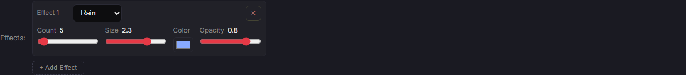

# PARTICLES-VISIBILITY-8 — one amount scale, 0 to 100, for every track effect

**Built 2026-09-29 on branch `fix/particles-visibility`, on top of PARTICLES-VISIBILITY-7 (`da9737d4`). Code commit
`501f1730`. Not merged: the owner looks first.**

**Owns:** the level scale of the track effects' amount control and the one conversion behind it. Open row:
[BACKLOG.md](../../docs/BACKLOG.md) PART ONE, *2026-09-28 — added (PARTICLES-VISIBILITY-1)*.

**The owner's decision of 2026-09-28:** the amount control of all seven track effects shows 0–100. 0 is off, 100 is the
effect's current maximum, and the values in between are linear (level × maximum / 100).

---

## 0 · The answer

- **The Track Editor's amount slider now runs 0–100 in steps of 1 for all seven effects**, and its label shows the level.
  Every other control (size, colour, opacity, drift, …) keeps its own native scale. **TESTED** for all seven.
- **Storage is unchanged.** Tracks keep native amounts, and the race reads native amounts, so the race screen and the
  drawing are untouched. **Opening and saving a track without touching the amount leaves the stored value
  byte-identical.** TESTED on the owner's three stored effect blocks, through the editor's real load and save functions.
- **A stored non-zero amount never shows 0.** Seatrack's bubbles (100 per minute) are 0.04 of the maximum and show **1**.
- **Nothing that the race runs on moved.** `engine-reach --check` places all four changed files outside the engine hull.
  No fingerprint can move, and none was minted.

*Dirt Oval in the Track Editor, production build `501f1730` with seeded throwaway data: rain's Count shows **5** (stored 200
drops per second of a 4,000 maximum). Size, Color and Opacity keep their native values.*

---

## 1 · Per effect: the maximum, and what the levels mean

The maxima were read at source (`client/src/modules/track-effects/effects/*.js`, the `count` field of each `configSchema`).
They are unchanged. The units are unchanged too: rain counts drops per second, bubbles and mud count per minute, and the
other four count items on the track at once.

| effect | unit | maximum (level 100) | level 1 | level 10 | level 50 |
| --- | --- | --- | --- | --- | --- |
| rain | drops per second | 4,000 | 40 | 400 | 2,000 |
| mud | clumps per minute | 80,000 | 800 | 8,000 | 40,000 |
| bubbles | bubbles per minute | 240,000 | 2,400 | 24,000 | 120,000 |
| dust | particles | 4,000 | 40 | 400 | 2,000 |
| fireflies | fireflies | 250 | 3 (2.5, rounded) | 25 | 125 |
| stars | stars | 8,000 | 80 | 800 | 4,000 |
| wave | rings | 1,000 | 10 | 100 | 500 |

**Rounding.** A level writes level × maximum / 100, **rounded to a whole number**, because the server accepts whole
amounts only (`server/src/routes/tracks.js`, `validateEffects`). That only matters for fireflies: every other maximum is a
multiple of 100, so its levels are whole already. A native amount reads back as round(native / maximum × 100), clamped
to 0–100, and at least 1 when the amount is not 0. Every level 0–100 of every effect reads back as itself (TESTED).

---

## 2 · The level every stored track shows

Read from the owner's `server/data/tracks/*.json` (read only). Seven of the ten tracks have no effect.

| track | effect | stored amount | exact level | shows |
| --- | --- | --- | --- | --- |
| Dirt Oval | rain | 200 per second | 5.0 | **5** |
| Seatrack | bubbles | 100 per minute | 0.04 | **1** (non-zero, would round to 0) |
| Space Sprint | stars | 360 | 4.5 | **5** |

**Which stored values the non-zero-to-1 rule affects: only Seatrack's bubbles.** The other two round to a level of 1 or
more on their own. The screenshots of Seatrack and Space Sprint were taken the same way and read 1 and 5. They are not
in the report; the DOM values the probe read for all three are:
`Count 5` / `Count 1` / `Count 5`, each on a slider with min 0, max 100, step 1.

**The effects' defaults, for a newly added effect** (unchanged; this is what they show, not a change):

| effect | default | shows |
| --- | --- | --- |
| rain | 200 per second | 5 |
| mud | 40 per minute | 1 (0.05) |
| bubbles | 40 per minute | 1 (0.017) |
| dust | 80 | 2 |
| fireflies | 30 | 12 |
| stars | 150 | 2 (1.875) |
| wave | 6 | 1 (0.6) |

---

## 3 · How an untouched amount keeps its stored value

**No extra mechanism was needed, and none was added.** The editor does not write every control back on save:

- Loading (`extractEffects`, `client/src/screens/TrackEditor/trackEditorSave.js`) only drops unknown effect ids. Each
  effect's `config` object comes through as stored.
- Saving (`buildTrackFromEditorState`, same file) passes the effects through, keeping at most three.
- The control (`EffectConfig.jsx`) writes a value only in a slider's `onChange`. The level is computed while drawing the
  control and is never stored.

So a native amount is replaced only when the amount slider itself is moved. Moving another control of the same effect
rewrites that field only. Both are TESTED.

---

## 4 · What was built, and where

| file | lines before → after | what |
| --- | --- | --- |
| `client/src/modules/track-effects/amountLevel.js` | new, 42 | The one conversion: `levelFromNative`, `nativeFromLevel`, `AMOUNT_KEY`, `LEVEL_MAX`. It has its own header. |
| `client/src/components/EffectConfig/EffectConfig.jsx` | 131 → 167 | The `range` case gets a branch for the amount field. It uses the same markup and classes as every other slider, with min 0, max 100 and step 1, and converts on display and on change. Header extended. There is an inline comment where the scale is applied. |
| `client/src/components/EffectConfig/EffectConfig.test.jsx` | 124 → 253 | The existing slider test moves in levels now (level 50 of stars writes 4,000). New tests cover the range for all seven, the write for all seven, the other fields staying native, the stored levels, and the untouched-save round trip. |
| `docs/SHIP-CEREMONY.md` | generated block only | Regenerated by `node scripts/gen-ceremony-costs.mjs --counts`. The new helper is a tracked non-test file under `client/src/modules/` outside the hull, so the folder-rule counts in the generated block moved by one. The first verify run caught this (`ceremony-counts` and `script-suite` red). |
| `client/src/modules/track-effects/amountLevel.test.js` | new, 84 | Tests for the conversion both ways: rounding, the non-zero-to-1 rule, the stored tracks' levels, and every level of all seven effects (whole, within 0–maximum, rising, reading back as itself). |

**Reused:** the existing `EffectConfig` control and its CSS, with no new component. The maximum is not restated: the
control reads it from each effect's own `configSchema` (`field.max`), so the only home of every maximum is still the
effect file.

**Left untouched, as ordered:**
- the other effect controls;
- the Dev Screen's surface-class editor, including the racer-trail opacity controls (its own `ConfigFields`, which
  `EffectConfig` does not render);
- every default and every maximum;
- the server's save cap;
- the drawing, the camera and the race.

---

## 5 · Tests and sabotage

The EffectConfig, track-effects and Track Editor test files give 23 files and 304 tests, all passing. Each sabotage below
was applied alone, the tests were run, and the file was restored. **Every one went red:**

| sabotage | red tests |
| --- | --- |
| non-zero-to-1 removed (`Math.max(1, …)` dropped) | 5 — Seatrack level 1, the bubbles/mud writes |
| level rounds down instead of to nearest | 10 — rounding, Space Sprint level 5 |
| native not rounded to a whole number | 2 — rounding, fireflies whole at every level |
| slider writes the level instead of native | 8 — every write test, the existing slider test |
| slider range is the native maximum instead of 100 | 7 — the range test for all seven |
| loading snaps the stored amount to the level grid | 4 — the untouched round trip, Seatrack and Space Sprint (Dirt Oval's 200 is on the grid) |
| moving another field snaps the amount to the level grid | 10 — including the "moving another field" round trip for Seatrack and Space Sprint |

**Fingerprints:** none expected to move, and none can: `node scripts/engine-reach.mjs --check` with the four changed paths
passed explicitly reports *none of 4 path(s) carry a change that can reach the race engine — 4 outside the hull*.
**`npm run verify -- --premerge`, on the final tree (code and these documents): PASS 32, FAIL 0, SKIP 4.** The world fingerprint reads `81798e1875975cc2`. The four skipped guards are the camera and render fingerprints, `check-container-paths` and `check-seed-versions`, all *nothing changed* in their import closure. The first run on the code alone failed `ceremony-counts` and `script-suite` for the one reason given in §4, and passed once the generated block was regenerated.

---

## 6 · Noticed, and left

- **Level 1 is coarse for the per-minute effects, and a stored value below it cannot be set again once the slider
  moves.** This follows from the linear scale the owner chose, and it is his to judge.
  - Seatrack's bubbles (100 per minute) show 1, but level 1 writes 2,400 per minute. Moving the slider to 1 and back is
    24 times the stored amount. The same holds for mud's and bubbles' defaults (40 per minute → 800 and 2,400 at level
    1) and wave's default (6 → 10).
  - Only an untouched slider keeps such a value.
  - Nothing was changed about it. A finer scale, or a non-linear one, would be a new decision.
- **The step in each `configSchema` no longer shapes the amount slider.** It still exists and is still tested
  (`countRange.test.js`: the default is a multiple of the step). Fireflies' levels write amounts such as 3 and 125,
  which are off its step of 10. The server accepts any whole number, and the race doesn't care. It was not removed,
  because removing it would change the maxima's file for no gain and the brief ordered the schemas untouched.
- **The label still says "Count"** while it now shows a level. The brief did not ask for a new label, so it was not
  renamed.
- **The throwaway clone `C:/tmp/pvm` was not deleted.** The session's safety check refused the removal because the
  session's working directory had moved into it. It holds only a clone of the branch, its `node_modules` and a built
  `client/dist`, and no data: the seeded data dir `C:/tmp/pvm-data-pv8-prod` was deleted. The owner can remove it by
  hand; it contains no junctions (checked).
