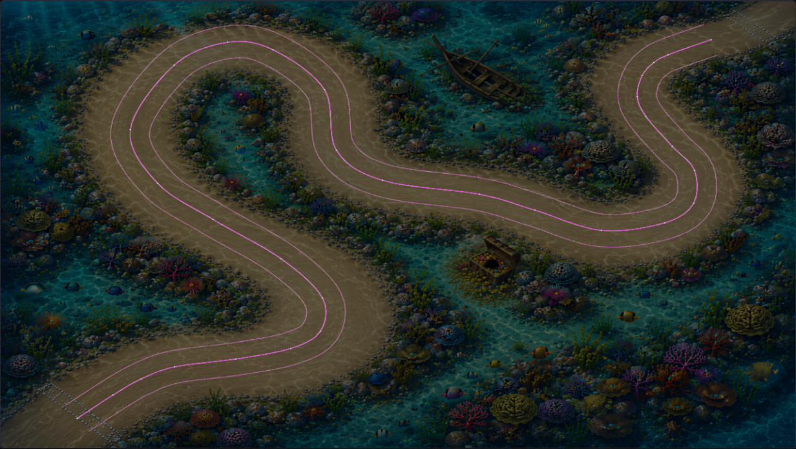
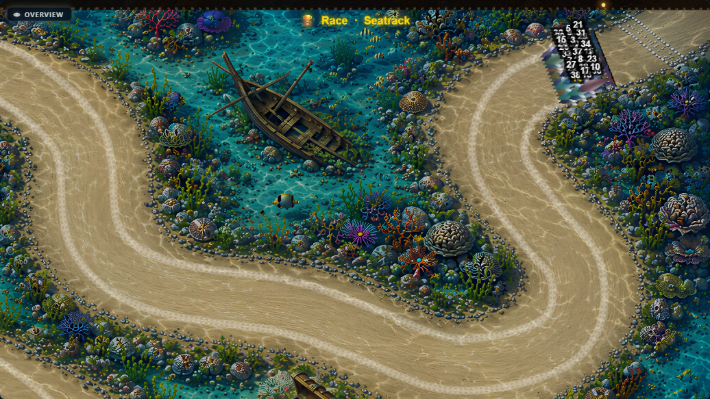
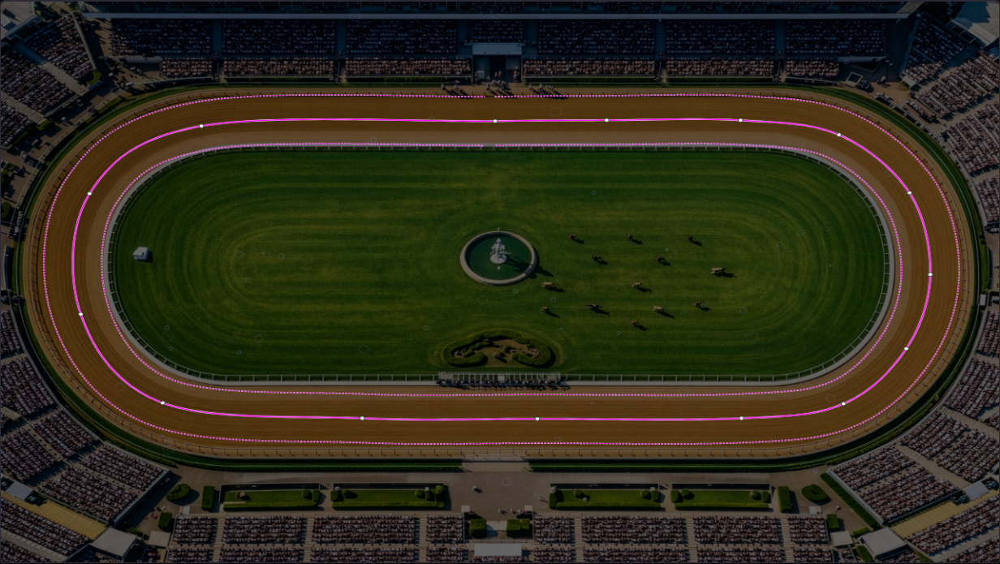
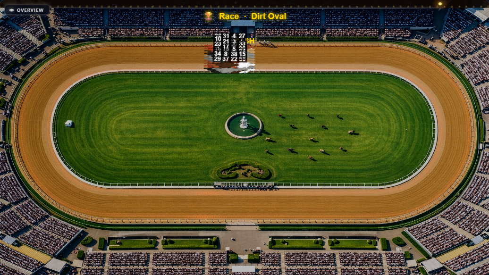

# PARTICLES-VISIBILITY-9 — why Seatrack's bubbles are invisible in the race, and an editor preview that shows what the race shows

**Measured and built 2026-09-29 on branch `fix/particles-visibility`, on top of PARTICLES-VISIBILITY-8 (`883630a7`).
Code commit `8810dc2f`. Not merged: the owner looks first.**

**Owns:** the measurement of Seatrack's bubbles in the race, and the Track Editor preview's world placement. Open row:
[BACKLOG.md](../../docs/BACKLOG.md) PART ONE, *2026-09-28 — added (PARTICLES-VISIBILITY-1)*.

**The owner's observation of 2026-09-29:** on Seatrack, with bubbles at level 10 (24,000 per minute), size 0.9 and opacity
0.25, he sees no bubbles at all in the race. The Track Editor's preview at the same settings shows very many, so the
preview does not match the race.

---

## 0 · The answer

- **The race is right, and the preview was wrong.** "Invisible at level 10" is caused by **count per screen**. MEASURED:
  while racing, about 330 bubbles are alive over the whole 6144×4096 track, and a median of **2** are on screen (p90 4).
  The stored values reach the race unchanged, and there is no defect.
- **Size is not the cause.** MEASURED: the race camera magnifies the world about 2.8×, so a bubble at its peak is about 9
  screen px (p90 of each frame's largest). At the maximum size they are larger (18 px median) and still 2.
- **Opacity makes the few that are there faint.** MEASURED: at 0.25 the brightest bubble drawn is 0.23 alpha, and at 1.0 it
  is 0.94, with the same 2 on screen. That this faintness is what the eye misses is NOT PROVEN; nothing here measures
  perception.
- **The only control that puts more on screen is the amount.** MEASURED: the median on screen is 2, 4, 8 and 17 at levels
  10, 25, 50 and 100.
- **The preview now shows what the race shows.** The Track Editor creates each effect with its world size (the race's
  third `create` argument) and draws it inside the same world-to-screen transform as the track. Before, it put the
  race's whole-track amount into one screen, at world-sized radii in screen pixels.
- **Nothing that the race runs on moved.** `engine-reach --check` places all nine changed files outside the engine hull.
  No fingerprint can move, and none was minted.

---

## 1 · The brief's reading, checked at source

**Correct**, with one addition:

- The race creates track effects with the world size (`client/src/screens/RaceScreen/index.jsx`, `effectWorld`) and
  draws them inside the world transform (`renderRaceFrame.js`, after the background and before the finish gate).
- The editor created them with the canvas only, and drew them after its world transform was restored, in screen space.
- Seatrack's world is 6144×4096 (the stored track's `worldWidth` and `worldHeight`).
- **The addition: Seatrack is an OPEN track.** The race draws open tracks with one uniform scale (`effectiveZoom`), where
  the editor's view scales x and y separately (1280/6144 and 720/4096). So on Seatrack the editor's whole-track view is
  not the race's venue shot. The race's venue shot is closer (scale 0.313 against the editor's 0.208 and 0.176), and it
  shows part of the track. On a closed track such as Dirt Oval the two views use the same mapping.
- The finish gate the race draws over the effects is not an opaque road. The track surface is the background image, so
  the draw order hides no bubbles beyond the gate, the lights, the dust and the racers.

---

## 2 · Part 1 — measured in the race

**Setup.**
- **Build:** the production build of a throwaway clone of `883630a7`, with a probe patch in `bubbles.js` only (it records
  what the effect receives, and per frame what it draws).
- **Track and settings:** a throwaway data directory holding a copy of the owner's current `seatrack.json`, read only
  from his data: bubbles count 24,000, size 0.9, colour `#aaddff`, opacity 0.25.
- **Camera:** his 11 camera overrides, taken from his latest stored race and seeded into the key the race reads them from.
- **The race:** the owner has no stored race on Seatrack, so each run is one measurement race. It was built from his
  latest stored race `VY7KKE` (40 racers, seed 9, his world config), moved onto Seatrack with Seatrack's own racer type
  (dolphin) and its 60 s duration.
- **Runs:** all six variants ran the same race. They differ only in the probe's override of one bubbles setting, applied
  after the stored values were recorded.

**The stored values reach the race.** In every run the effect instance received count 24,000, size 0.9, colour
`#aaddff`, opacity 0.25 and world 6144×4096.

**Phases.** Each run is split by time since the first frame:
- *venue*, 0–3 s: the whole-track opening shot;
- *ceremony*, 3–18 s;
- *racing*, 18–78 s: the race camera.

Each cell below is median / p90 / max over the frames of that phase. "On screen" counts bubbles whose centre is inside
the canvas. "Screen r" is the radius in pixels of the race's 1280×720 canvas; per frame the probe takes the largest
drawn circle.

**Racing (the race camera, scale median 2.82):**

| variant | frames | alive, whole track | bubbles on screen | largest screen r per frame | brightest alpha |
| --- | --- | --- | --- | --- | --- |
| **his settings (level 10, size 0.9, opacity 0.25)** | 1,361 | 328 / 333 / 339 | **2 / 4 / 10** | 4.4 / 9.1 / 12.3 | 0.23 |
| level 25 | 1,594 | 819 / 827 / 839 | 4 / 8 / 20 | 6.9 / 9.7 / 12.3 | 0.23 |
| level 50 | 1,371 | 1,643 / 1,656 / 1,671 | 8 / 15 / 33 | 8.7 / 10.0 / 12.3 | 0.23 |
| level 100 | 987 | 3,298 / 3,313 / 3,332 | 17 / 40 / 58 | 9.3 / 10.0 / 10.2 | 0.23 |
| level 10, size 3 (max) | 1,168 | 329 / 334 / 340 | 2 / 4 / 9 | 18.3 / 31.3 / 40.5 | 0.23 |
| level 10, opacity 1.0 | 1,281 | 329 / 334 / 341 | 2 / 4 / 12 | 4.3 / 9.1 / 12.3 | 0.94 |

**Venue shot (0–3 s, scale 0.313):**

| variant | bubbles on screen | largest screen r per frame |
| --- | --- | --- |
| his settings | 109 / 121 / 131 | 1.1 |
| level 100 | 1,176 / 1,220 / 1,245 | 1.1 |
| level 10, size 3 | 128 / 143 / 147 | 3.7 |

**Why so few, from the numbers.** 24,000 per minute is 400 per second, and a bubble lives about 0.8 s (rise 0.4–0.6 s,
pop 0.3 s), so about 320 are alive. That matches the measured 328. The race camera shows about 453×255 world px of a
6144×4096 world, which is 0.46% of it. 0.46% of 320 is 1.5 bubbles, and the measured median is 2. The race does exactly
what the settings ask. The settings spread the bubbles over the whole world, of which the race camera shows under half a
percent, and each lives under a second.

**The verdict, per cause:**

| cause | finding | label |
| --- | --- | --- |
| **count** | 2 on screen at level 10 while racing; it rises in step with the level (4, 8, 17 at 25, 50, 100) | **MEASURED — the cause** |
| screen size | about 9 px at peak at size 0.9; size 3 makes them larger, and there are still 2 | MEASURED — not the cause |
| opacity | at most 0.23 alpha at 0.25; opacity 1.0 makes them 0.94, and there are still 2 | MEASURED faint; its share of "invisible" NOT PROVEN |
| a defect | the stored values arrive, the world is the track's, the alive count is what the rate predicts | MEASURED — none found |

**Why the old preview showed very many.** It placed the same ~320 bubbles over one 1280×720 screen instead of the world,
which is 27 times the area of that screen. It drew each at its world radius in screen pixels, up to 3.6 px.

The headless browser ran at about 16–26 frames per second in these races; the counts per frame do not depend on that.

---

## 3 · Part 2 — the preview, built

**The decision rule held.** The editor has a world transform: its view draws the track inside `ctx.scale(zoom × 1280 /
worldW, zoom × 720 / worldH)` and `ctx.translate(-panX, -panY)`. So Part 2 was built.

- **`create(canvas, config, world)`:** the preview passes `{ width: editorWorldW, height: editorWorldH }`, the same third
  argument the race passes, so each effect places its content over the whole world.
- **Drawing:** effects render inside the same save/scale/translate as the track, before its restore. They zoom and pan with
  the track, and each effect's own culling (`cullBounds` and `isVisible`, already in all seven) runs against this view.
- **The world size is a dependency of the preview**, so loading a track of another size re-creates the effects over it.

**Side by side, at the owner's settings** (production build `8810dc2f`, throwaway data holding copies of his tracks):

*Seatrack, bubbles at level 10, size 0.9, opacity 0.25. Top: the editor's whole-track view. Bottom: the race's venue shot
1.5 s after the race screen opened. Neither shows bubbles you can pick out: at these scales a bubble is about 1 screen px
at 0.23 alpha. Before this change the editor showed several hundred at up to 3.6 px. The race's venue shot is closer
than the editor's view (open track, §1).*

*Dirt Oval, rain at level 5 (his stored 200 per second), same whole-track framing in both. Both show the same sparse,
faint rain rings. The race image is smaller because the race canvas is displayed smaller on the page; the editor's
background is darker because the editor lays a 60% dark overlay over it, where the race's is lighter.*

---

## 4 · Tests and sabotage

Two tests are new, in `TrackEditor.effects.test.jsx`, on a 3840×1440 world (set through the background upload), so the
two axes scale differently:

1. **Every effect gets the editor's world size** (two effects at once), and again after the world changes.
2. **An item at a world position is drawn at the matching editor screen position.** An item at a quarter across and
   three quarters down the world lands at a quarter across and three quarters down the canvas (320, 540). A context
   stub records every arc through the composed transform.

The Track Editor, track-effects and EffectConfig suites give 23 files and 306 tests, all passing. Each sabotage below
was applied alone and restored:

| sabotage | red |
| --- | --- |
| no world passed to `create` | both tests |
| effects drawn outside the world transform | the screen-position test |
| world size not a dependency of the preview | the world-size test (its second half) |

**Fingerprints:** none expected, and none can move. `node scripts/engine-reach.mjs --check` with all nine changed paths
passed explicitly reports *none of 9 path(s) carry a change that can reach the race engine — 9 outside the hull*.
**`npm run verify -- --premerge`, on the final tree (code and these documents): PASS 32, FAIL 0, SKIP 4.** The four
skipped guards are the camera and render fingerprints, `check-container-paths` and `check-seed-versions`, all *nothing
changed* in their import closure.

---

## 5 · What was changed, and where

| file | lines before → after | what |
| --- | --- | --- |
| `client/src/screens/TrackEditor/TrackEditor.jsx` | 1,146 → 1,153 | The preview passes the world size to `create` and renders effects inside the world transform; the world size is a dependency. Inline comments say where and why. |
| `client/src/screens/TrackEditor/TrackEditor.effects.test.jsx` | 477 → 609 | The two tests above, with a transform-tracking context stub and a world set by background upload. |
| `client/src/modules/track-effects/effects/{bubbles,dust,fireflies,mud,stars,wave}.js` | +1 each (116→117, 88→89, 112→113, 96→97, 107→108, 86→87) | Their comment said the editor draws in screen space and passes nothing. It now says the editor passes its world size and draws inside its own world transform. |
| `client/src/modules/track-effects/effects/rain.js` | 110 → 111 | The same comment in rain's own wording. |

**Reused:** the race's path, `create(canvas, config, world)`, and the culling helpers already in every effect, with no new
mechanism. The editor's own transform stays the one in its preview loop and was not copied anywhere.

**Left untouched, as ordered:**
- every stored track value (read only);
- every slider scale, maximum and default;
- the race's drawing, the camera and the race;
- the server. No server file changed, so the API needed no restart for this change.

---

## 6 · Noticed, and left

- **An open track's editor view and race venue shot differ in scale and shape.** The editor stretches x and y separately
  for every track; the race does so only for closed tracks. On Seatrack an effect in the editor is drawn a little
  flattened (0.208 across, 0.176 down) and smaller than in the venue shot (0.313). This is the editor's view of the track
  itself, which the brief keeps. Changing it would be a change to the editor's view, not to effects.
- **The editor still draws effects on top of its track lines and points**, where the race draws them under the finish
  gate, the lights and the racers. The editor's scene is one call (`drawStaticScene`), background and lines together, so
  putting effects between them would mean splitting that function. Nothing here needed it.
- **The editor's background is darker than the race's** (a 60% overlay against the race's lighter one). A faint effect
  can therefore look different against it, even at the same density and size.
- **The whole-track view is not what the owner watches.** Any whole-track view, the editor's or the race's venue shot,
  shows the effect at about 1 px per bubble on Seatrack. The race camera shows 2.8× the world scale and 0.46% of the
  area. So "the same as the race's whole-track view" is now true, but it is still not the race camera.
- **The throwaway clone `C:/tmp/pvm` from PARTICLES-VISIBILITY-8 was reused** as this task's clone, and is deleted with it.
